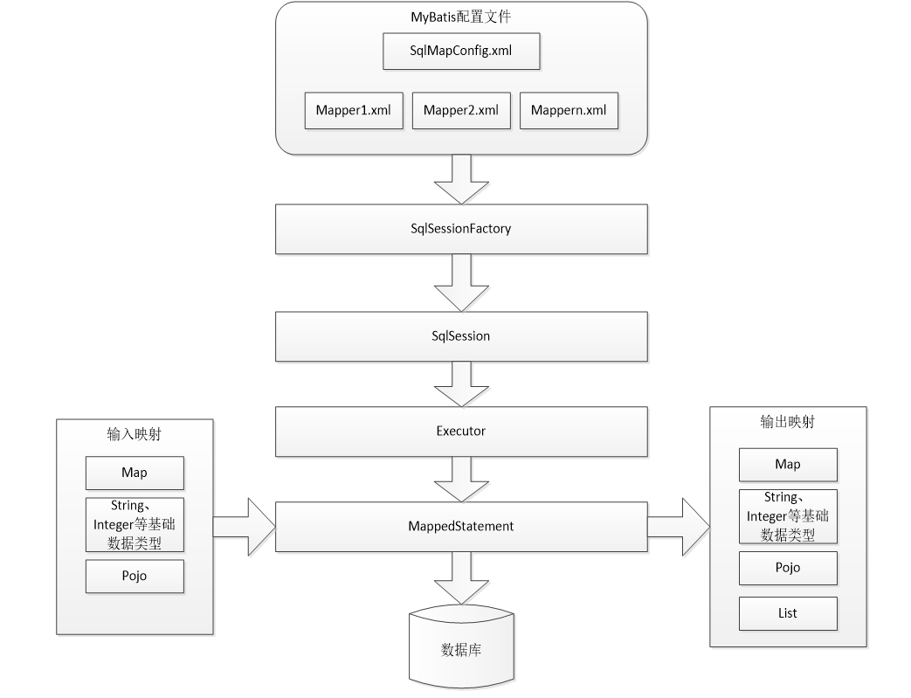

# MyBatis

---
## 1 MyBatis 简介

MyBatis 本是 apache 的一个开源项目iBatis, 2010年这个项目由 `apache software foundation` 迁移到了 `google code`，并且改名为 MyBatis 。2013年11月迁移到Github。

MyBatis 是一个优秀的**持久层框架**，它对jdbc的操作数据库的过程进行封装，使开发者只需要关注 SQL 本身，而不需要花费精力去处理例如注册驱动、创建connection、创建statement、手动设置参数、结果集检索等jdbc繁杂的过程代码。

Mybatis 通过 xml 或注解的方式将要执行的各种statement（`statement、preparedStatemnt、CallableStatement`）配置起来，并通过 java 对象和 statement 中的 sql 进行映射生成最终执行的 sql 语句，最后由 mybatis 框架执行 sql 并将结果映射成 java 对象并返回。

### 1.1 传统 JDBC 的问题

jdbc编程步骤：

1. 加载数据库驱动
2. 创建并获取数据库链接
3. 创建 jdbc statement 对象
4. 设置 sql 语句
5. 设置 sql 语句中的参数(使用 preparedStatement)
6. 通过 statement 执行 sql 并获取结果
7. 对 sql 执行结果进行解析处理
8. 释放资源(resultSet、preparedstatement、connection)

jdbc问题总结如下

1、数据库连接创建、释放频繁造成系统资源浪费，从而影响系统性能。如果使用数据库连接池可解决此问题。
2、sql 语句在代码中硬编码，造成代码不易维护，实际应用中 sql 变化的可能较大，sql 变动需要改变 java 代码。
3、使用 preparedStatement 向占有位符号传参数存在硬编码，因为sql语句的where条件不一定，可能多也可能少，修改sql还要修改代码，系统不易维护。
4、对结果集解析存在硬编码（查询列名），sql 变化导致解析代码变化，系统不易维护，如果能将数据库记录封装成 pojo 对象解析比较方便。

### 1.2 MyBatis 架构

MyBatis解决了上面问题：



1. mybatis配置 `SqlMapConfig.xml`，此文件作为 mybatis 的全局配置文件，配置了 mybatis 的运行环境等信息。`mapper.xml` 文件即 sql 映射文件，文件中配置了操作数据库的 sql 语句。此文件需要在`SqlMapConfig.xml`中加载。
2. 通过 mybatis 环境等配置信息构造 `SqlSessionFactory` 即会话工厂
3. 由会话工厂创建 `sqlSession` 即会话，操作数据库需要通过 `sqlSession` 进行。
4. mybatis 底层自定义了 `Executor` 执行器接口操作数据库，`Executor` 接口有两个实现，一个是基本执行器、一个是缓存执行器。
5. `Mapped Statement` 也是 mybatis 一个底层封装对象，它包装了 mybatis 配置信息及 sql 映射信息等。`mapper.xml` 文件中一个sql对应一个 Mapped Statement 对象，sql 的 id 即是 `Mapped statement` 的id。
6. Mapped Statement 对 sql 执行输入参数进行定义，包括 `HashMap、基本类型、pojo`，Executor 通过 Mapped Statement 在执行 sql 前将输入的 java 对象映射至 sql 中，输入参数映射就是 jdbc 编程中对 `preparedStatement` 设置参数。
7. Mapped Statement 对 sql 执行输出结果进行定义，包括 `HashMap、基本类型、pojo`，Executor通过 Mapped Statement 在执行sql后将输出结果映射至java对象中，输出结果映射过程相当于jdbc编程中对结果的解析处理过程。


### 1.3 Mybatis 解决 jdbc 编程的问题

1. 数据库连接创建、释放频繁造成系统资源浪费从而影响系统性能，如果使用数据库连接池可解决此问题。
  - 解决：在SqlMapConfig.xml中配置数据连接池，使用连接池管理数据库链接。
2. Sql语句写在代码中造成代码不易维护，实际应用sql变化的可能较大，sql变动需要改变java代码。
  - 解决：将Sql语句配置在XXXXmapper.xml文件中与java代码分离。
3. 向sql语句传参数麻烦，因为sql语句的where条件不一定，可能多也可能少，占位符需要和参数一一对应。
  - 解决：Mybatis自动将java对象映射至sql语句，通过statement中的parameterType定义输入参数的类型。
4. 对结果集解析麻烦，sql变化导致解析代码变化，且解析前需要遍历，如果能将数据库记录封装成pojo对象解析比较方便。
  - 解决：Mybatis自动将sql执行结果映射至java对象，通过statement中的resultType定义输出结果的类型。

### 1.4 mybatis 与 hibernate 不同

- Mybatis和hibernate不同，它不完全是一个ORM框架，因为MyBatis需要程序员自己编写Sql语句。mybatis可以通过XML或注解方式灵活配置要运行的sql语句，并将java对象和sql语句映射生成最终执行的sql，最后将sql执行的结果再映射生成java对象。
- Mybatis学习门槛低，简单易学，程序员直接编写原生态sql，可严格控制sql执行性能，灵活度高，非常适合对关系数据模型要求不高的软件开发，例如互联网软件、企业运营类软件等，因为这类软件需求变化频繁，一但需求变化要求成果输出迅速。但是灵活的前提是mybatis无法做到数据库无关性，如果需要实现支持多种数据库的软件则需要自定义多套sql映射文件，工作量大。
- Hibernate对象/关系映射能力强，数据库无关性好，对于关系模型要求高的软件（例如需求固定的定制化软件）如果用hibernate开发可以节省很多代码，提高效率。但是Hibernate的学习门槛高，要精通门槛更高，而且怎么设计O/R映射，在性能和对象模型之间如何权衡，以及怎样用好Hibernate需要具有很强的经验和能力才行。

**总之，按照用户的需求在有限的资源环境下只要能做出维护性、扩展性良好的软件架构都是好架构，所以框架只有适合才是最好。**


---
## 2 MyBatis 入门

### 2.1 开发步骤

- 添加 MyBatis 相关依赖。
- 在类路径中创建 MyBatis 核心配置文件。
- 创建 pojo，pojo 类作为 mybatis 进行 sql 映射使用，pojo 类字段通常与数据库表列对应。
- 创建 sql 映射文件(sql映射文件中描述了如何操作数据库的sql语句)，并在核心配置文件中配置好该映射文件的位置。
- 创建 SqlSessionFactoryBuilder 对象，加载核心配置文件，创建 SqlSessionFactory 对象。
- 创建 SqlSession 对象，通过调用 SqlSession 相关方法操作数据库，关闭 SqlSession 释放资源。

### 2.2 核心类

- **SqlSessionFactory**：每个基于 MyBatis 的应用都是以一个 **SqlSessionFactory** 的实例为中心的。SqlSessionFactory 的实例可以通过 SqlSessionFactoryBuilder 获得。而 SqlSessionFactoryBuilder 则可以从 XML 配置文件或一个预先定制的 Configuration 的实例构建出 SqlSessionFactory 的实例。
- **SqlSessionFactory** 的构建方式：
  - 从 XML 中构建 SqlSessionFactory
  - 直接使用 Java 代码构建 SqlSessionFactory
- **SqlSession**：从 SqlSessionFactory 中获取 SqlSession，SqlSession 完全包含了面向数据库执行 SQL 命令所需的所有方法

**注意**：

- XML 核心配置文件（configuration XML）中包含了对 MyBatis 系统的核心设置，包含获取数据库连接实例的数据源（DataSource）和决定事务作用域和控制方式的事务管理器（TransactionManager）
- 注意添加 XML 头部的声明，用来验证 XML 文档正确性
- environment 元素体中包含了事务管理和连接池的配置
- mappers 元素则是包含一组 mapper 映射器（这些 mapper 的 XML 文件包含了 SQL 代码和映射定义信息）


**Dao 开发方法**：通常有两个方法，即原始 Dao 开发方法和 Mapper 动态代理开发方法。Mapper动态代理方式让程序员只需要编写 Mapper 接口（相当于Dao接口），由 Mybatis 框架根据接口定义创建接口的动态代理对象，Mapper接口开发需要遵循以下规范如下。

1. Mapper.xml 文件中的 namespace 与mapper 接口的类路径相同。
2. Mapper 接口方法名和 Mapper.xml 中定义的每个 statement 的 id 相同
3. Mapper 接口方法的输入参数类型和 mapper.xml 中定义的每个 sql 的 parameterType 的类型相同
4. Mapper 接口方法的输出参数类型和 mapper.xml 中定义的每个 sql 的 resultType 的类型相同

### 2.3 作用域（Scope）和生命周期

从上面可以看出 MyBatis 的构建与使用会需要使用到很多对象，理解它们的不同作用域和生命周期类是至关重要的：

- **SqlSessionFactoryBuilder**：这个类可以被实例化、使用和丢弃，一旦创建了 SqlSessionFactory，就不再需要它了。因此 SqlSessionFactoryBuilder 实例的最佳作用域是方法作用域（也就是局部方法变量）
- **SqlSessionFactory** 一旦被创建就应该在应用的运行期间一直存在，没有任何理由对它进行清除或重建。使用 SqlSessionFactory 的最佳实践是在应用运行期间不要重复创建多次
- **SqlSession**：每个线程都应该有它自己的 SqlSession 实例。SqlSession 的实例不是线程安全的，因此是不能被共享的，所以它的最佳的作用域是请求或方法作用域。绝对不能将 SqlSession 实例的引用放在一个类的静态域，甚至一个类的实例变量也不行。也绝不能将 SqlSession 实例的引用放在任何类型的管理作用域中，比如 Servlet 架构中的 HttpSession。
- **映射器实例（Mapper Instances）**：映射器接口的实例是从 SqlSession 中获得的。因此从技术层面讲，任何映射器实例的最大作用域是和请求它们的 SqlSession 相同的。尽管如此，映射器实例的最佳作用域是方法作用域。


---
## 3 MyBatis 配置

### 3.1 核心配置文件

- **properties**：这些属性都是可外部配置且可动态替换的，既可以在典型的 Java 属性文件中配置，亦可通过 properties 元素的子元素来传递。
- **settings**：全局配置参数，这是 MyBatis 中极为重要的调整设置，它们会改变 MyBatis 的运行时行为。
- **typeAliases**：类型别名是为 Java 类型设置一个短的名字。它只和 XML 配置有关，存在的意义仅在于用来减少类完全限定名的冗余。
- **typeHandlers**：类型处理器，无论是 MyBatis 在预处理语句（PreparedStatement）中设置一个参数时，还是从结果集中取出一个值时，都会用类型处理器将获取的值以合适的方式转换成 Java 类型。MyBatis 内置了很多有用的类型处理器，对于复杂的类型转换，需要开发者提供。
- **objectFactory**：MyBatis 每次创建结果对象的新实例时，它都会使用一个对象工厂（ObjectFactory）实例来完成。 默认的对象工厂需要做的仅仅是实例化目标类，要么通过默认构造方法，要么在参数映射存在的时候通过参数构造方法来实例化。 如果想覆盖对象工厂的默认行为，则可以通过创建自己的对象工厂来实现。
- **plugins**：MyBatis 允许开发者在已映射语句执行过程中的某一点进行拦截调用。
- **environments**：MyBatis 可以配置成适应多种环境，这种机制有助于将 SQL 映射应用于多种数据库之中。
  - environment：环境子属性对象
  - transactionManager：事务管理
  - dataSource：数据源
- **mappers**：映射器，告诉 MyBatis 到哪里去找到定义的 SQL 映射语句。


### 3.2 mapper（映射器）

mapper 配置的几种方法：

- `<mapper resource=" " />`：使用相对于类路径的资源
- `<mapper class=" " />`：使用mapper接口类路径，此种方法要求 mapper 接口名称和 mapper 映射文件名称相同，且放在同一个目录中
- `<package name=""/>`：注册指定包下的所有mapper接口，此种方法要求 mapper 接口名称和 mapper 映射文件名称相同，且放在同一个目录中

还可以通过 Java 注解的方式来配置 Mapper 接口，这样就可以避免使用 xml 配置 sql 映射了，但是 Java 注解的表现能力有限，复杂的 sql 语句还是需要使用 xml 编写：

```java
public interface BlogMapper {
  @Select("SELECT * FROM blog WHERE id = #{id}")
  Blog selectBlog(int id);
}
```

#### 命名空间 与 命名解析

命名空间（Namespaces）：sql 映射文件中，mapper 需要定义一个唯一的命名空间，命名空间在之前版本的 MyBatis 中是可选的，但现在命名空间则是必须的，且意于简单地用更长的完全限定名来隔离语句。

命名解析：为了减少输入量，MyBatis 对所有的命名配置元素（包括语句，结果映射，缓存等）使用了如下的命名解析规则：

- 完全限定名（比如`com.mypackage.MyMapper.selectAllThings`）将被直接查找并且找到即用。
- 短名称（比如`selectAllThings`）如果全局唯一也可以作为一个单独的引用。如果不唯一，有两个或两个以上的相同名称（比如`com.foo.selectAllThings `和`com.bar.selectAllThings`），那么使用时就会收到错误报告说短名称是不唯一的，这种情况下就必须使用完全限定名。

#### parameterType

parameterType 指定 sql 输入参数类型，mybatis 通过 ognl 从输入对象中获取参数值拼接在 sql 中。parameterType 输入类型传递有两种方式：

- 传递pojo对象：Mybatis使用ognl表达式解析对象字段的值，`#{}` 或者 `${}` 括号中的值为pojo属性名称。
- 传递pojo包装对象：比如传递多个查询条件，查询条件可能是综合的查询条件，不仅包括用户查询条件还包括其它的查询条件（比如查询用户信息的时候，将用户购买商品信息也作为查询条件），这时可以使用包装对象传递输入参数。


#### `#{}` 和 `${}`

- `#{}`表示一个占位符号，通过 `#{}` 可以实现 preparedStatement 向占位符中设置值，自动进行 java 类型和jdbc类型转换。`#{}` 可以有效防止 sql 注入。 `#{}` 可以接收简单类型值或 pojo 属性值。 如果 parameterType 传输单个简单类型值，`#{}` 括号中可以是 value 或其它名称。
-` ${}`表示拼接sql串，通过 `${}` 可以将 parameterType 传入的内容拼接在 sql 中且不进行 jdbc 类型转换， `${}` 可以接收简单类型值或 pojo 属性值，如果 parameterType 传输单个简单类型值，`${}`括号中只能是value。


#### resultType

resultType 指定输出结果类型，mybatis 将 sql 查询结果的一行记录数据映射为 resultType 指定类型的对象。如果有多条数据，则分别进行映射，并把对象放到容器List中。resultType可以指定将查询结果映射为pojo，但需要pojo的属性名和sql查询的列名一致方可映射成功。如果 sql 查询字段名和 pojo 的属性名不一致，可以通过 resultMap 将字段名和属性名作一个对应关系 ，resultMap 实质上还需要将查询结果映射到 pojo 对象中。resultMap 可以实现将查询结果映射为复杂类型的 pojo，比如在查询结果映射对象中包括 pojo 和 list 实现**一对一查询和一对多查询**。

#### 其他

- 动态 SQL
- 多表查询
- Java API
- 配置日志


---
## 4 逆向工程

根据SQL生成POJO、Mapper、和 xml 映射文件。具体参考[mybatis-generator-plugin](https://blog.csdn.net/Inke88/article/details/74766432)

---
## 5 整合 Spring

### 4.1  整合思路

1. SqlSessionFactory 对象应该放到 spring 容器中作为单例存在。
2. 传统 dao 的开发方式中，应该从 spring 容器中获得 sqlsession 对象。
3. Mapper 代理形式中，应该从 spring 容器中直接获得 mapper 的代理对象。
4. 数据库的连接以及数据库连接池事务管理都交给 spring 容器来完成

###  5.2 事务管理

MyBatis事务管理：

- 手动 commit 管理，默认的 SqlSession 是 `org.apache.ibatis.session.defaults.DefaultSqlSession`
- 使用 SqlSessionTemplate 管理 MyBatis 事务，注入的 SqlSession 实现为：`org.mybatis.spring.SqlSessionTemplate`
- 使用 Spring 的事务模板管理 MyBatis 事务


#### 单表事务管理

在同一张表里面，我想批量插入100条数据，但是由于这100条数据之间存在一定的相关性，只要其中任何一条事务的插入失败，之前插入成功的数据就全部回滚，这应当如何实现？这里有两种解决方案：

1. 使用MyBatis的批量插入功能
2. 使用Spring管理事务，任何一条数据插入失败

由于我们限定的前提是单表，因此比较推荐的是第一种做法。第二种做法尽管也可以实现我们的目标，但是每插入一条数据就要发起一次数据库连接，即使使用了数据库连接池，但在性能上依然有一定程度的损失。而使用MyBatis的批量插入功能，只需要发起一次数据库的连接，这100次的插入操作在MyBatis看来是一个整体，其中任何一个插入的失败都将导致整体插入操作的失败，即：要么全部成功，要么全部失败。

实际上这并没有用到事务管理，而是使用MyBatis批量操作数据的做法，目的是为了减少和数据库的交互次数。


#### 多库/多表事务管理

我要对单库/多库的两张表（Student表、Teacher表）同时插入一条数据，要么全部成功，要么全部失败，该如何处理？此时明显就不可以使用MyBatis批量操作的方法了，要实现这个功能，可以使用Spring的事务管理。

一般，Dao层中的方法更多的是一种对数据库的增删改查的原子性操作，而Service层中的方法相当于对这些原子性的操作做一个组合。

所以一般在Service层加入Spring体工队事务管理。


---
## 引用

- [mybatis 官网](http://blog.mybatis.org/)，mybatis提供了中文文档
- [MyBatis 系列博客](http://www.importnew.com/22783.html)
- [mybatis-generator-plugin](https://github.com/kimichen13/mybatis-generator-plugin)