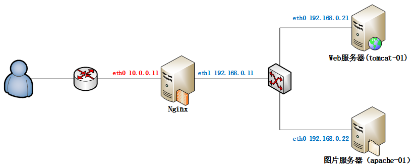
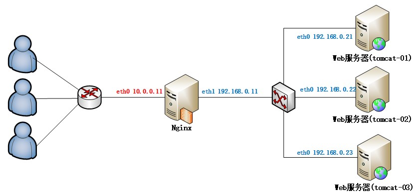

# Nginx 入门


---
## 1 Nginx 简介

Nginx 是一个高性能的 HTTP和反向代理服务器，也是一个 IMAP/POP3/SMTP 服务器。很多大网站都是使用nginx做反向代理，应用非常广泛。Nginx由俄罗斯的程序设计师Igor Sysoev所开发，官方测试nginx能够支支撑5万并发链接，并且cpu、内存等资源消耗却非常低，运行非常稳定。

应用场景：

1. http服务器，可以做静态网页的http服务器。
2. 配置虚拟机，一个域名可以被多个ip绑定。可以根据域名的不同吧请求转发给运行在不同端口的服务器。
3. 反向代理，负载均衡。把请求转发给不同的服务器。

常用命令：

```
# 关闭命令：相当于找到nginx进程kill。
./nginx -s stop

# 退出命令：等程序执行完毕后关闭，建议使用此命令。
./nginx -s quit

# 可以不关闭nginx的情况下更新配置文件。
./nginx -s reload
```

为什么使用Nginx:

互联网飞速发展的今天,大用户量高并发已经成为互联网的主体。怎样能让一个网站能够承载几万个或几十万个用户的持续访问呢？这是一些中小网站急需解决的问题。用单机tomcat搭建的网站，在比较理想的状态下能够承受的并发访问量在150到200左右。按照并发访问量占总用户数量的5%到10%这样计算，单点tomcat网站的用户人数在1500到4000左右。对于一个为全国范围提供服务的网站显然是不够用的，为了解决这个问题引入了负载均衡方法。负载均衡就是一个web服务器解决不了的问题可以通过多个web服务器来平均分担压力来解决，并发过来的请求被平均分配到多个后台web服务器来处理，这样压力就被分解开来。负载均衡服务器分为两种。一种是通过硬件实现的负载均衡服务器，简称硬负载例如：f5。另一种是通过软件来实现的负载均衡，简称软负载:例如apache和nginx。硬负载和软负载相比，前者作用的网络层次比较多可以作用到socket接口的数据链路层对发出的请求进行分组转发但是价格成本比较贵，而软负载作用的层次在http协议层之上可以对http请求进行分组转发并且因为是开源的所以几乎是0成本，并且阿里巴巴，京东等电商网站使用的都是Nginx服务器。

---
## 2 反向代理与负载均衡

反向代理（Reverse Proxy）方式是指以代理服务器来接受internet上的连接请求，然后将请求转发给内部网络上的服务器，并将从服务器上得到的结果返回给internet上请求连接的客户端，此时代理服务器对外就表现为一个服务器。



负载均衡，英文名称为Load Balance，是指建立在现有网络结构之上，并提供了一种廉价有效透明的方法扩展网络设备和服务器的带宽、增加吞吐量、加强网络数据处理能力、提高网络的灵活性和可用性。其原理就是数据流量分摊到多个服务器上执行，减轻每台服务器的压力，多台服务器共同完成工作任务，从而提高了数据的吞吐量。




---
## 3 配置 Tomcat 集群

- 1 开启多个tomcat服务器(需要配置不同的端口)

- 2 下载nginx，配置反向代理

在解压目录下，打开`conf/nginx.conf`文件，在 http 下面添加如下内容：

```
# weight为权重
upstream server_tomcat{
        server 127.0.0.1:8080 weight=2;
        server 127.0.0.1:8090 weight=4;
}

# 在server的local下添加proxy_pass
server {
    location / {
        proxy_pass http://server_tomcat;
    }
}
```

- 3 当访问 `http:127.0.0.1:80` 时，nginx 就会按照策略把访问转发到一个tomcat下

---
## 4 session 共享问题

- 解决方式1:web服务器解决(广播机制)，

```
#注意:tomcat下性能低；只在windows下有作用

#1.修改tomcat的server.xml支持共享，打开下面配置

<Cluster className="org.apache.catalina.ha.tcp.SimpleTcpCluster"/>

#2.修改项目的配置文件 web.xml中添加一个节点：
<distributable/>
```

- 解决方式2:可以将session的id放入redis中

- 解决方式3:保证一个ip地址永远的访问一台web服务器，就不存在session共享问题了,在nginx的配置文件中upstream中添加`ip_hash`;