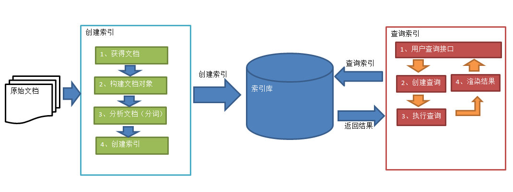
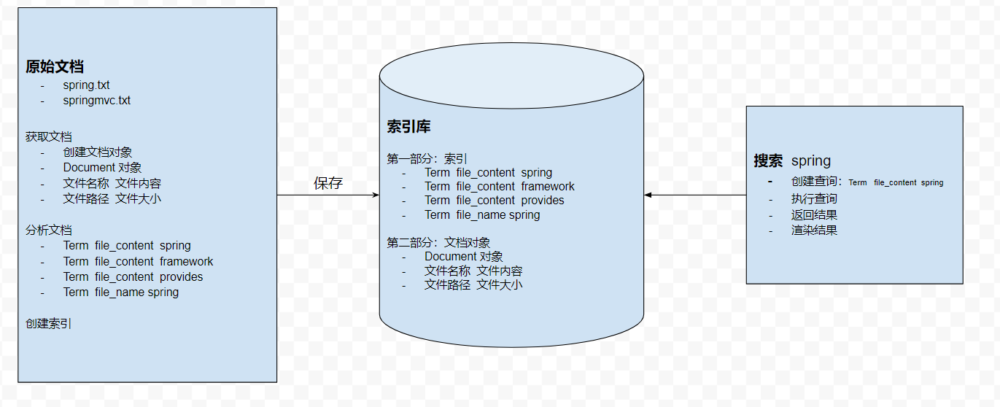
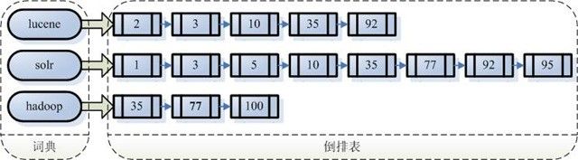

[TOC]

# Lucene

---
## 1 Lucene 简介

Lucene是apache下的一个开放源代码的全文检索引擎工具包。提供了完整的查询引擎和索引引擎，部分文本分析引擎。Lucene的目的是为软件开发人员提供一个简单易用的工具包，以方便的在目标系统中实现全文检索的功能。

---
## 2 什么是全文检索

实现一个文件的搜索功能，通过关键字搜索文件，凡是`指定位置的文件名或文件内容包括关键字的文件`都需要找出来。还可以根据中文词语进行查询，并且需要支持多个条件查询。如何实现？

### 2.1 数据库搜索

数据库中的搜索很容易实现，通常都是使用sql语句进行查询，而且能很快的得到查询结果。为什么数据库搜索很容易？因为数据库中的数据存储是有规律的，有行有列而且数据格式、数据长度都是固定的。

### 2.12 数据分类

我们生活中的数据总体分为两种：结构化数据和非结构化数据。

- 结构化数据：指具有固定格式或有限长度的数据，如数据库，元数据等。
- 非结构化数据：指不定长或无固定格式的数据，如邮件，word文档等磁盘上的文件

### 2.3 非结构化数据查询方法

- 顺序扫描法(Serial Scanning)：所谓顺序扫描，比如要找内容包含某一个字符串的文件，就是一个文档一个文档的看，对于每一个文档，从头看到尾，如果此文档包含此字符串，则此文档为我们要找的文件，接着看下一个文件，直到扫描完所有的文件。如利用windows的搜索也可以搜索文件内容，只是相当的慢。
- 全文检索(Full-text Search)：将非结构化数据中的一部分信息提取出来，重新组织，使其变得有一定结构，然后对此有一定结构的数据进行搜索，从而达到搜索相对较快的目的。这部分从非结构化数据中提取出的然后重新组织的信息，我们称之索引。

全文检索示例：例如：字典。字典的拼音表和部首检字表就相当于字典的索引，对每一个字的解释是非结构化的，如果字典没有音节表和部首检字表，在茫茫辞海中找一个字只能顺序扫描。然而字的某些信息可以提取出来进行结构化处理，比如读音，就比较结构化，分声母和韵母，分别只有几种可以一一列举，于是将读音拿出来按一定的顺序排列，每一项读音都指向此字的详细解释的页数。我们搜索时按结构化的拼音搜到读音，然后按其指向的页数，便可找到我们的非结构化数据——也即对字的解释。

**这种先建立索引，再对索引进行搜索的过程就叫全文检索(Full-text Search)。**，虽然创建索引的过程也是非常耗时的，但是索引一旦创建就可以多次使用，全文检索主要处理的是查询，所以耗时间创建索引是值得的。

### 2.4 如何实现全文检索

可以使用Lucene实现全文检索。Lucene是apache下的一个开放源代码的全文检索引擎工具包。提供了完整的查询引擎和索引引擎，部分文本分析引擎。Lucene的目的是为软件开发人员提供一个简单易用的工具包，以方便的在目标系统中实现全文检索的功能。

### 2.5 全文检索的应用场景

对于数据量大、数据结构不固定的数据可采用全文检索方式搜索，比如百度、Google等搜索引擎、论坛站内搜索、电商网站站内搜索等。

---
## 3 Lucene实现全文检索的流程

### 3.1 索引和搜索流程图



1. 绿色表示索引过程，对要搜索的原始内容进行索引构建一个索引库，索引过程包括：`确定原始内容(即要搜索的内容)、采集文档、创建文档、分析文档、索引文档`。
2. 红色表示搜索过程，从索引库中搜索内容，搜索过程包括：`用户通过搜索界面、创建查询、执行搜索、从索引库搜索、渲染搜索结果`。

### 3.2 创建索引

#### 获得原始文档

原始文档是指要索引和搜索的内容。原始内容包括互联网上的网页、数据库中的数据、磁盘上的文件等。

从互联网上、数据库、文件系统中等获取需要搜索的原始信息，这个过程就是信息采集，信息采集的目的是为了对原始内容进行索引。

在Internet上采集信息的软件通常称为爬虫或蜘蛛，也称为网络机器人，爬虫访问互联网上的每一个网页，将获取到的网页内容存储起来。

Lucene不提供信息采集的类库，需要自己编写一个爬虫程序实现信息采集，也可以通过一些开源软件实现信息采集，如下：

- [Nutch](http://lucene.apache.org/nutch), Nutch是apache的一个子项目，包括大规模爬虫工具，能够抓取和分辨web网站数据。
- [jsoup](http://jsoup.org/)，jsoup 是一款Java 的HTML解析器，可直接解析某个URL地址、HTML文本内容。它提供了一套非常省力的API，可通过DOM，CSS以及类似于jQuery的操作方法来取出和操作数据。
- [heritrix](http://sourceforge.net/projects/archive-crawler/files/)，Heritrix 是一个由 java 开发的、开源的网络爬虫，用户可以使用它来从网上抓取想要的资源。其最出色之处在于它良好的可扩展性，方便用户实现自己的抓取逻辑。

对于获取磁盘上文件的内容，可以通过文件流来读取文本文件的内容，对于 `pdf、doc、xls` 等文件可通过第三方提供的解析工具读取文件内容，比如Apache POI读取doc和xls的文件内容。

#### 创建文档对象

获取原始内容的目的是为了索引，在索引前需要将原始内容创建成文档（Document），文档中包括一个一个的域（Field），域中存储内容。比如我们可以将磁盘上的一个文件当成一个document，Document中包括一些Field（file_name文件名称、file_path文件路径、file_size文件大小、file_content文件内容）。**注意**：每个Document可以有多个Field，不同的Document可以有不同的Field，同一个Document可以有相同的Field（域名和域值都相同），**每个文档都有一个唯一的编号，就是文档id。**

#### 分析文档

将原始内容创建为包含域（Field）的文档（document），需要再对域中的内容进行分析，分析的过程是经过对原始文档提取单词、将字母转为小写、去除标点符号、去除停用词等过程生成最终的语汇单元，可以将语汇单元理解为一个一个的单词。比如下边的文档经过分析如下：

    Lucene is a Java full-text search engine.  Lucene is not a complete application, but rather a code library and API that can easily be used to add search capabilities to applications.

分析后得到的语汇单元：

    lucene、java、full、search、engine...

每个单词叫做一个**Term**，不同的域中拆分出来的相同的单词是不同的term。term中包含两部分：一部分是文档的域名，另一部分是单词的内容。例如：文件名中包含apache和文件内容中包含的apache是不同的term。

#### 创建索引

对所有文档分析得出的语汇单元进行索引，索引的目的是为了搜索，最终要实现只搜索被索引的语汇单元从而找到Document（文档）。



注意：创建索引是对语汇单元索引，通过词语找文档，这种索引的结构叫**倒排索引结构**。而传统方法是根据文件找到该文件的内容，在文件内容中匹配搜索关键字，这种方法是顺序扫描方法，数据量大、搜索慢。倒排索引结构是根据内容（词语）找文档，如下图：


>图中数字表示搜索结果出现的次数

倒排索引结构也叫**反向索引结构**，包括索引和文档两部分，索引即词汇表，它的规模较小，而文档集合较大。

### 3.3 查询索引

查询索引也是搜索的过程。搜索就是用户输入关键字，从索引（index）中进行搜索的过程。根据关键字搜索索引，根据索引找到对应的文档，从而找到要搜索的内容（这里指磁盘上的文件）。

查询索引一般包括下面步骤：

- 用户查询接口：全文检索系统提供用户搜索的界面供用户提交搜索的关键字，搜索完成展示搜索结果。Lucene不提供制作用户搜索界面的功能，需要根据自己的需求开发搜索界面。
- 创建查询：用户输入查询关键字执行搜索之前需要先构建一个查询对象，查询对象中可以指定查询要搜索的Field文档域、查询关键字等，查询对象会生成具体的查询语法，例如：语法 `“fileName:lucene”`表示要搜索Field域的内容为“lucene”的文档
- 执行查询：搜索索引过程为根据查询语法在倒排索引词典表中分别找出对应搜索词的索引，从而找到索引所链接的文档链表。比如搜索语法为`“fileName:lucene”`表示搜索出fileName域中包含Lucene的文档。搜索过程就是在索引上查找域为fileName，并且关键字为Lucene的term，并根据term找到文档id列表。
- 渲染结果：以一个友好的界面将查询结果展示给用户，用户根据搜索结果找自己想要的信息，为了帮助用户很快找到自己的结果，提供了很多展示的效果，比如搜索结果中将关键字高亮显示，百度提供的快照等。

---
## 4 Lucene 实战


### 4.1  创建索引库

使用indexwriter对象创建索引

#### IndexWriter 对象创建

```
第二步：创建一个indexwriter对象。
  1）指定索引库的存放位置Directory对象
  2）指定一个分析器，对文档内容进行分析。
第二步：创建document对象。
第三步：创建field对象，将field添加到document对象中。
第四步：使用indexwriter对象将document对象写入索引库，此过程进行索引创建。并将索引和document对象写入索引库。
第五步：关闭IndexWriter对象。
```

#### Field 域的属性

- **是否分析**：是否对域的内容进行分词处理。前提是我们要对域的内容进行查询。
- **是否索引**：将Field分析后的词或整个Field值进行索引，只有索引方可搜索到。
比如：商品名称、商品简介分析后进行索引，订单号、身份证号不用分析但也要索引，这些将来都要作为查询条件。
- **是否存储**：将Field值存储在文档中，存储在文档中的Field才可以从Document中获取，是否存储的标准：是否要将内容展示给用户
比如：商品名称、订单号，凡是将来要从Document中获取的Field都要存储。


Field类 | 数据类型 | Analyzed是否分析 | Indexed是否索引 | Stored是否存储 | 说明
---|---|----|---|---
`StringField(FieldName, FieldValue,Store.YES))` | 字符串 | N | Y | Y或N | 这个Field用来构建一个字符串Field，但是不会进行分析，会将整个串存储在索引中，比如(订单号,姓名等)，是否存储在文档中用Store.YES或Store.NO决定
`LongField(FieldName, FieldValue,Store.YES)` | Long型  | Y | Y | Y或N | 这个Field用来构建一个Long数字型Field，进行分析和索引，比如(价格)，是否存储在文档中用Store.YES或Store.NO决定
`StoredField(FieldName, FieldValue)`  | 重载方法，支持多种类型 | N | N | Y | 这个Field用来构建不同类型Field，不分析，不索引，但要Field存储在文档中，比如路径、身份证号
`TextField(FieldName, FieldValue, Store.NO)` 或 `TextField(FieldName, reader)` | 字符串或流 | Y | Y | Y或N | 如果是一个Reader, lucene猜测内容比较多,会采用Unstored的策略.


代码示例：

```
public void createIndex() throws Exception {
        //指定索引库存放的路径
        //D:\temp\0108\index
        Directory directory = FSDirectory.open(new File("D:\\temp\\0108\\index"));
        //索引库还可以存放到内存中
        //Directory directory = new RAMDirectory();
        //创建一个标准分析器
        Analyzer analyzer = new StandardAnalyzer();
        //创建indexwriterCofig对象
        //第一个参数： Lucene的版本信息，可以选择对应的lucene版本也可以使用LATEST
        //第二根参数：分析器对象
        IndexWriterConfig config = new IndexWriterConfig(Version.LATEST, analyzer);
        //创建indexwriter对象
        IndexWriter indexWriter = new IndexWriter(directory, config);
        //原始文档的路径D:\传智播客\01.课程\04.lucene\01.参考资料\searchsource
        File dir = new File("D:\\传智播客\\01.课程\\04.lucene\\01.参考资料\\searchsource");
        for (File f : dir.listFiles()) {
            //文件名
            String fileName = f.getName();
            //文件内容
            String fileContent = FileUtils.readFileToString(f);
            //文件路径
            String filePath = f.getPath();
            //文件的大小
            long fileSize  = FileUtils.sizeOf(f);
            //创建文件名域
            //第一个参数：域的名称
            //第二个参数：域的内容
            //第三个参数：是否存储
            Field fileNameField = new TextField("filename", fileName, Store.YES);
            //文件内容域
            Field fileContentField = new TextField("content", fileContent, Store.YES);
            //文件路径域（不分析、不索引、只存储）
            Field filePathField = new StoredField("path", filePath);
            //文件大小域
            Field fileSizeField = new LongField("size", fileSize, Store.YES);
            
            //创建document对象
            Document document = new Document();
            document.add(fileNameField);
            document.add(fileContentField);
            document.add(filePathField);
            document.add(fileSizeField);
            //创建索引，并写入索引库
            indexWriter.addDocument(document);
        }
        //关闭indexwriter
        indexWriter.close();
    }
```

#### 使用 Luke 工具查看索引文件

Luke提供了简单的视图界面用查看索引文件的内容


### 4.2 查询索引

#### 编码步骤

```
第一步：创建一个Directory对象，也就是索引库存放的位置。
第二步：创建一个indexReader对象，需要指定Directory对象。
第三步：创建一个indexsearcher对象，需要指定IndexReader对象
第四步：创建一个TermQuery对象，指定查询的域和查询的关键词。
第五步：执行查询。
第六步：返回查询结果。遍历查询结果并输出。
第七步：关闭IndexReader对象
```

#### IndexSearcher 搜索方法

方法 | 说明
---|----
`indexSearcher.search(query, n) `| 根据Query搜索，返回评分最高的n条记录
`indexSearcher.search(query, filter, n)` | 根据Query搜索，添加过滤策略，返回评分最高的n条记录
`indexSearcher.search(query, n, sort)` | 根据Query搜索，添加排序策略，返回评分最高的n条记录
`indexSearcher.search(booleanQuery, filter, n, sort) `| 根据Query搜索，添加过滤策略，添加排序策略，返回评分最高的n条记录

代码示例：

```
public void searchIndex() throws Exception {
        //指定索引库存放的路径
        //D:\temp\0108\index
        Directory directory = FSDirectory.open(new File("D:\\temp\\0108\\index"));
        //创建indexReader对象
        IndexReader indexReader = DirectoryReader.open(directory);
        //创建indexsearcher对象
        IndexSearcher indexSearcher = new IndexSearcher(indexReader);
        //创建查询
        Query query = new TermQuery(new Term("filename", "apache"));
        //执行查询
        //第一个参数是查询对象，第二个参数是查询结果返回的最大值
        TopDocs topDocs = indexSearcher.search(query, 10);
        //查询结果的总条数
        System.out.println("查询结果的总条数："+ topDocs.totalHits);
        //遍历查询结果
        //topDocs.scoreDocs存储了document对象的id
        for (ScoreDoc scoreDoc : topDocs.scoreDocs) {
            //scoreDoc.doc属性就是document对象的id
            //根据document的id找到document对象
            Document document = indexSearcher.doc(scoreDoc.doc);
            System.out.println(document.get("filename"));
            //System.out.println(document.get("content"));
            System.out.println(document.get("path"));
            System.out.println(document.get("size"));
        }
        //关闭indexreader对象
        indexReader.close();
    }
```

#### TopDocs

Lucene搜索结果可通过TopDocs遍历，TopDocs类提供了少量的属性，如下：

方法或属性 | 说明
---|---
totalHits | 匹配搜索条件的总记录数
scoreDocs | 顶部匹配记录

注意：
- Search方法需要指定匹配记录数量n：`indexSearcher.search(query, n)`
- `TopDocs.totalHits`：是匹配索引库中所有记录的数量
- `TopDocs.scoreDocs`：匹配相关度高的前边记录数组，scoreDocs的长度小于等于search方法指定的参数n

### 4.3 支持中文分词

#### 分析器（Analyzer）的执行过程

从一个Reader字符流开始，创建一个基于Reader的Tokenizer分词器，经过三个TokenFilter生成语汇单元Tokens。
要看分析器的分析效果，只需要看Tokenstream中的内容就可以了。每个分析器都有一个方法tokenStream，返回一个tokenStream对象。代码如下：

```
public void testTokenStream() throws Exception {
        //创建一个标准分析器对象
        Analyzer analyzer = new StandardAnalyzer();
        //获得tokenStream对象
        //第一个参数：域名，可以随便给一个
        //第二个参数：要分析的文本内容
        TokenStream tokenStream = analyzer.tokenStream("test", "The Spring Framework provides a comprehensive programming and configuration model.");
        //添加一个引用，可以获得每个关键词
        CharTermAttribute charTermAttribute = tokenStream.addAttribute(CharTermAttribute.class);
        //添加一个偏移量的引用，记录了关键词的开始位置以及结束位置
        OffsetAttribute offsetAttribute = tokenStream.addAttribute(OffsetAttribute.class);
        //将指针调整到列表的头部
        tokenStream.reset();
        //遍历关键词列表，通过incrementToken方法判断列表是否结束
        while(tokenStream.incrementToken()) {
            //关键词的起始位置
            System.out.println("start->" + offsetAttribute.startOffset());
            //取关键词
            System.out.println(charTermAttribute);
            //结束位置
            System.out.println("end->" + offsetAttribute.endOffset());
        }
        tokenStream.close();
    }
```

#### 中文分析器

Lucene自带中文分词器：

- **StandardAnalyzer**：
单字分词：就是按照中文一个字一个字地进行分词。如：“我爱中国”，
效果：“我”、“爱”、“中”、“国”。
- **CJKAnalyzer**
二分法分词：按两个字进行切分。如：“我是中国人”，效果：“我是”、“是中”、“中国”“国人”。

这两个分词器均无法满足开发要求。不过分词器是可扩展的，可以选择第三方中文分析器：

- [paoding](https://code.google.com/p/paoding/)：最多支持Lucene 3.0，且最新提交的代码在 2008-06-03，在svn中最新也是2010年提交，已经过时，不予考虑。
- [mmseg4j](https://github.com/chenlb/mmseg4j-solr)：支持Lucene 4.10，且在github中最新提交代码是2014年6月，从09年～14年一共有：18个版本，也就是一年几乎有3个大小版本，有较大的活跃度，用了mmseg算法。
- [IK-analyzer](https://code.google.com/p/ik-analyzer/)：支持Lucene 4.10从2006年12月推出1.0版开始， IKAnalyzer已经推出了4个大版本。最初，它是以开源项目Luence为应用主体的，结合词典分词和文法分析算法的中文分词组件。从3.0版本开 始，IK发展为面向Java的公用分词组件，独立于Lucene项目，同时提供了对Lucene的默认优化实现。在2012版本中，IK实现了简单的分词 歧义排除算法，标志着IK分词器从单纯的词典分词向模拟语义分词衍化。 但是也就是2012年12月后没有在更新。
- [Jcseg](git.oschina.net/lionsoul/jcseg)：支持Lucene 4.10，作者有较高的活跃度。利用mmseg算法。


#### Analyzer使用时机

索引时使用Analyzer：输入关键字进行搜索，当需要让该关键字与文档域内容所包含的词进行匹配时需要对文档域内容进行分析，需要经过Analyzer分析器处理生成语汇单元（Token）。分析器分析的对象是文档中的Field域。当Field的属性tokenized（是否分词）为true时会对Field值进行分析，对于一些Field可以不用分析：

  - 1、不作为查询条件的内容，比如文件路径
  - 2、不是匹配内容中的词而匹配Field的整体内容，比如订单号、身份证号等。

搜索时使用Analyzer：对搜索关键字进行分析和索引分析一样，使用Analyzer对搜索关键字进行分析、分词处理，使用分析后每个词语进行搜索。比如：搜索关键字：spring web ，经过分析器进行分词，得出：spring  web拿词去索引词典表查找 ，找到索引链接到Document，解析Document内容。对于匹配整体Field域的查询可以在搜索时不分析，比如根据订单号、身份证号查询等。注意：搜索使用的分析器要和索引使用的分析器一致。

### 4.4 索引库的维护

- 索引库的添加
- 删除全部
- 索引库的修改

### 4.5 Lucene 索引库查询

对要搜索的信息创建Query查询对象，Lucene会根据Query查询对象生成最终的查询语法，类似关系数据库Sql语法一样Lucene也有自己的查询语法，比如：`“name:lucene”`表示查询Field的name为“lucene”的文档信息。可通过两种方法创建查询对象：

```
    //方式1：使用Lucene提供Query子类，Query是一个抽象类，lucene提供了很多查询对象，比如TermQuery项精确查询，NumericRangeQuery数字范围查询等。如下代码：
    Query query = new TermQuery(new Term("name", "lucene"));

    //方式2：使用QueryParse解析查询表达式，QueryParse会将用户输入的查询表达式解析成Query对象实例。如下代码：
    QueryParser queryParser = new QueryParser("name", new IKAnalyzer());
    Query query = queryParser.parse("name:lucene");
```

#### Query 子类查询

- MatchAllDocsQuery：查询索引目录中的所有文档。
- TermQuery：通过项查询，TermQuery不使用分析器所以建议匹配不分词的Field域查询，比如订单号、分类ID号等。
- NumericRangeQuery：可以根据数值范围查询。
- BooleanQuery：可以组合查询条件
    - Occur.MUST：必须满足此条件，相当于and
    - Occur.SHOULD：应该满足，但是不满足也可以，相当于or
    - Occur.MUST_NOT：必须不满足。相当于not

#### 使用 QueryParser 语法查询

通过QueryParser也可以创建Query，QueryParser提供一个Parse方法，此方法可以直接根据查询语法来查询。Query对象执行的查询语法可通过`System.out.println(query);`打印，查询需要使用到分析器。建议创建索引时使用的分析器和查询索引时使用的分析器要一致。

##### QueryParser

查询语法：

```
1、基础的查询语法，关键词查询：
    域名+“：”+搜索的关键字
    例如：content:java

2、范围查询
    域名+“:”+[最小值 TO 最大值]
    例如：size:[1 TO 1000]
    范围查询在lucene中支持数值类型，不支持字符串类型。在solr中支持字符串类型。

3、组合条件查询
    1）+条件1 +条件2：两个条件之间是并且的关系and
    例如：+filename:apache +content:apache
    2）+条件1 条件2：必须满足第一个条件，应该满足第二个条件
    例如：+filename:apache content:apache
    3）条件1 条件2：两个条件满足其一即可。
    例如：filename:apache content:apache
    4）-条件1 条件2：必须不满足条件1，要满足条件2
    例如：-filename:apache content:apache

Occur.MUST 查询条件必须满足，相当于and，符号为+（加号）
Occur.SHOULD 查询条件可选，相当于or空，不用符号
Occur.MUST_NOT 查询条件不能满足，相当于not非，符号为-（减号）
```

##### MultiFieldQueryParser

MultiFieldQueryParser可以指定多个默认搜索域