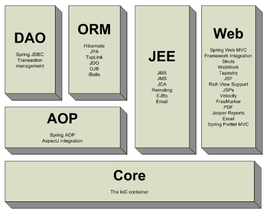
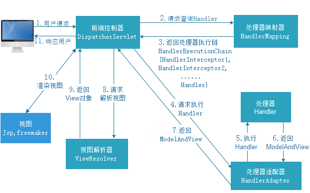
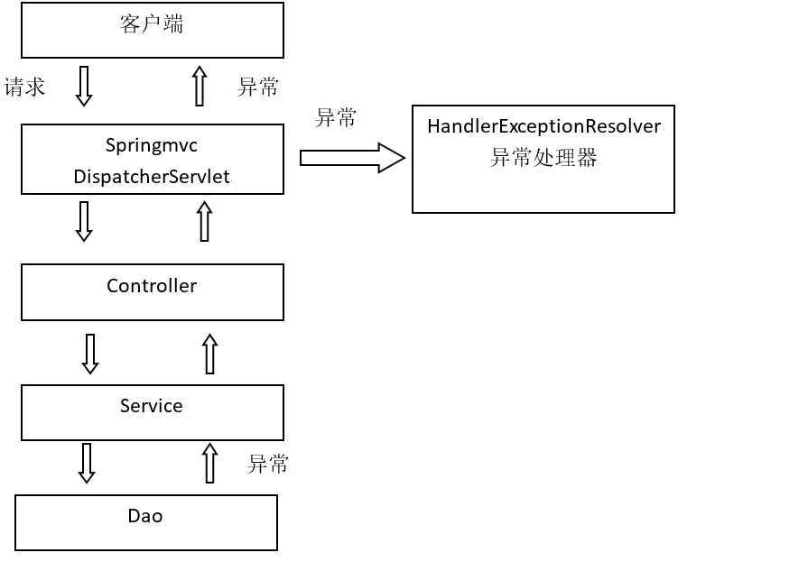

# Spring MVC 快速入门

---
## 1 Spring MVC 简介

Spring 框架提供了构建 Web 应用程序的全功能 MVC 模块。使用 Spring 可插入的 MVC 架构，开发者可以选择是使用内置的 Spring Web 框架还是 Struts 这样的 Web 框架。通过策略接口，Spring 框架是高度可配置的，而且包含多种视图技术，例如 JavaServer Pages（JSP）技术、Velocity、Tiles、iText 和 POI。Spring MVC 框架并不知道使用的视图，所以不会强迫开发者只使用 JSP 技术。

SpringMVC 框架是一个 MVC 框架，通过实现 Model-View-Controller 模式来很好地将数据、业务与展现进行分离。SpringMVC 和 Struts、Struts2 都是表现层的框架。SpringMVC 的设计是围绕 DispatcherServlet 展开的，DispatcherServlet 负责将请求派发到特定的 handler。通过可配置的 handler mappings、view resolution、locale 以及 theme resolution 来处理请求并且转到对应的视图。




SpringMVC 与 Struts2 不同：

1. SpringMVC 的入口是一个 servlet 即前端控制器，而 Struts2 入口是一个 filter 过滤器。
2. SpringMVC 是基于方法开发(一个url对应一个方法)，请求参数传递到方法的形参，可以设计为单例或多例(建议单例)，Struts2 是基于类开发，传递参数是通过类的属性，只能设计为多例。
3. Struts2 采用值栈存储请求和响应的数据，通过 OGNL 存取数据， SpringMVC 通过参数解析器是将 request 请求内容解析，并给方法形参赋值，将数据和视图封装成 ModelAndView 对象，最后又将 ModelAndView 中的模型数据通过 request 域传输到页面。Jsp 视图解析器默认使用 jstl。

---
## 2 Spring MVC 处理流程与组件

### 2.1  处理流程

SpringMVC 处理流程：


SpringMVC 处理架构：



1. 用户发送请求至前端控制器 DispatcherServlet
2. DispatcherServlet 收到请求调用 HandlerMapping 处理器映射器
3. 处理器映射器根据请求 url 找到具体的处理器，生成处理器对象及处理器拦截器(如果有则生成)一并返回给 DispatcherServlet
4. DispatcherServlet 通过 HandlerAdapter 处理器适配器调用处理器
5. 执行处理器(Controller，也叫后端控制器)
6. Controller 执行完成返回 ModelAndView
7. HandlerAdapter 将 controller 执行结果 ModelAndView 返回给 DispatcherServlet
8. DispatcherServlet 将 ModelAndView 传给 ViewReslover 视图解析器
9. ViewReslover 解析后返回具体 View
10. DispatcherServlet 对 View 进行渲染视图（即将模型数据填充至视图中）
11. DispatcherServlet响 应用户

### 2.2 组件说明

- **DispatcherServlet**：前端控制器
用户请求到达前端控制器，它就相当于mvc模式中的c，dispatcherServlet 是整个流程控制的中心，由它调用其它组件处理用户的请求，dispatcherServlet 的存在降低了组件之间的耦合性。
- **HandlerMapping**：处理器映射器
HandlerMapping 负责根据用户请求 url 找到 Handler 即处理器，SpringMVC 提供了不同的映射器实现不同的映射方式，例如：配置文件方式、实现接口方式、注解方式等。
- **Handler**：处理器
Handler 是继 DispatcherServlet 前端控制器的后端控制器，在 DispatcherServlet 的控制下 Handler 对具体的用户请求进行处理。由于 Handler 涉及到具体的用户业务请求，所以一般情况需要程序员根据业务需求开发 Handler。
- **HandlAdapter**：处理器适配器
通过 HandlerAdapter 对处理器进行执行，这是适配器模式的应用，通过扩展适配器可以对更多类型的处理器进行执行。比如有许多不同的适配器，最终都可以使用 usb 接口连接
- **ViewResolver**：视图解析器
ViewResolver 负责将处理结果生成 View 视图，ViewResolver 首先根据逻辑视图名解析成物理视图名即具体的页面地址，再生成 View 视图对象，最后对 View 进行渲染将处理结果通过页面展示给用户。
- **View**：视图
SpringMVC 框架提供了很多的 View 视图类型的支持，包括：jstlView、freemarkerView、pdfView等。我们最常用的视图就是 jsp。一般情况下需要通过页面标签或页面模版技术将模型数据通过页面展示给用户，需要由程序员根据业务需求开发具体的页面。

>在springmvc的各个组件中，处理器映射器、处理器适配器、视图解析器称为springmvc的三大组件，DispatcherServlet是核心，需要用户开发的组件有**handler、view**。


---
## 3 Spring MVC 最简示例

### 3.1 gradle 集成 Spring MVC

```
    // https://mvnrepository.com/artifact/org.springframework/spring-web
    compile group: 'org.springframework', name: 'spring-web', version: '4.3.17.RELEASE'
    // https://mvnrepository.com/artifact/org.springframework/spring-webmvc
    compile group: 'org.springframework', name: 'spring-webmvc', version: '4.3.17.RELEASE'
```

### 3.2 SpringMVC 配置文件

配置文件`springmvc.xml`(名称没有要求)：

```xml
<?xml version="1.0" encoding="UTF-8"?>
<beans xmlns="http://www.springframework.org/schema/beans"
       xmlns:xsi="http://www.w3.org/2001/XMLSchema-instance"
       xmlns:context="http://www.springframework.org/schema/context"
       xsi:schemaLocation="
        http://www.springframework.org/schema/beans
        http://www.springframework.org/schema/beans/spring-beans.xsd
        http://www.springframework.org/schema/context
        http://www.springframework.org/schema/context/spring-context.xsd">

    <!-- 扫描 @Controler  -->
    <context:component-scan base-package="me.ztiany.mvc"/>

</beans>
```

### 3.3 编写 Controller

Controller 就是一个普通的 POJO，通过注解以添加到 Spring 容器中：

- `@Controller`：告诉 Spring 这是一个Controller
- `@RequestMapping`：配置该方法响应的请求路径
- 通过返回一个 ModelAndView 告知 SpringMVC 响应的数据和展示数据的页面(当然这只是 SpringMVC 支持的众多响应方式的一种)

```
@Controller //表示这个是一个Controller，Spring会扫描这个注解然后添加到容器中
public class ItemController {

    //添加RequestMapping，表示这个方法能响应一个对于的路径
    @RequestMapping(value = "/item/itemlist.action")
    public ModelAndView itemList(){

        // 创建页面需要显示的商品数据
        List<Items> list = new ArrayList<Items>();
        list.add(new Items(1, "1华为 荣耀8", 2399f, new Date(), "质量好！1"));
        list.add(new Items(2, "2华为 荣耀8", 2399f, new Date(), "质量好！2"));
        list.add(new Items(3, "3华为 荣耀8", 2399f, new Date(), "质量好！3"));
        list.add(new Items(4, "4华为 荣耀8", 2399f, new Date(), "质量好！4"));
        list.add(new Items(5, "5华为 荣耀8", 2399f, new Date(), "质量好！5"));
        list.add(new Items(6, "6华为 荣耀8", 2399f, new Date(), "质量好！6"));

        //返回Spring规定的ModelAndView，可以展示响应结果
        ModelAndView mav = new ModelAndView();
        mav.addObject("itemList", list);

        //这里表示展示 /WEB-INF/jsp/itemList.jsp
        mav.setViewName("/WEB-INF/jsp/itemList.jsp");
        return mav;
    }

}
```

### 3.4 配置 Spring 核心控制器

Spring MVC 以 DispatcherServlet 为核心控制，url 模式配置为 `*.action`，表示由 Spring 处理任何以 .action 为后缀的请求。

```
  <!-- 前端控制器 -->
  <servlet>
      <servlet-name>springmvc</servlet-name>
      <servlet-class>org.springframework.web.servlet.DispatcherServlet</servlet-class>
      <init-param>
          <param-name>contextConfigLocation</param-name>
          <param-value>classpath:springmvc.xml</param-value>
      </init-param>
  </servlet>

  <servlet-mapping>
      <servlet-name>springmvc</servlet-name>
      <url-pattern>*.action</url-pattern>
  </servlet-mapping>
</web-app>
```

当请求 `localhost:8080/springmvc/item/itemlist.action` 时，就可以请求到上面 ItemController 的 itemList 方法，然后把数据展示到 `itemList.jsp`页面。

---
## 4 组件配置

### 4.1 默认组件

上述示例中中，没有做任何配置，就可以使用 Spring 的组件，这是因为框架已经默认加载这些组件了，在 SpringMVC 的`DispatcherServlet.properties` 中定义了这些 Handler 的默认配置顺序：

```
org.springframework.web.servlet.HandlerMapping=
    org.springframework.web.servlet.handler.BeanNameUrlHandlerMapping,\
    org.springframework.web.servlet.mvc.annotation.DefaultAnnotationHandlerMapping

org.springframework.web.servlet.HandlerAdapter=
    org.springframework.web.servlet.mvc.HttpRequestHandlerAdapter,\
    org.springframework.web.servlet.mvc.SimpleControllerHandlerAdapter,\
    org.springframework.web.servlet.mvc.annotation.AnnotationMethodHandlerAdapter
```

处理器映射器：

- BeanNameUrlHandlerMapping 用于配置式开发
- DefaultAnnotationHandlerMapping 用于注解式开发，现在都会使用注解式开发，如果项目中使用了注解，SpringMVC 就默认使用注解式开发处理器

处理器适配器：

- HttpRequestHandlerAdapter 支持实现了`org.springframework.web.HttpRequestHandler`的 Handler
- SimpleControllerHandlerAdapter 支持实现了`org.springframework.web.servlet.mvc.Controller`的 Handler
- AnnotationMethodHandlerAdapter 支持注解式配置 Handler


### 4.2 组件扫描器

在 `Spring3.x` 中定义一个控制器类，建议以 `@Controller` 注解标记（当然也可以使用`@Component`，表意性上可能会差一些，无法确定HomeController是什么组件类型）。当控制器类接收到一个请求时，它会在自己内部寻找一个合适的处理方法来处理请求。使用`@RequestMapping`注解将方法映射到一些请求上，以便让该方法处理那些请求。这种方法就像一般的类中的方法，方法名参数列表和返回值并不像 Struts2 之类的框架有很强的限制。

使用组件扫描器省去在 spring 容器配置每个 Controller 类的繁琐。使用 `<context:component-scan>` 自动扫描标记 `@Controller` 的控制器类，在 `springmvc.xml` 配置文件中配置如下：

```
<!-- 配置controller扫描包，多个包之间用,分隔 -->
<context:component-scan base-package="cn.itcast.springmvc.controller" />
```

### 4.3 注解映射器和适配器

- **配置处理器映射器**：注解式处理器映射器，对类中标记了 `@ResquestMapping` 的方法进行映射。根据 `@ResquestMapping` 定义的 url 匹配 `@ResquestMapping` 标记的方法，匹配成功返回 HandlerMethod 对象给前端控制器。HandlerMethod 对象中封装了 url 对应的方法 Method。从 `spring3.1` 版本开始，废除了 DefaultAnnotationHandlerMapping 的使用，推荐使用 RequestMappingHandlerMapping 完成注解式处理器映射。

```
<!-- 处理器映射器 -->
<bean class="org.springframework.web.servlet.mvc.method.annotation.RequestMappingHandlerMapping"/>
```

- **配置处理器适配器**：注解式处理器适配器，对标记 `@ResquestMapping` 的方法进行适配。从 `spring3.1` 版本开始，废除了 AnnotationMethodHandlerAdapter 的使用，推荐使用 RequestMappingHandlerAdapter 完成注解式处理器适配。

```
<bean class="org.springframework.web.servlet.mvc.method.annotation.RequestMappingHandlerAdapter"/>-->
```

- **注解驱动**：直接配置处理器映射器和处理器适配器比较麻烦，可以使用注解驱动来加载。SpringMVC 使用`<mvc:annotation-driven>`自动加载 RequestMappingHandlerMapping 和 RequestMappingHandlerAdapter。

可以在 `springmvc.xml` 配置文件中使用 `<mvc:annotation-driven>` 替代注解处理器和适配器的配置。

```
<mvc:annotation-driven conversion-service="conversionServiceFactoryBean"/>
```

- **视图解析器**：视图解析器使用 SpringMVC 框架默认的 InternalResourceViewResolver，这个视图解析器支持 JSP 视图解析，在 `springmvc.xml` 配置文件中配置如下：

```
    class="org.springframework.web.servlet.view.InternalResourceViewResolver">
        <!-- 配置逻辑视图的前缀 -->
        <property name="prefix" value="/WEB-INF/jsp/" />
        <!-- 配置逻辑视图的后缀 -->
        <property name="suffix" value=".jsp" />
    </bean>
```

逻辑视图名需要在 Controller 中返回 ModelAndView 指定，比如逻辑视图名为 itemList，则最终返回的 jsp视图地址:`WEB-INF/jsp/itemList.jsp`，最终 jsp 物理地址：`前缀+逻辑视图名+后缀`。

---
## 5 参数绑定

从前端页面传递数据到后端处理，在没有框架的开发中，需要我们手动的去解析每一个字段，或者利用一些初级的框架来封装数据到对象，而 SpringMVC 支持直接在响应方法中用参数声明接收前端传递的数据。

### 5.1 默认支持的参数类型

想获得 Request 对象只需要在 Controller 方法的形参中添加一个参数即可。SpringMVC 框架会自动把 Request 对象传递给方法。处理器形参中添加如下类型的参数处理适配器会默认识别并进行赋值：

- `HttpServletRequest`：通过request对象获取请求信息
- `HttpServletResponse`：通过response处理响应信息
- `HttpSession`：通过session对象得到session中存放的对象

```
@RequestMapping("/itemEdit")
public ModelAndView queryItemById(HttpServletRequest request) {
         ...
}
```

### 5.2 Model 和 ModelMap

除了 `org.springframework.web.servlet.ModelAndView` 以外，还可以使用 `org.springframework.ui.Model` 来向页面传递数据，Model 是一个接口，在参数里直接声明 model 即可。如果使用 Model 则可以不使用 ModelAndView 对象，Model 对象可以向页面传递数据，View 对象则可以使用 String 返回值替代。这个 String 代表将要详情请求的页面名称，不管是 Model 还是 ModelAndView，**其本质都是使用 Request 对象向 jsp 传递数据。**除了 Model 接口外，也可以通过 ModelMap 向页面传递数据，使用 Model 和 ModelMap 的效果一样。示例代码：

```
@RequestMapping("/itemEdit")
public String queryItemById(HttpServletRequest request, Model model) {
    // 从request中获取请求参数
    String strId = request.getParameter("id");
    Integer id = Integer.valueOf(strId);

    // 根据id查询商品数据
    Item item = this.itemService.queryItemById(id);

    // 把数据放在模型中
    model.addAttribute("item", item);

    //表示展示itemEdit页面(根据视图解析器配置的前后缀而定，比如itemEdit.jsp)
    return "itemEdit";
}
```

### 5.3 绑定简单数据类型

当请求的参数名称和处理器形参**名称一致**时，会将请求参数与形参进行绑定。这样，从Request取参数的方法就可以进一步简化。

```
//响应方法
@RequestMapping("/itemEdit")
public String queryItemById(int id, ModelMap model) {
    // 根据id查询商品数据
    Item item = this.itemService.queryItemById(id);

    // 把商品数据放在模型中
    model.addAttribute("item", item);

    return "itemEdit";
}

//前端表单
<input type="text" name="id"/>
```

声明的参数类型推荐使用**包装数据**类型，因为基础数据类型不可以为 null。SpringMVC 支持的简单数据类型如下：

- 整形：Integer、int
- 字符串：String
- 单精度：Float、float
- 双精度：Double、double
- 布尔型：Boolean、boolean，说明：对于布尔类型的参数，请求的参数值可以为 true 或 false。或者 1 或 0


当参数名和前端字段名不一致时，可以使用`@RequestParam`常用于处理简单类型的绑定，RequestParam有如下属性：

- `value`：参数名字，即入参的请求参数名字，如`value=“itemId”`表示请求的参数，区中的名字为 itemId 的参数的值将传入
- `required`：是否必须，默认是true，表示请求中一定要有相应的参数，否则将报错 `TTP Status 400 - Required Integer parameter 'XXXX' is not present`
- `defaultValue`：默认值，表示如果请求中没有同名参数时的默认值

### 5.4 绑定pojo类型

如果提交的参数很多，或者提交的表单中的内容很多的时候，可以使用简单类型接受数据，也可以使用 pojo 接收数据。要求：**pojo对象中的属性名和表单中input的name属性一致**。注意：提交的表单中不要有日期类型的数据，否则会报400错误。如果想提交日期类型的数据需要用到给 SpringMVC 配置类型转换器。

```
//pojo类型定义，请求的参数名称和pojo的属性名称一致，会自动将请求参数赋值给pojo的属性
public class Item{
    private Integer id;
    private String name;
    private Float price;
    ...省略setter和getter
}

//表单
<input type="hidden" name="id"/>
<input type="text" name="name"/>
<input type="text" name="price"/>


//绑定包装数据类型，参数名是没有要求的，item可以替换为其他名字
@RequestMapping("/queryItem")
public String queryItem(Item item) {
    ...

    //返回逻辑视图
    return "success";
}
```

使用 pojo 的包装类也可以接收请求参数，注意表单字段 name 命名：

```
//包装对象定义
public class QueryVO {
    private Item items;
    ...省略setter和getter
}

//表单，items与QueryVO中的items字段一致
<input type="hidden" name="items.id"/>
<input type="text" name="items.name"/>
<input type="text" name="items.price"/>

// 绑定包装数据类型
@RequestMapping("/queryItem")
public String queryItem(QueryVO queryVO) {
    System.out.println(queryVO.getItem().getId());
    System.out.println(queryVO.getItem().getName());
    return "success";
}
```

### 5.5 自定义参数绑定

如果接收参数的 POJO 有日期类型，由于日期数据有很多种格式，SpringMVC 没办法把字符串转换成日期类型。所以需要自定义参数绑定。前端控制器接收到请求后，找到注解形式的处理器适配器，对 RequestMapping 标记的方法进行适配，并对方法中的形参进行参数绑定。可以在 SpringMVC 处理器适配器上自定义转换器 Converter 进行参数绑定。一般使用 `<mvc:annotation-driven/>` 注解驱动加载处理器适配器，可以在此标签上进行配置。

定义转换器：
```
//Converter<S, T>
//S:source,需要转换的源的类型
//T:target,需要转换的目标类型
public class DateConverter implements Converter<String, Date> {

    @Override
    public Date convert(String source) {
        try {
            // 把字符串转换为日期类型
            SimpleDateFormat simpleDateFormat = new SimpleDateFormat("yyy-MM-dd HH:mm:ss");
            Date date = simpleDateFormat.parse(source);

            return date;
        } catch (ParseException e) {
            // TODO Auto-generated catch block
            e.printStackTrace();
        }
        // 如果转换异常则返回空
        return null;
    }
}
```

配置方式 ：
```
<mvc:annotation-driven conversion-service="conversionService" />

<!-- 转换器配置 -->
<bean id="conversionService" class="org.springframework.format.support.FormattingConversionServiceFactoryBean">
    <property name="converters">
        <set>
            <bean class="me.ztiany.springmvc.converter.DateConverter" />
        </set>
    </property>
</bean>
```

### 5.6 绑定数组

比如表单中的一个 checkbox 有多个值，这时前端传递过来的就是一个数组，这时可以直接在 Controller 的方法参数上定义数组参数或者在POJO中定义数组字段来接收参数：

```
//pojo，字段与前端表单名保持一致
public class QueryVO {
    private Integer[] ids;
    ...省略setter和getter
}


//表单
<input type="checkbox" name="ids" value="1"/>
<input type="checkbox" name="ids" value="2"/>
<input type="checkbox" name="ids" value="3"/>

```

### 5.7 将表单的数据绑定到 List

在表单中提交一个列表数据时，使用在 pojo 中定义 List 接收数据，**name 属性必须是 `list属性名+下标+元素属性`，而且只能使用 pojo 的属性进行接收。**


```
//pojo
public class QueryVO {
    private List<Items> itemsList;
    ...省略setter和getter
}

//表单
<c:forEach items="${itemList }" var="item" varStatus="s">
<tr>

    <td><input type="checkbox" name="ids" value="${item.id}"/></td>
    
    <td>
        <input type="hidden" name="itemList[${s.index}].id" value="${item.id }"/>
        <input type="text" name="itemList[${s.index}].name" value="${item.name }"/>
    </td>
    
    <td><input type="text" name="itemList[${s.index}].price" value="${item.price }"/></td>
    
    <td><input type="text" name="itemList[${s.index}].createtime" value="<fmt:formatDate value="${item.createtime}" pattern="yyyy-MM-dd HH:mm:ss"/>"/></td>
    
    <td><input type="text" name="itemList[${s.index}].detail" value="${item.detail }"/></td>
    
    <td><a href="${pageContext.request.contextPath }/itemEdit.action?id=${item.id}">修改</a></td>

</tr>
</c:forEach>
```


### 5.8 解决 post 乱码问题

在 web.xml中加入：

```xml
<!-- 解决post乱码问题 -->
    <filter>
        <filter-name>encoding</filter-name>
        <filter-class>org.springframework.web.filter.CharacterEncodingFilter</filter-class>
        <!-- 设置编码参是UTF8 -->
        <init-param>
            <param-name>encoding</param-name>
            <param-value>UTF-8</param-value>
        </init-param>
    </filter>

    <filter-mapping>
        <filter-name>encoding</filter-name>
        <url-pattern>/*</url-pattern>
    </filter-mapping>
```


---
## 6 RequestMapping 路径配置

RequestMapping 支持多种的配置规则，通过 `@RequestMapping` 注解可以定义不同的处理器映射规则。

- **多URL路径映射**

`@RequestMapping(value="item")`或`@RequestMapping("/item")`，value的值是数组，可以将多个 url 映射到同一个方法

- **通用请求前缀**

在 class 上添加 `@RequestMapping(url)` 指定通用请求前缀， 限制此类下的所有方法请求 url 必须以请求前缀开头

- **请求方法限定**

除了可以对url进行设置，还可以限定请求进来的方法，比如配置`@RequestMapping(method = RequestMethod.GET)`，如果通过POST访问则报错：`HTTP Status 405 - Request method 'POST' not supported`


---
## 7 Controller 方法返回值

Controller 中通过响应方法的返回值告知 SpringMVC 响应该请求的页面，SpringMVC 支持 Controller 的多种返回方式：

### 返回 ModelAndView

Controller 方法中定义 ModelAndView 对象并返回，ModelAndView 对象中可添加 model 数据和指定 view。

### 返回 void

在 Controller 方法形参上可以定义 request和 response，使用 request 或 response 指定响应结果：

```
//1、使用request转发页面，如下：
request.getRequestDispatcher("页面路径").forward(request, response);
request.getRequestDispatcher("/WEB-INF/jsp/success.jsp").forward(request, response);

//2、可以通过response页面重定向：
response.sendRedirect("url")
response.sendRedirect("/springmvc-web2/itemEdit.action");

//3、可以通过response指定响应结果，例如响应json数据如下：
response.getWriter().print("{\"abc\":123}");
```

### 返回字符串

- **逻辑视图名**

Controller 方法返回字符串可以指定逻辑视图名，通过视图解析器解析为物理视图地址。

```
//指定逻辑视图名，经过视图解析器解析为jsp物理路径：/WEB-INF/jsp/itemList.jsp
return "itemList";
```

- **Redirect 重定向**

Contrller 方法返回字符串可以重定向到一个url地址，比如：

```
@RequestMapping("updateItem")
public String updateItemById(Item item) {
       ...
    // 重定向后浏览器地址栏变更为重定向的地址，
    // 重定向相当于执行了新的request和response，所以之前的请求参数都会丢失
    // 如果要指定请求参数，需要在重定向的url后面添加 ?itemId=1 这样的请求参数
    return "redirect:/itemEdit.action?itemId=" + item.getId();
}
```

- **forward 转发**

Controller方法执行后继续执行另一个Controller方法

```
@RequestMapping("updateItem")
public String updateItemById(Item item) {
     ...
    // 使用转发的方式实现。转发后浏览器地址栏还是原来的请求地址，
    // 转发并没有执行新的request和response，所以之前的请求参数都存在
    // 结果转发到editItem.action，request可以带过去
   return "forward:/itemEdit.action";
```


---
## 8 异常处理器

SpringMVC 在处理请求过程中出现异常信息交由**异常处理器**进行处理，自定义异常处理器可以实现一个系统的异常处理逻辑。

### 8.1 异常处理思路

系统中异常包括两类：预期异常和运行时异常，前者通过捕获异常从而获取异常信息，后者主要通过规范代码开发、测试手段减少运行时异常的发生。系统的`dao、service、controller`出现的异常都通过`throws Exception`向上抛出，最后由 SpringMVC 前端控制器交由异常处理器进行异常处理，如下图：



### 8.2 自定义异常处理器

通过实现 HandlerExceptionResolver 接口来定义异常处理器

```
public class CustomHandleException implements HandlerExceptionResolver {

    @Override
    public ModelAndView resolveException(HttpServletRequest request, HttpServletResponse response, Object handler, Exception exception) {
        // 定义异常信息
        String msg;

        // 判断异常类型，CustomException为自定义异常
        // 如果controller、service、dao抛出此类异常说明是系统预期处理的异常信息
        if (exception instanceof CustomException) {
            // 如果是自定义异常，读取异常信息
            msg = exception.getMessage();
        } else {
            // 如果是运行时异常，则取错误堆栈，从堆栈中获取异常信息
            Writer out = new StringWriter();
            PrintWriter s = new PrintWriter(out);
            exception.printStackTrace(s);
            msg = out.toString();
        }

        // 把错误信息以日志的形式记录，并邮件发给相关人员

        ...
        // 返回错误页面，给用户友好页面显示错误信息
        ModelAndView modelAndView = new ModelAndView();
        modelAndView.addObject("msg", msg);
        modelAndView.setViewName("error");
        return modelAndView;
    }
}
```

在 spring 配置文件中配置异常处理器：

```
<!-- 配置全局异常处理器 -->
<bean id="customHandleException" class="me.ztiany.ssm.exception.CustomHandleException"/>
```

### 8.3 SimpleMappingExceptionResolver

SimpleMappingExceptionResolver 是 HandlerExceptionResolver 的简单实现，提供了更多的功能：

```
<!-- 全局异常配置 -->
    <bean id="exceptionResolver" class="org.springframework.web.servlet.handler.SimpleMappingExceptionResolver">
        <property name="exceptionMappings">
            <props>
                <prop key="java.lang.Exception">errors/500</prop>
                <prop key="java.lang.Throwable">errors/500</prop>
            </props>
        </property>
        <property name="statusCodes">
            <props>
                <prop key="errors/500">500</prop>
            </props>
        </property>
        <!-- 设置日志输出级别，不定义则默认不输出警告等错误日志信息 -->
        <property name="warnLogCategory" value="WARN"></property>
        <!-- 默认错误页面，当找不到上面mappings中指定的异常对应视图时，使用本默认配置 -->
        <property name="defaultErrorView" value="errors/500"></property>
        <!-- 默认HTTP状态码 -->
        <property name="defaultStatusCode" value="500"></property>
    </bean>
```

### 8.4 配置 404 等默认处理页面

当 DispatcherServlet 中没有找到匹配 url 的处理器时，就会调用它的 noHandlerFound 方法，处理方法是：

- 重写 DispatcherServlet 的 noHandlerFound 方法
- 利用 web 容器提供的error-page，配置`<error-page>`，不过值得注意的是，这里配置的的location其实会被当成一个请求来访问。所以要防止 DispatcherServlet 对这个请求的拦截

---
## 9  文件上传

SpringMVC 的文件上传需要 apache-fileupload 类库的支持：

```
    // https://mvnrepository.com/artifact/commons-io/commons-io
    compile group: 'commons-io', name: 'commons-io', version: '2.6'
    // https://mvnrepository.com/artifact/commons-fileupload/commons-fileupload
    compile group: 'commons-fileupload', name: 'commons-fileupload', version: '1.3.3'
```

在 spring 配置文件中配置上传解析器：

```
在springmvc.xml中配置文件上传解析器
<!-- 文件上传，id必须设置为 multipartResolver -->
<bean id="multipartResolver"
    class="org.springframework.web.multipart.commons.CommonsMultipartResolver">
    <!-- 设置文件上传大小 -->
    <property name="maxUploadSize" value="5000000" />
    <!-- 设置内存缓冲区大小 -->
    <property name="maxInMemorySize" value="4096" />
    <!-- 设置编码 -->
    <property name="defaultEncoding" value="UTF-8"></property>
</bean>
```

文件上传处理：

```
@RequestMapping("updateItem")
public String updateItemById(MultipartFile pictureFile) throws Exception {
    //保存文件
    pictureFile.transferTo(new File("C:/upload/image/" + picName + extName));
    return "forward:/success.action";
}
```

如果是多文件上传，则定义一个 MultipartFile 数组接收参数，注意多个文件表单的 name 要一致才会放入 MultipartFile 数组中。


---
## 10 json数据交互

SpringMVC 支持直接 json 数据交互，默认使用 `MappingJackson2HttpMessageConverter` json 的转换。

###  10.1 RequestBody

`@RequestBody` 注解用于读取 http 请求的内容(字符串)，通过 SpringMVC 提供的 HttpMessageConverter 接口将读到的内容（json 数据）转换为 java 对象并绑定到 Controller 方法的参数上。

### 10.2 ResponseBody

`@ResponseBody` 注解用于将 Controller 的方法返回的对象，通过 SpringMVC 提供的 HttpMessageConverter 接口转换为指定格式的数据如：json、xml 等，通过Response响应给客户端，**如果加上`@ResponseBody`注解，就不会走视图解析器，不会返回页面，如果不加，就走视图解析器，返回页面**

```
@RequestMapping("testJson")
public @ResponseBody Item testJson(@RequestBody Item item) {

   return item;
}
```

### 10.3 配置 MappingJackson2HttpMessageConverter

我们还可以配置 MappingJackson2HttpMessageConverter 的一些属性：

```
<bean id="mappingJacksonHttpMessageConverter"
        class="org.springframework.http.converter.json.MappingJackson2HttpMessageConverter">
        <property name="supportedMediaTypes">
            <list>
                <value>application/json;charset=UTF-8</value>
            </list>
        </property>
</bean>
```


### 10.4 **配置 json 转换器**

如果不使用注解驱动 `<mvc:annotation-driven/>`，就需要给处理器适配器配置 json 转换器，在 springmvc 配置文件中给处理器适配器加入 json 转换器：

```
<!--处理器适配器 -->
    <bean class="org.springframework.web.servlet.mvc.method.annotation.RequestMappingHandlerAdapter">
        <property name="messageConverters">
        <list>
        <bean class="org.springframework.http.converter.json.MappingJacksonHttpMessageConverter"></bean>
        </list>
        </property>
    </bean>
```

---
## 11 RESTful 支持


### 11.1 什么是 restful

Restful就是一个**资源定位及资源操作**的风格。不是标准也不是协议，只是一种风格。基于这个风格设计的软件可以更简洁，更有层次，更易于实现缓存等机制。

- 资源：互联网所有的事物都可以被抽象为资源
- 资源操作：使用`POST、DELETE、PUT、GET`不同方法对资源进行操作。分别对应 添加、 删除、修改、查询。

传统方式操作资源：

```
http://127.0.0.1/item/queryItem.action?id=1 查询 GET
http://127.0.0.1/item/saveItem.action 新增 POST
http://127.0.0.1/item/updateItem.action 更新 POST
http://127.0.0.1/item/deleteItem.action?id=1 删除 GET或POST
```


使用RESTful操作资源

```
http://127.0.0.1/item/1 查询 GET
http://127.0.0.1/item 新增 POST
http://127.0.0.1/item 更新 PUT
http://127.0.0.1/item/1 删除 DELETE
```

### 11.2 RequestMapping 占位符

示例：RESTful 方式实现商品信息查询，使用 RESTful 风格开发的接口，根据 id 查询商品，接口地址是：`http://127.0.0.1/item/1`

- 使用注解 `@RequestMapping("item/{id}")` 声明请求的 url，`{xxx}`叫做占位符，请求的URL可以是`“item/1”`或`“item/2”`
- 使用`(@PathVariable() Integer id)`获取 url 上的数据
- 注意：`@PathVariable`是获取 url 上数据的。`@RequestParam` 获取请求参数的（包括post表单提交）

```
//如果@RequestMapping中表示为"item/{id}"，id和形参名称一致，@PathVariable不用指定名称。
//如果不一致，例如"item/{ItemId}"则需要指定名称@PathVariable("itemId")。
@RequestMapping("item/{id}")
@ResponseBody
public Item queryItemById(@PathVariable() Integer id) {
    Item item = this.itemService.queryItemById(id);
    return item;
}
```


---
## 12 拦截器

SpringMVC 的处理器拦截器类似于 Servlet 开发中的过滤器 Filter，用于对处理器进行预处理和后处理。

### 12.1 拦截器定义

实现 HandlerInterceptor 接口：

```
public class TestHandlerInterceptor implements HandlerInterceptor {

    // controller执行后且视图返回后调用此方法
    // 这里可得到执行controller时的异常信息
    // 这里可记录操作日志
    @Override
    public void afterCompletion(HttpServletRequest arg0, HttpServletResponse arg1, Object arg2, Exception arg3)
            throws Exception {
        System.out.println("HandlerInterceptor1....afterCompletion");
    }

    // controller执行后但未返回视图前调用此方法
    // 这里可在返回用户前对模型数据进行加工处理，比如这里加入公用信息以便页面显示
    @Override
    public void postHandle(HttpServletRequest arg0, HttpServletResponse arg1, Object arg2, ModelAndView arg3)
            throws Exception {
        System.out.println("HandlerInterceptor1....postHandle");
    }

    // Controller执行前调用此方法
    // 返回true表示继续执行，返回false中止执行
    // 这里可以加入登录校验、权限拦截等
    @Override
    public boolean preHandle(HttpServletRequest arg0, HttpServletResponse arg1, Object arg2) throws Exception {
        System.out.println("HandlerInterceptor1....preHandle");
        // 设置为true，测试使用
        return true;
    }
}
```

拦截器配置：

```
<!-- 配置拦截器 -->
<mvc:interceptors>
    <mvc:interceptor>
        <!-- ** 可以拦截任意层级的访问路径 -->
        <!-- * 只能连接一个层级的访问路径  -->
        <mvc:mapping path="/**" />
        <!-- 配置具体的拦截器 -->
        <bean class="me.ztiany.mvc.TestHandlerInterceptor" />
    </mvc:interceptor>
</mvc:interceptors>
```

总结：

- `preHandle`按拦截器定义顺序调用
- `postHandler`按拦截器定义逆序调用
- `afterCompletion`按拦截器定义逆序调用
- `postHandler`在拦截器链内所有拦截器返成功调用
- `afterCompletion`只有preHandle返回true才调用


### 12.2 拦截器应用

- 拦截用户请求，判断用户是否登录
- 控制缓存

---
## 13 整合 MyBatis

控制层采用 springmvc、持久层使用 mybatis 实现。

### 13.1 整合思路

- Dao层：
  - `SqlMapConfig.xml`：配置别名
  -  `mapper.xml`：配置 sql 映射
  - `applicationContext-dao.xml`：数据库连接池、SqlSessionFactory 对象、配置 mapper 文件扫描器
- Service层：
  - `applicationContext-service.xml`：包扫描器，扫描 `@service` 注解的类
  - `applicationContext-trans.xml`：配置事务。
- Controller层
  - `springmvc.xml`：包扫描器，扫描 `@Controller` 注解的类、配置注解驱动、配置视图解析器
  - `Web.xml`：配置spring、配置前端控制器。

### 13.2 xml 配置

这里把`applicationContext-service.xml`和`applicationContext-trans.xml`的内容都放在了`springmvc.xml`中，实际开发中是可以分开配置的。web.xml中配置spring配置文件的路径时，可以使用`*`通配符用来加载多个配置文件

#### applicationContext.xml

```xml
<?xml version="1.0" encoding="UTF-8"?>
<beans
    xmlns:xsi="http://www.w3.org/2001/XMLSchema-instance"
    xmlns="http://www.springframework.org/schema/beans"
    xmlns:context="http://www.springframework.org/schema/context"
    xmlns:tx="http://www.springframework.org/schema/tx"
    xsi:schemaLocation="
       http://www.springframework.org/schema/context
       http://www.springframework.org/schema/context/spring-context.xsd
       http://www.springframework.org/schema/beans
       http://www.springframework.org/schema/beans/spring-beans.xsd
       http://www.springframework.org/schema/tx
       http://www.springframework.org/schema/tx/spring-tx.xsd">

    <!--全局配置-->

    <!-- 指定spring读取db.properties配置 -->
    <context:property-placeholder location="classpath:db.properties"/>

    <!--将连接池放入spring容器 -->
    <bean name="dataSource" class="org.apache.commons.dbcp2.BasicDataSource" destroy-method="close">
        <property name="url" value="${jdbc.url}"/>
        <property name="driverClassName" value="${jdbc.driver}"/>
        <property name="username" value="${jdbc.username}"/>
        <property name="password" value="${jdbc.password}"/>
        <property name="maxTotal" value="10"/>
        <property name="maxIdle" value="5"/>
    </bean>

    <!-- Mybatis的工厂 -->
    <bean id="sqlSessionFactoryBean" class="org.mybatis.spring.SqlSessionFactoryBean">
        <property name="dataSource" ref="dataSource"/>
        <!-- 核心配置文件的位置 -->
        <property name="configLocation" value="classpath:sqlMapConfig.xml"/>
    </bean>

    <!-- Mapper动态代理开发   扫描 -->
    <bean class="org.mybatis.spring.mapper.MapperScannerConfigurer">
        <!-- 基本包 -->
        <property name="basePackage" value="me.ztiany.mvc.dao"/>
    </bean>

    <!-- 注解事务 -->
    <bean id="transactionManager"
          class="org.springframework.jdbc.datasource.DataSourceTransactionManager">
        <property name="dataSource" ref="dataSource"/>
    </bean>

    <!-- 开启注解 -->
    <tx:annotation-driven transaction-manager="transactionManager"/>

</beans>
```

#### springmvc.xml

```xml
<?xml version="1.0" encoding="UTF-8"?>
<beans xmlns="http://www.springframework.org/schema/beans"
       xmlns:xsi="http://www.w3.org/2001/XMLSchema-instance"
       xmlns:context="http://www.springframework.org/schema/context"
       xmlns:mvc="http://www.springframework.org/schema/mvc"
       xsi:schemaLocation="
        http://www.springframework.org/schema/beans
        http://www.springframework.org/schema/beans/spring-beans.xsd
        http://www.springframework.org/schema/mvc
        http://www.springframework.org/schema/mvc/spring-mvc.xsd
        http://www.springframework.org/schema/context
        http://www.springframework.org/schema/context/spring-context.xsd">

    <!--mvc核心配置文件-->

    <!-- 扫描@Controler  @Service   -->
    <context:component-scan base-package="me.ztiany.mvc"/>

    <!-- 处理器映射器 -->
    <!--<bean
        class="org.springframework.web.servlet.mvc.method.annotation.RequestMappingHandlerMapping"/>-->
    <!-- 处理器适配器 -->
    <!--<bean
        class="org.springframework.web.servlet.mvc.method.annotation.RequestMappingHandlerAdapter"/>-->

    <!-- 注解驱动，等效于上面两个-->
    <mvc:annotation-driven conversion-service="conversionServiceFactoryBean"/>

    <!-- 视图解释器 -->
    <bean class="org.springframework.web.servlet.view.InternalResourceViewResolver">
        <property name="prefix" value="/WEB-INF/jsp/"/>
        <property name="suffix" value=".jsp"/>
    </bean>

    <!-- 配置转换器转换工厂 （日期去掉前后空格） -->
    <bean id="conversionServiceFactoryBean"
          class="org.springframework.format.support.FormattingConversionServiceFactoryBean">
        <!-- 配置 多个转换器-->
        <property name="converters">
            <list>
                <bean class="me.ztiany.mvc.conversion.DateConverter"/>
            </list>
        </property>
    </bean>

</beans>
```

#### sqlMapConfig.xml

```
<?xml version="1.0" encoding="UTF-8" ?>
<!DOCTYPE configuration
    PUBLIC "-//mybatis.org//DTD Config 3.0//EN"
    "http://mybatis.org/dtd/mybatis-3-config.dtd">

<configuration>

    <typeAliases>
        <package name="me.ztiany.mvc.pojo"/>
    </typeAliases>

</configuration>
```

sql Mapper 文件按照 MyBatis 规范配置即可。

#### web.xml

```xml
<?xml version="1.0" encoding="UTF-8"?>
<web-app xmlns="http://xmlns.jcp.org/xml/ns/javaee"
         xmlns:xsi="http://www.w3.org/2001/XMLSchema-instance"
         xsi:schemaLocation="http://xmlns.jcp.org/xml/ns/javaee http://xmlns.jcp.org/xml/ns/javaee/web-app_3_1.xsd"
         version="3.1">

    <!-- Spring监听器 -->
    <listener>
        <listener-class>org.springframework.web.context.ContextLoaderListener</listener-class>
    </listener>
    <context-param>
        <param-name>contextConfigLocation</param-name>
        <param-value>classpath:applicationContext.xml</param-value>
    </context-param>

    <!-- 处理POST提交乱码问题 -->
    <filter>
        <filter-name>encoding</filter-name>
        <filter-class>org.springframework.web.filter.CharacterEncodingFilter</filter-class>
        <init-param>
            <param-name>encoding</param-name>
            <param-value>UTF-8</param-value>
        </init-param>
    </filter>

    <filter-mapping>
        <filter-name>encoding</filter-name>
        <url-pattern>*.action</url-pattern>
    </filter-mapping>

    <!--Spring核心控制-->
    <servlet>
        <servlet-name>springmvc</servlet-name>
        <servlet-class>org.springframework.web.servlet.DispatcherServlet</servlet-class>
        <!-- 默认找 /WEB-INF/[servlet的名称]-servlet.xml -->
        <init-param>
            <param-name>contextConfigLocation</param-name>
            <param-value>classpath:springmvc.xml</param-value>
        </init-param>
    </servlet>

    <servlet-mapping>
        <servlet-name>springmvc</servlet-name>
        <url-pattern>*.action</url-pattern>
    </servlet-mapping>

</web-app>
```


---
## 疑问

###  核心 DispatcherServlet 的 path 配置策略

```
    <!--Spring核心控制-->
    <servlet>
        <servlet-name>springmvc</servlet-name>
        <servlet-class>org.springframework.web.servlet.DispatcherServlet</servlet-class>
        <!-- 默认找 /WEB-INF/[servlet的名称]-servlet.xml -->
        <init-param>
            <param-name>contextConfigLocation</param-name>
            <param-value>classpath:springmvc.xml</param-value>
        </init-param>
    </servlet>

    <servlet-mapping>
        <servlet-name>springmvc</servlet-name>
        <url-pattern>*.action</url-pattern>
    </servlet-mapping>

```

如何配置 url-pattern：

1. `<url-pattern>/*</url-pattern>` 会匹配所有 url：路径型的和后缀型的 url(包括 `/login`、`*.jsp`、`*.js`和`*.html`等)
2. `<url-pattern>*.action</url-pattern>` 拦截以 `.action` 结尾的请求
3. `<url-pattern>/</url-pattern>`  会匹配到 `/login` 这样的路径型 url，不会匹配到模式为 `*.jsp` 这样的后缀型url

web.xml配置时，如果设置所有的请求都进入 SpringMVC。因为 SpringMVC 无法处理 css、js 等静态资源，所以无法正常显示，解决方案：

- 1 在springmvc.xml中配置：

```
<!-- 解决静态资源无法被springMVC处理的问题 -->
    <mvc:default-servlet-handler />
```

- 2 修改web.xml，让所有以action结尾的请求都进入SpringMVC

```
<servlet-mapping>
        <servlet-name>boot-crm</servlet-name>
        <!-- 所有的请求都进入springMVC -->
        <url-pattern>*.action</url-pattern>
</servlet-mapping>
```

- 3 指定位置对静态资源放行

```
<!-- 对静态资源放行  -->
    <mvc:resources location="/css/" mapping="/css/**"/>
    <mvc:resources location="/js/" mapping="/js/**"/>
    <mvc:resources location="/fonts/" mapping="/fonts/**"/>
```


### 待解决

- 配置了视图解析器前缀，某些页面如何特殊处理，比如返回`.html`
- 使用 ResponseBody 如何配置支持 xml
- 文件下载如何处理
- 如何在 Controller 中获取上下文路径
```
ContextLoader.getCurrentWebApplicationContext().getServletContext().getRealPath("/");
```