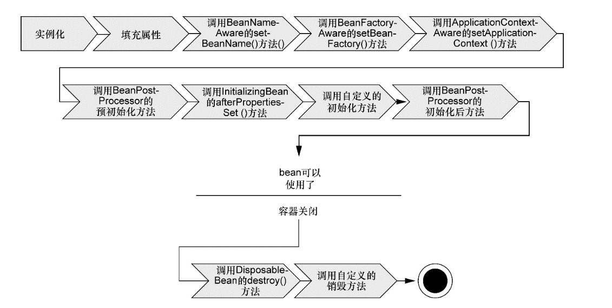
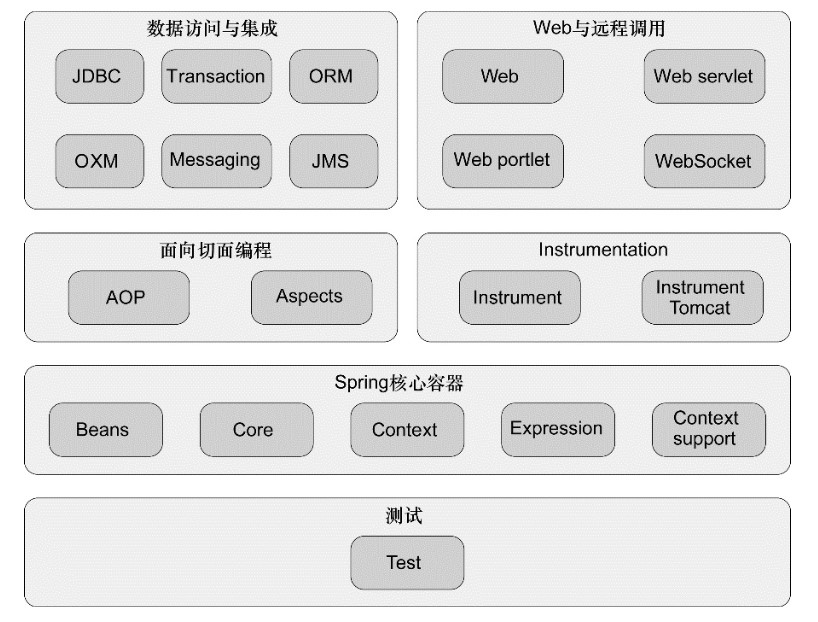

# 学习路线

- 第1部分：Spring 框架的核心知识。
 - Spring 框架的核心：**依赖注入**（dependency injection，DI）和**面向切面编程**（aspect-oriented programming，AOP）
 - 依赖注入高级装配技术
 - 使用Spring的AOP来为对象解耦那些对其提供服务的横切性关注点

- 第2部分：介绍如何使用 Spring 构建 Web 应用程序。
 - Spring MVC 的基础知识
 - 各种视图技术：JSP、Apache Tiles 以及 Thymeleaf
 - 自定义 Spring MVC 配置
 - Spring Web Flow
 - Spring Security

- 第3部分：介绍如何在应用程序的后端使用 Spring。
 - Spring 对 JDBC 的抽象实现关系型数据库中的数据持久化
 - Spring 与非关系型数据库结合使用，如 MongoDB 和 Neo4j
 - Spring 对声明式缓存的支持
 - 如何通过 AOP 将安全性应用到方法级别

- 第4部分：描述如何使用 Spring 与其他的应用和服务进行集成。
 - 如何创建与使用远程服务，包括 RMI、Hessian、Burlap 以及基于 SOAP 的服务
 - 如何创建 RESTful 服务
 - Spring 对异步消息的支持
 - 如何将 Spring 与 WebSocket 和 STOMP 结合起来，实现服务端与客户端之间的异步通信
 - 使用 Spring 发送 E-mail
 - Spring 对 Java 管理扩展（Java Management Extensions，JMX）功能的支持
 - Spring Boot

>第一部分：1-4章：Spring的核心

---
# 第一章：Spring 之旅

Spring 是一个开源框架，最早由 Rod Johnson 创建，并在《Expert One-on-One：J2EE Design andDevelopment》这本著作中进行了介绍。Spring 是为了解决企业级应用开发的复杂性而创建的，**使用Spring可以让简单的 JavaBean 实现之前只有 EJB 才能完成的事情**。但 Spring 不仅仅局限于服务器端开发，任何 Java 应用都能在简单性、可测试性和松耦合等方面从 Spring 中获益。Spring 最根本的使命：**简化Java开发**.

诞生之初，创建 Spring 的主要目的是用来替代更加重量级的企业级 Java 技术，尤其是 EJB。相对于 EJB 来说，Spring 提供了更加轻量级和简单的编程模型。它增强了简单老式 Java 对象（Plain Old Java object，POJO）的功能，使其具备了之前只有 EJB 和其他企业级 Java 规范才具有的功能。

Spring可以做很多事情，它为企业级开发提供给了丰富的功能，但是这些功能的底层都依赖于它的两个核心特性，也就是**依赖注入**（dependency injection，DI）和**面向切面编程**（aspect-oriented programming，AOP）。而关于 bean 的各种名称——虽然 Spring 用 bean 或者 JavaBean 来表示应用组件，但并不意味着 Spring 组件必须要遵循 JavaBean 规范。一个 Spring 组件可以是任何形式的 POJO。

---
## 1 简化 Java 开发

为了降低 Java 开发的复杂性，Spring 采取了以下 4 种关键策略：

- 基于 POJO 的轻量级和最小侵入性编程
- 通过依赖注入和面向接口实现松耦合
- 基于切面和惯例进行声明式编程
- 通过切面和模板减少样板式代码

### 简化 POJO

- 很多框架通过强迫应用继承它们的类或实现它们的接口从而导致应用与框架绑死
- Spring 不会强迫你实现 Spring 规范的接口或继承 Spring 规范的类
- POJO 甚至可以没有任何痕迹的应用 Spring 功能，最坏的场景是，一个类使用了 Spring 注解，但它依旧是POJO。

### 依赖注入

任何一个有实际意义的应用都会由两个或者更多的类组成，这些类相互之间进行协作来完成特定的业务逻辑。按照传统的做法，每个对象负责管理与自己相互协作的对象（即它所依赖的对象）的引用，这将会导致高度耦合和难以测试的代码。

耦合的两面性：

- 紧密耦合的代码难以测试、难以复用、难以理解，并且典型地表现出“打地鼠”式的bug特性
- 一定程度的耦合又是必须的，完全没有耦合的代码什么也做不了。为了完成有实际意义的功能，不同的类必须以适当的方式进行交互。

所以，应当小心谨慎地管理耦合，而**依赖注入会将所依赖的关系自动交给目标对象，而不是让对象自己去获取依赖**。创建应用组件之间协作的行为通常称为装配（wiring）。Spring 有多种装配 bean 的方式，比如：采用 XML 配置或采用 Java 注解。

Spring 通过应用上下文（Application Context）装载 bean 的定义并把它们组装起来。Spring 应用上下文全权负责对象的创建和组装。Spring 自带了多种应用上下文的实现，它们之间主要的区别仅仅在于如何加载配置。比如 `ClassPathXmlApplicationContext` 用于加载类路径下的 xml 文件配置。

### 应用切面

DI 能够让相互协作的软件组件保持松散耦合，而面向切面编程（aspect-orientedprogramming，AOP）允许你把遍布应用各处的功能分离出来形成可重用的组件。

面向切面编程往往被定义为促使软件系统实现关注点的分离一项技术。系统由许多不同的组件组成，每一个组件各负责一块特定功能。除了实现自身核心的功能之外，这些组件还经常承担着额外的职责。诸如日志、事务管理和安全这样的系统服务经常融入到自身具有核心业务逻辑的组件中去，这些系统服务通常被称为横切关注点，因为它们会跨越系统的多个组件。**如果将这些关注点分散到多个组件中去，你的代码将会带来双重的复杂性。**

- 实现系统关注点功能的代码将会重复出现在多个组件中。这意味着如果你要改变这些关注点的逻辑，必须修改各个模块中的相关实现。即使你把这些关注点抽象为一个独立的模块，其他模块只是调用它的方法，但方法的调用还是会重复出现在各个模块中。
- 组件会因为那些与自身核心业务无关的代码而变得混乱。一个向地址簿增加地址条目的方法应该只关注如何添加地址，而不应该关注它是不是安全的或者是否需要支持事务。

AOP 能够使这些服务模块化，并以声明的方式将它们应用到它们需要影响的组件中去。所造成的结果就是这些**组件会具有更高的内聚性并且会更加关注自身的业务**，完全不需要了解涉及系统服务所带来复杂性。总之，AOP 能够确保 POJO 的简单性。

### 使用模板消除样板式代码

你是否写过这样的代码，当编写的时候总会感觉以前曾经这么写过？我的朋友，这不是似曾相识。这是样板式的代码（boilerplate code）。通常为了实现通用的和简单的任务，你不得不一遍遍地重复编写这样的代码。它们中的很多是因为使用Java API而导致的样板式代码。样板式代码的一个常见范例是使用 JDBC 访问数据库查询数据。Spring 旨在通过模板封装来消除样板式代码。Spring 的 JdbcTemplate 使得执行数据库操作时有效的避免了传统的 JDBC 样板代码。

---
## 2 Bean 容器

在基于 Spring 的应用中，你的应用对象生存于 Spring 容器（container）中。Spring 容器负责创建对象，装配它们，配置它们并管理它们的整个生命周期，从生存到死亡（在这里，可能就是 `new` 到 `finalize()`）。

- 容器是 Spring 框架的核心。Spring 容器使用 DI 管理构成应用的组件，它会创建相互协作的组件之间的关联
- Spring 容器并不是只有一个。Spring 自带了多个容器实现，可以归为两种不同的类型
- bean 工厂（由`org.springframework. beans. factory.BeanFactory`接口定义）是最简单的容器，提供基本的 DI 支持
- 应用上下文（由`org.springframework.context.ApplicationContext`接口定义）基于 BeanFactory 构建

### 应用上下文

Spring 自带了多种类型的应用上下文。常见的如下列表：

-  `AnnotationConfigApplicationContext`：从一个或多个基于 Java 的配置类(注解)中加载 Spring 应用上下文。
-  `AnnotationConfigWebApplicationContext`：从一个或多个基于 Java 的配置类中加载 Spring Web 应用上下文。
-  `ClassPathXmlApplicationContext`：从类路径下的一个或多个 XML 配置文件中加载上下文定义。
-  `FileSystemXmlapplicationcontext`：从文件系统下的一个或多个 XML 配置文件中加载上下文定义。
-  `XmlWebApplicationContext`：从 Web 应用下的一个或多个 XML 配置文件中加载上下文定义。

应用上下文准备就绪之后，我们就可以调用上下文的 `getBean()` 方法从 Spring 容器中获取 bean。

### bean的生命周期

正确理解 Spring bean 的生命周期非常重要，因为你或许要利用 Spring 提供的扩展点来自定义 bean 的创建过程。下图展示了bean在Spring容器中从创建到销毁经历了若干阶段：

在bean准备就绪之前，bean工厂执行了若干启动步骤：

1．Spring 对 bean 进行实例化；
2．Sprin g将值和 bean 的引用注入到 bean 对应的属性中；
3．如果 bean 实现了 BeanNameAware 接口，Spring 将 bean 的 ID 传递给 `setBean-Name()` 方法；
4．如果 bean 实现了 BeanFactoryAware 接口，Sprin g将调用 `setBeanFactory()`方法，将 BeanFactory 容器实例传入；
5．如果 bean 实现了 ApplicationContextAware 接口，Spring 将调用 `setApplicationContext()` 方法，将bean所在的应用上下文的引用传入进来；
6．如果 bean 实现了 BeanPostProcessor 接口，Spring 将调用它们的 `postProcessBeforeInitialization()`方法；
7．如果 bean 实现了 InitializingBean 接口，Spring 将调用它们的 `afterPropertiesSet()`方法。类似地，如果 bean 使用 `init-method` 声明了初始化方法，该方法也会被调用；
8．如果 bean 实现了 BeanPostProcessor 接口，Spring将调用它们的 `postProcessAfterInitialization()`方法；
9．此时，bean 已经准备就绪，可以被应用程序使用了，它们将一直驻留在应用上下文中，直到该应用上下文被销毁；
10．如果 bean 实现了 DisposableBean 接口，Spring 将调用它的 `destroy()` 接口方法。同样，如果 bean 使用 `destroy-method` 声明了销毁方法，该方法也会被调用。

### Spring 组件介绍

在 Spring 框架之外还存在一个构建在核心框架之上的庞大生态圈，它将 Spring 扩展到不同的领域，例如 Web 服务、REST、移动开发以及 NoSQL。Spring 有着诸多的扩展模块，这些模块依据其所属的功能可以划分为6类不同的功能：

-  **Spring 核心容器**：容器是 Spring 框架最核心的部分，它管理着Spring 应用中 bean 的创建、配置和管理。在该模块中，包括了 Spring bean 工厂，它为 Spring提供了 DI 的功能。
- Context 模块：提供了多种 Spring 应用上下文的实现，每一种都提供了配置 Spring 的不同方式。
- 除了 bean 工厂和应用上下文，该模块也提供了许多企业服务，例如 E-mail、JNDI 访问、EJB 集成和调度。
- 其他所有的 Spring 模块都构建于核心容器之上。
-  **Spring 的 AOP模块**：在 AOP 模块中，Spring 对面向切面编程提供了丰富的支持。这个模块是 Spring 应用系统中开发切面的基础。
-  **数据访问与集成**：Spring 的 JDBC和 DAO（Data Access Object）模块抽象了数据库操作的板式代码
- Spring 提供了 ORM 模块。Spring 的 ORM 模块建立在对 DAO 的支持之上，并为多个 ORM 框架提供了一种构建 DAO 的简便方式。
- Spring 支持与许多流行的 ORM 框架进行了集成，比如：Hibernate、Java Persisternce API、Java Data Object和iBATISSQL Maps。
- Transaction：Spring 的事务管理支持所有的 ORM 框架以及 JDBC。
- Messageing：在 JMS（Java Message Service）之上构建的 Spring 抽象层，它会使用消息以异步的方式与其他应用集成。
-  **Web 与远程调用**
- Spring Web 上下文模块建立在应用程序上下文模块之上，为基于 Web 的应用程序提供了上下文。所以，Spring 框架支持与 Jakarta Struts 的集成。Web 模块还简化了处理多部分请求以及将请求参数绑定到域对象的工作。
- Spring MVC（Model-View-Controller）:MVC 框架是一个全功能的构建 Web 应用程序的 MVC 实现。通过策略接口，MVC 框架变成为高度可配置的，MVC 容纳了大量视图技术，其中包括 JSP、Velocity、Tiles、iText 和 POI。
- Spring 远程调用功能集成了 RMI（Remote Method Invocation）、Hessian、Burlap、JAX-WS
- Spring 自带远程调用框架：HTTP invoker
-  **Instrumentation**：Spring 的 Instrumentation 模块提供了为 JVM 添加代理（agent）的功能。它为 Tomcat 提供了一个织入代理，能够为Tomcat传递类文件，就像这些文件是被类加载器加载的一样。
-  **测试**：Spring 提供了测试模块以致力于 Spring 应用的测试。

### Spring Portfolio

整个 Spring Portfolio 包括多个构建于核心 Spring 框架之上的框架和类库。Spring Portfolio 几乎为每一个领域的 Java 开发都提供了 Spring 编程模型。

-  **Spring Web Flow**：Spring Web Flow 建立于 Spring MVC 框架之上，它为基于流程的会话式 Web 应用（可以想一下购物车或者向导功能）提供了支持。
-  **Spring Web Service**：Spring Web Service 提供了契约优先的 Web Service 模型，服务的实现都是为了满足服务的契约而编写的。
-  **Spring Security**：安全对于许多应用都是一个非常关键的切面。利用 Spring AOP，Spring Security 为 Spring 应用提供了声明式的安全机制。
-  **Spring Integration**：许多企业级应用都需要与其他应用进行交互。Spring Integration 提供了多种通用应用集成模式的 Spring 声明式风格实现。
-  **Spring Batch**：如果需要开发一个批处理应用，可以通过 Spring Batch，使用Spring强大的面向 POJO 的编程模型。
-  **Spring Data**：Spring Data 使得在 Spring 中使用任何数据库都变得非常容易。不管你使用文档数据库，如 MongoDB，图数据库，如 Neo4j，还是传统的关系型数据库，Spring Data 都为持久化提供了一种简单的编程模型。这包括为多种数据库类型提供了一种自动化的 Repository 机制，它负责为你创建 Repository 的实现。
-  **Spring Social**：这是 Spring 的一个社交网络扩展模块。
-  **Spring Mobile**：Spring Mobile 是 Spring MVC 新的扩展模块，用于支持移动 Web 应用开发。与 Spring Mobile 相关的是 Spring Android 项目。这个新项目，旨在通过 Spring 框架为开发基于Android设备的本地应用提供某些简单的支持。

### Spring 新特性

#### Spring 3.1 新特性

- 声明式缓存的支持：能够使用简单的注解声明缓存边界和规则
- 环境 profile 功能：借助于 profile，就能根据应用部署在什么环境之中选择不同的数据源 bean
- 新添加的用于构造器注入的 `c命名空间`：类似 `p名称空间`
- Spring 开始支持 `Servlet 3.0` ：包括在基于 Java 的配置中声明 Servlet 和 Filter
- 改善 Spring 对 JPA 的支持：使得它能够在 Spring 中完整地配置 JPA，不必再使用 `persistence.xml` 文件
- 对 Spring MVC 的功能增强
- 自动绑定路径变量到模型属性中
- 提供了 `@RequestMappingproduces` 和 consumes 属性，用于匹配请求中的 Accept 和`Content-Type`头部信息
- 提供了 `@RequestPart注解`，用于将 multipart 请求中的某些部分绑定到处理器的方法参数中
- 支持 Flash 属性（在 redirect 请求之后依然能够存活的属性）以及用于在请求间存放 flash 属性的 RedirectAttributes 类型

#### Spring 3.2 新特性

Spring MVC是 Spring 3.2 改善的核心内容：

- Spring 3.2 的控制器（Controller）可以使用 `Servlet 3.0` 的异步请求
- Spring 3.2 引入了 Spring MVC 测试框架
- Spring 3.2 包含了基于 RestTemplate 的客户端的测试支持，在测试的过程中，不需要往真正的REST端点上发送请求
-  `@ControllerAdvice` 注解能够将通用的 `@ExceptionHandler`、`@InitBinder` 和 `@ModelAttributes` 方法收集到一个类中，并应用到所有控制器上
-  `@MatrixVariable `注解，这个注解能够将请求中的矩阵变量（matrix variable）绑定到处理器的方法参数中
- 基础的抽象类` AbstractDispatcherServletInitializer` 能够非常便利地配置 DispatcherServlet，而不必再使用 web.xml
-  `AbstractAnnotationConfigDispatcherServletInitializer` 的子类，支持通过基于 Java 的方式来配置 Spring
-  `ResponseEntityExceptionHandler` 可以用来替代 DefaultHandlerExceptionResolver
- RestTemplate 和 `@RequestBody` 的参数可以支持范型
- RestTemplate 和 `@RequestMapping` 可以支持 HTTP PATCH 方法
- 在拦截器匹配时，支持使用 URL 模式将其排除在拦截器的处理功能之外

其它非 Spring MVC 新特性

-  `@Autowired`、`@Value` 和 `@Bean` 注解能够作为元注解，用于创建自定义的注入和 bean 声明注解
-  `@DateTimeFormat` 注解不再强依赖 JodaTime。如果提供了 JodaTime，就会使用它，否则的话，会使用 SimpleDateFormat
- Spring 的声明式缓存提供了对 `JCache 0.5` 的支持
- 支持定义全局的格式来解析和渲染日期与时间
- 在集成测试中，能够配置和加载 WebApplicationContext
- 在集成测试中，能够针对 request 和 session 作用域的 bean 进行测试

#### Spring 4.0 新特性

- Spring 提供了对 WebSocket 编程的支持，包括支持`JSR-356——Java API for WebSocket`
- Spring 4.0 在 WebSocket 之上提供了一个高层次的面向消息的编程模型，该模型基于 SockJS，并且包含了对 STOMP 协议的支持
- 新的消息（messaging）模块：这个消息模块支持 Spring 的 SockJS/STOMP 功能，同时提供了基于模板的方式发布消息
- 支持Java 8特性和 `JSR-310——Date与Time API`
- 为 Groovy开发的应用程序提供了更加顺畅的编程体验：Grails
- 条件化创建 bean 的功能：某些条件下才会创建 bean 实例
- 提供了 Spring RestTemplate 新的异步实现
- 添加了对多项 JavaEE 规范的支持，包括`JMS 2.0、JTA 1.2、JPA 2.1和Bean Validation 1.1`