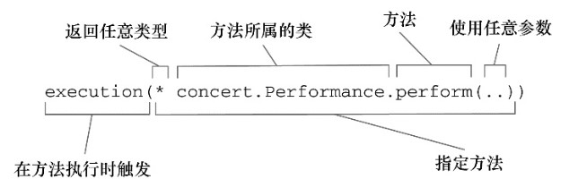

# 第四章： AOP

软件系统中有这样一些功能。这些功能需要用到应用程序的多个地方，但是我们又不想在每个点都明确调用它们。日志、安全和事务管理的确都很重要，但它们是否为应用对象主动参与的行为呢？如果让应用对象只关注于自己所针对的业务领域问题，而其他方面的问题由其他应用对象来处理，这会不会更好呢？

在软件开发中，散布于应用中多处的功能被称为横切关注点（cross-cutting concern），通常来讲，这些横切关注点从概念上是与应用的业务逻辑相分离的（但是往往会直接嵌入到应用的业务逻辑之中）。把这些横切关注点与业务逻辑相分离正是面向切面编程（AOP）所要解决的问题。

---
## 1 什么是面向切面编程

横切关注点可以被描述为影响应用多处的功能。例如，安全就是一个横切关注点，应用中的许多方法都会涉及到安全规则。切面能帮助我们模块化横切关注点。

重用通用功能最常见的面向对象技术有继承和委托，但是它们都存在一些问题：

- 继承（inheritance）：如果在整个应用中都使用相同的基类，继承往往会导致一个脆弱的对象体系
- 委托（delegation）使用委托可能需要对委托对象进行复杂的调用

使用 AOP，横切关注点可以被模块化为特殊的类，这些类被称为切面（aspect）。这样做有两个好处：

- 每个关注点都集中于一个地方，而不是分散到多处代码中
- 服务模块更简洁，因为它们只包含主要关注点（或核心功能）的代码，而次要关注点的代码被转移到切面中了

### 1.1 AOP 术语

#### 通知（Advice）

在AOP术语中，切面的工作被称为通知，通知定义了切面是什么以及何时使用。除了描述切面要完成的工作，通知还解决了何时执行这个工作的问题。它应该应用在某个方法被调用之前？之后？之前和之后都调用？还是只在方法抛出异常时调用？

Spring切面可以应用5种类型的通知：

- 前置通知（Before）：在目标方法被调用之前调用通知功能
- 后置通知（After）：在目标方法完成之后调用通知，此时不会关心方法的输出是什么
- 返回通知（After-returning）：在目标方法成功执行之后调用通知
- 异常通知（After-throwing）：在目标方法抛出异常后调用通知
- 环绕通知（Around）：通知包裹了被通知的方法，在被通知的方法调用之前和调用之后执行自定义的行为

#### 连接点（Join point）

连接点是在应用执行过程中**能够插入切面的一个点**。这个点可以是调用方法时、抛出异常时、甚至修改一个字段时。切面代码可以利用这些点插入到应用的正常流程之中，并添加新的行为。

#### 切点（Poincut）

一个切面并不需要通知应用的所有连接点。切点有助于缩小切面所通知的连接点的范围。如果说通知定义了切面的“什么”和“何时”的话，那么切点就定义了“何处”。切点的定义会匹配通知所要织入的一个或多个连接点。

#### 切面（Aspect）

切面是通知和切点的结合。通知和切点共同定义了切面的全部内容。

#### 引入（Introduction）

引入允许我们向现有的类添加新方法或属性。

#### 织入（Weaving）

织入是把切面应用到目标对象并创建新的代理对象的过程。切面在指定的连接点被织入到目标对象中。在目标对象的生命周期里有多个点可以进行织入：

- 编译期：切面在目标类编译时被织入。这种方式需要特殊的编译器。AspectJ 的织入编译器就是以这种方式织入切面的。
- 类加载期：切面在目标类加载到JVM时被织入。这种方式需要特殊的类加载器（ClassLoader），它可以在目标类被引入应用之前增强该目标类的字节码。AspectJ5 的加载时织入（load-time weaving，LTW）就支持以这种方式织入切面。
- 运行期：切面在应用运行的某个时刻被织入。一般情况下，在织入切面时，AOP 容器会为目标对象动态地创建一个代理对象。Spring AOP 就是以这种方式织入切面的。

###  1.2  Spring 对 AOP 的支持

这一节介绍的是 Spring AOP，但是需要注意的是，Spring 和 AspectJ 项目之间有大量的协作，而且 Spring 对 AOP 的支持在很多方面借鉴了 AspectJ 项目。

Spring 提供了 4 种类型的 AOP 支持：

- 基于代理的经典 Spring AOP
- 纯 POJO 切面
- `@AspectJ`注解驱动的切面
- 注入式 AspectJ 切面（适用于Spring各版本）

前三种都是 Spring AOP 实现的变体，Spring AOP 构建在动态代理基础之上，因此，**Spring 对 AOP 的支持局限于方法拦截**。

4 种类型的 AOP 支持简要介绍：

1. Spring 经典的 AOP 看起来就显得非常笨重和过于复杂，直接使用 ProxyFactory Bean 会让人感觉厌烦。
1. 借助 Spring 的 aop 命名空间，可以将纯 POJO 转换为切面，这些 POJO 只是提供了满足切点条件时所要调用的方法。这种技术需要 XML 配置，但这的确是声明式地将对象转换为切面的简便方式。
1. Spring 借鉴了 AspectJ 的切面，以提供注解驱动的 AOP。本质上，它依然是 Spring 基于代理的 AOP，但是编程模型几乎与编写成熟的 AspectJ 注解切面完全一致。这种 AOP 风格的好处在于能够不使用XML来完成功能。
1. 如果 AOP 需求超过了简单的方法调用（如构造器或属性拦截），那么需要考虑使用 AspectJ 来实现切面，即上面提到的第四种

Spring AOP框架的一些关键知识：

- Spring 通知是 Java 编写的：Spring 所创建的通知都是用标准的 Java 类编写的。这样的话，我们就可以使用与普通 Java 开发一样的集成开发环境（IDE）来开发切面
- Spring 在运行时通知对象：通过在代理类中包裹切面，Spring 在运行期把切面织入到 Spring 管理的 bean 中。代理类封装了目标类，并拦截被通知方法的调用，再把调用转发给真正的目标 bean。当代理拦截到方法调用时，在调用目标 bean 方法之前，会执行切面逻辑。
- Spring只支持方法级别的连接点

---
## 2 通过切点来选择连接点

在 Spring AOP 中，要使用 AspectJ 的切点表达式语言来定义切点。进一步了解 AspectJ 和 AspectJ 切点表达式语言可以参考《AspectJ in Action》一书，关于 Spring AOP 的 AspectJ 切点，最重要的一点就是 Spring 仅支持 AspectJ 切点指示器（pointcutdesignator）的一个子集，Spring 是基于代理的，而某些切点表达式是与基于代理的 AOP 无关的。下表列出了 Spring AOP 所支持的 AspectJ 切点指示器。

AspectJ指示器 | 描述
---|---
 `arg()` | 限制连接点匹配参数为指定类型的执行方法
 `@args()` | 限制连接点匹配参数由指定注解标注的执行方法
 `execution()` | 用于匹配是连接点的执行方法
 `this()` | 限制连接点匹配AOP代理的bean引用为指定类型的类
 `target` | 限制连接点匹配目标对象为指定类型的类
 `@target()` | 限制连接点匹配特定的执行对象，这些对象对应的类要具有指定类型的注解
 `within()` | 限制连接点匹配指定的类型
 `@within()` | 限制连接点匹配指定注解所标注的类型（当使用Spring AOP时，方法定义在由指定的注解所标注的类里）
 `@annotation` | 限定匹配带有指定注解的连接点

在 Spring 中尝试使用 AspectJ 其他指示器时，将会抛出 IllegalArgumentException 异常

### 编写切点

下面是一个示例：




### 在切点中选择 bean

除了上边列出的指示器外，Spring 还引入了一个新的 `bean()`指示器，它允许我们在切点表达式中使用 bean 的 ID 来标识 bean。bean() 使用 bean ID 或 bean 名称作为参数来限制切点只匹配特定的 bean

```
execution(* demo.Deme.doSomething()) and !bean('beanId')
```


---
## 3 使用注解创建切面

使用注解来创建切面是 AspectJ 5 所引入的关键特性。

AspectJ提供了五个注解来定义通知:

- `@After`通知方法会在目标方法返回或抛出异常后调用
- `@AfterReturning`通知方法会在目标方法返回后调用
- `@AfterThrowing`通知方法会在目标方法抛出异常后调用
- `@Around`通知方法会将目标方法封装起来
- `@Before`通知方法会在目标方法调用之前执行

其他注解：

- `@AspectJ` 用于声明一个切面
- `@Pointcut` 用于声明切点表达式

开启 AOP：

- 如果使用 JavaConfig，可以在配置类的类级别上通过使用 EnableAspectJAutoProxy 注解启用自动代理功能。
- 如果使用 XML 来装配 bean 的话，那么需要使用 Spring aop 命名空间中的 `<aop:aspectj-autoproxy>`

注意：

- 应用了`@AspectJ`的类依然是一个 POJO。我们能够像使用其他的Java类那样调用它的方法，像其他的 Java 类一样，它可以装配为 Spring 中的 bean

### 创建环绕通知

- 使用 Around 注解
- 声明 ProceedingJoinPoint 参数
- 调用 ProceedingJoinPoint 参数的 proceed() 方法

### 处理通知中的参数

切点定义中的参数与切点方法中的参数名称必须是一样的，这样才能完成从命名切点到通知方法的参数转移

### 通过注解引入新功能

利用被称为 **引入** 的 AOP 概念，切面可以为 Spring bean 添加新方法。在 Spring 中，切面只是实现了它们所包装 bean 相同接口的代理。如果除了实现这些接口，代理也能暴露新接口的话，切面所通知的 bean 看起来像是实现了新的接口，即便底层实现类并没有实现这些接口也无所谓。相关注解：`@DeclareParents`

---
## 4 在 XML 中声明切面

如果没有源码，或者不想将 AspectJ 注解放到代码之中，Spring 为切面提供了另外一种可选方案：Spring XML 配置文件中声明切面

在 Spring 的 aop 命名空间中，提供了多个元素用来在 XML 中声明切面：

AOP配置元素|用途
---|---
`<aop:advisor>` | 定义 AOP 通知器
`<aop:after>` | 定义 AOP 后置通知（不管被通知的方法是否执行成功）
`<aop:after-returning>` | 定义AOP返回通知
`<aop:after-throwing>` | 定义AOP异常通知
`<aop:around>` | 定义AOP环绕通知
`<aop:aspect>` | 定义一个切面
`<aop:aspectj-autoproxy>` | 启用 `@AspectJ` 注解驱动的切面
`<aop:before>` | 定义一个AOP前置通知
`<aop:config>` | 顶层的AOP配置元素。大多数的 `<aop:*>` 元素必须包含在 `<aop:config>` 元素内
`<aop:declare-parents>` | 以透明的方式为被通知的对象引入额外的接口
`<aop:pointcut>` | 定义一个切点


---
## 5 注入 AspectJ 切面

虽然 Spring AO P能够满足许多应用的切面需求，但是与 AspectJ 相比，Spring AOP 是一个功能比较弱的 AOP 解决方案。AspectJ 提供了 Spring AOP 所不能支持的许多类型的切点。比如使用构造器切点实现在创建对象时应用通知。

- 切面也需要注入。像其他的 bean 一样，Spring可以为 AspectJ 切面注入依赖
- 配置切面时，指定 `factory-method` 为 `aspectOf()` 方法