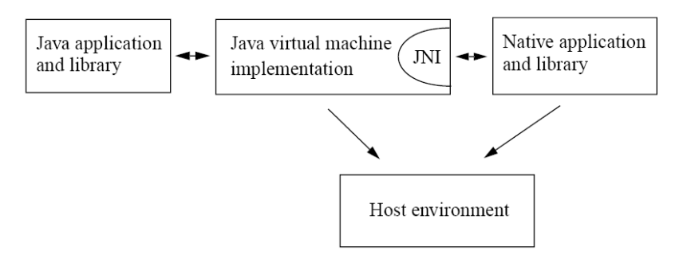
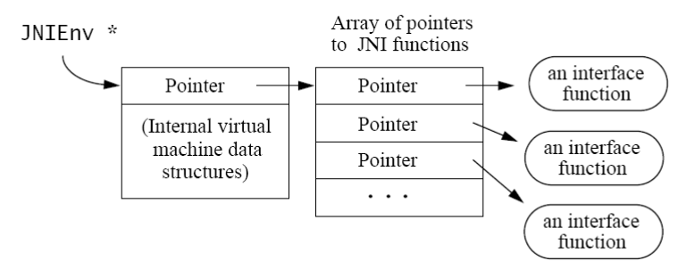

---
JNI 学习资料：

- [Oracle JNI 文档 1.5](https://docs.oracle.com/javase/1.5.0/docs/guide/jni/spec/jniTOC.html)
- [Oracle JNI 文档 1.7](https://docs.oracle.com/javase/7/docs/technotes/guides/jni/spec/jniTOC.html)
- [《The Java™ NativeInterfaceProgrammer’s Guide and Specification》](http://barbie.uta.edu/~jli/Resources/Resource%20Provisoning&Performance%20Evaluation/85.pdf)
- [IBM：Java 本机接口 (JNI)](https://www.ibm.com/support/knowledgecenter/zh/SSYKE2_8.0.0/com.ibm.java.lnx.80.doc/diag/understanding/jni.html)
- [极客学院：JNI/NDK 开发指南](http://wiki.jikexueyuan.com/project/jni-ndk-developer-guide/workflow.html)
- [IntelliJ IDEA平台下 JNI 编程](http://blog.csdn.net/huachao1001/article/details/53906237)

>笔记大量翻译自[《The Java™ NativeInterfaceProgrammer’s Guide and Specification》](http://barbie.uta.edu/~jli/Resources/Resource%20Provisoning&Performance%20Evaluation/85.pdf)

#  JNI 笔记 1

---
## 0 JNI 开发环境

### Java 命令

- `javah` 命令用于根据 class 文件生成 c 头文件
- `javap` 可以查看 java 方法的签名
- `java -Djava.library.path=. HelloWorld`，其中`java.library.path` 用于 指定 lib 位置

### windows JNI 开发环境

windows JNI开发需要工具：MinGW(64位)提供的 gcc 工具链。

>若发生`Can't load IA 32-bit .dll on a AMD 64-bit platform`错误，是因为MinGW版本错误，应该使用 64 位的。

命令：

- `gcc -c HelloC.c  -I "H:\dev_tools\java8\include" -I "H:\dev_tools\java8\include\win32"` 用于编译c代码生成 `.o` 库
- `gcc -Wl,--add-stdcall-alias -shared -o HelloC.dll HelloC.o` 用于把 `.o` 库转换成windows平台的 `dll` 库
- `gcc -Wl,--add-stdcall-alias -I "H:\dev_tools\java8\include" -I "H:\dev_tools\java8\include\win32" -shared -o helloC.dll HelloC.c` 直接生成.dll库

### IDEA 技巧

使用 ExternalTools自动生成头文件和编译c代码：`Setting-->Tool-->ExternalTools`


`-classpath $OutputPath$ -d $FileDir$ $FileClass$`


`-Wl,--add-stdcall-alias -I "$JDKPath$\include" -I "$JDKPath$\include\win32" -shared -o $FileDir$\$FileNameWithoutAllExtensions$.dll $FileDir$\$FileName$`


---
## 1 JNI 是什么

JNI(Java Native Interface)是 SUN 定义的一套标准接口，如 Dalvik, Apache Harmony 项目...等 Java 虚拟机，都会实现 JNI 接口，供本地(C/C++)应用与 Java VM 互调。 JNI 可以供 Java 代码调用本地代码，本地代码也可以调用 Java 代码。

当 Java 部署到具体的本地环境时，出于一些原因，有必要让其和本地代码进行交互：

- 一些效率敏感的代码用 C 实现
- 应用需要访问系统特性和设备，而无法通过java实现
- 需要实现的功能已经有了`c/c++`的实现，而通过java重新编写需要耗费比较大的资源
- 对敏感数据进行加密

JNI 是一套双向的接口，允许 Java 与本地代码间的互操作。而作为双向接口，JNI 支持两种类型本地代码：

- 用本地代码实现 Java 中定义的 native method 接口，使 Java 调用本地代码
- 通过 JNI 把Java VM 嵌到一个应用程序中，此时 Java 平台作为应用程序的增强，使其可以调用 Java 类库，比如，在浏览器中运行Applet。

一般我们将用 C/C++ 实现的部分代码说成`本地代码`



### 使用 JNI 前你应该考虑的因素

原则上 100% 的纯 java 代码是很好的解决方案，这样不再需要考虑跨平台的事情，但是有时候不得不借助其他的原有来完成一个工作。比如应用需要访问的系统特性或者设备通过java平台无法实现时。使用 JNI 你需要考虑的是：

- 脱离 Java 后，本地代码可移植性问题你要自己解决。
- 小心处理JNI编程中各方面问题和来自C/C++语言本身的细节性问题，处理不当，应用将崩溃。

原则：做好应用程序架构，使 `native methods` 定义在尽可能少的几个类里。

除了上面的问题，在 JNI 的开发过程中，你还可能遇到下面问题：

- 在本地代码中 new 一个 Java 对象后期望在本地代码中维护此对象的引用，如何避免被 GC 将该对象回收？
- Java 面向对象语言的封装性被破坏了，Java 类中任何方法和属性对 JNI 都是可见的，不管它是 public 的，还是 `private/protected/package`的，JNI 通过反射调用 java。
- 对 `LocalRef/GlobalRef` 管理不善，会引发Table Overflow Exception，导致应用崩溃。
- 从 JNI 调用 Java 的过程不是很直观，往往几行 Java 代码能搞定的事情，用JNI实现却要几百行。通过 JNI 的反射 API 调用 Java 确实繁琐。

在使用 JNI 前你应该考虑是否有其他可选方案，比如：

- IPC 或者通过TCP/IP网络方案
- 数据库方面，可以使用JDBC
- 使用Java的分布式对象技术: Java IDLAPI

类似 IPC 使用多进程方案的优缺点：

- Java程序与本地代码分别运行在不同的进程中. 采用进程分置最大的好处是：一个进程的崩溃，不会立即影响到另一个进程。
- 进程间的数据拷贝是低效的。
- 多进程的派生：耗时、耗资源(内存)。

某些情况下，必须让 Java 代码与本地代码运行在同一个进程中，此时必须使用 JNI。

### JNI 的演变

- JNI 1.0：实现比较混乱，甚至本地代码可以得到对象在内存中的地址。
- JNI 1.1：所有 JNI 开发者面对的是操作 Java VM 的规范 API。

---
## 2 Java 调用本地代码

Java 方法与本地方法编写规范

```c
                //ztiany.JNIMain.java中的方法
                public static native void helloC();

                //此时c文件在中的方法应该写成
                JNIEXPORT void JNICALL Java_ztiany_JNIMain_helloC(JNIEnv * env, jclass cls){
```

1. 使用完整的Java方法名:`ztiany.JNIMain.helloC`
2. 用下划线代替所有的`.`符号，并加上Java前缀:`Java_ztiany_JNIMain_helloC`
3. 如果类名含有非ASCII字母或者数字(比如`_,$`)或是大于`\u007F`的unicode字符，用`_0xxxx`来代替他们，xxxx是该字符的Unicode值的4个十六进制数序列

当然面对这样的规则，我们可以使用`javah`命名来自动生成头文件。

每个被调用的方法至少有两个参数:

- JNIEnv指针类型，env 是 jninativeinterface的指针，jninativeinterface 是指向函数指针表的指针：

- jclass 或者 jobject：第二个参数的意义取决于该方法是静态还是实例方法。当本地方法作为一个实例方法时，第二个参数相当于对象本身，即this。class表示调用此方法的类(静态方法)，jobject表示调用此方法的java对象(非静态方法)。

如果有其他的方法参数，则参数按顺序加在上面两个参数后面。总结步骤如下：

1. 编写 native 方法
2. 生成头文件
3. 实现并编译 c 代码
4. 静态代码块中使用 `System.loadLibrary` 方法加载编译好的c库(不需要加后缀名)

---
## 3 Java 与 C 数据类型对应

---
### 3.1 基本类型与宏定义

java调用c/c++需要注意不同数据类型的传递，以及在c中如何处理这些不同类型的数据并返回。

Java语言|C语言|位
---|---|---
boolean|jboolean|unsigned 8 bits
byte|jbyte|signed 8 bits
char|jchar|    unsigned 16 bits
short|jshort|signed 16 bits
int|jint|signed 32 bits
long|jlong|signed 64 bits
float|jfloat|32 bits
double|jdouble|64 bits

jvalue类型:

```
            typedef union jvalue {
                jboolean    z;
                jbyte       b;
                jchar       c;
                jshort      s;
                jint        i;
                jlong       j;
                jfloat      f;
                jdouble     d;
                jobject     l;
            } jvalue;
```

JNI 中常用的宏定义常量

- `JNIEXPORT` 和 `JNICALL` 都是宏定义，用于指定JNI函数和本地方法实现之间的调用和链接规则。必须将 `JNIEXPORT` 放在函数的返回类型之前，将 `JNICALL` 放在函数名称与返回类型之间
- `JNI_FALSE = 0` ,`JNI_TRUE = 1` 是定义jboolean类型的两个常量
- `JNI_OK` 表示 JNI 函数成功返回， `JNI_ERR` 有时用于表示错误。
- `JNI_COMMIT` 与 `JNI_ABORT` 两个常量被用于函数中，释放本地拷贝的基本类型数组。
    - JNI_COMMIT 强制要求本地数组数据拷贝至JVM中对应的数组，
    - JNI_ABORT 释放本地数组占用的内存空间，并且不作为新返回数据拷贝至JVM中对应的数组。


---
### 3.2 不透明类型：opaque references

相比基本类型，对象类型的传递要复杂很多。 Java层对象作为opaque references(指针)传递到JNI层。 Opaque references是一种C的指针类型，它指向JavaVM内部数据结构。使用这种指针的目的是：不希望JNI用户了解JavaVM内部数据结构。对Opaque reference所指结构的操作，都要通过JNI方法进行. 比如，"java.lang.String"对象，JNI层对应的类型为jstring，对该opaque reference的操作要通过JNIEnv->GetStringUTFChars进行。 一定要按这种原则编程，千万不要为了效率或容易的取到某个值，绕过JNI，直接操作opaque reference. JNI是一套完善接口，所有需求都能满足。

---
### 3.3 处理字符串类型

jni 中 jstring 对应 Java 中的 String，在 jni 中不要直接使用 jstring，而应将其转换为字符数组再使用，例如下面操作是错误的：

```c
JNIEXPORT jstring JNICALL Java_Prompt_getLine(JNIEnv* env, jobject obj, jstring prompt){
    /*错误：直接将 jstring 当作字符指针 */
    printf("%s",prompt);...
}
```

java 是 unicode 编码的，本地层则是 utf-8 编码的，jni 中有两组操作字符串的函数：

UTF-8：

- `jstring NewStringUTF(const char* bytes)`
- `jsize GetStringUTFLength(jstring string)` 得到字串长度
- `const char* GetStringUTFChars(jstring string, jboolean* isCopy)`
- `void ReleaseStringUTFChars(jstring string, const char* utf)`
- `const jchar* (*GetStringChars)(JNIEnv*, jstring, jboolean*)`
- `void  (*ReleaseStringChars)(JNIEnv*, jstring, const jchar*)`
- `void GetStringUTFRegion(jstring str, jsize start, jsize len, char* buf)`

UNICODE：

- `jstring NewString(const jchar* unicodeChars, jsize len)`
- `jsize GetStringLength(jstring string)`
- `const jchar* GetStringChars(jstring string, jboolean* isCopy)`
- `void ReleaseStringChars(jstring string, const jchar* chars)`
- `void GetStringRegion(jstring str, jsize start, jsize len, jchar* buf)`

#### 创建新的字符串

NewStringUTF 可以创建一个新的字符串，如果此时没有足够的内存，NewStringUTF 将抛 OutOfMemoryError 异常，同时返回NULL。

#### 把 jstring 转成 C/C++ 字串。

JNI支持 Unicode/UTF-8 字符编码互转。

- Unicode以16-bits值编码；
- UTF-8 是一种以字节为单位变长格式的字符编码，并与7-bitsASCII码兼容。UTF-8字串与C字串一样，以NULL('\0')做结束符。

以 UTF-8 类函为例，要读取 jstring 对象的内容，需要使用 GetStringUTFChars 函数把 jstring 转成 C/C++ 字串：

```c
jstring Java_Prompt_getLine(JNIEnv* env,jobject obj,jstring prompt){
    charbuf[128];
    constjbyte*str;
    str=(*env)->GetStringUTFChars(env,prompt,NULL);
    if(str==NULL){
        returnNULL;/*OutOfMemoryError already thrown */
    }
    printf("%s",str);
    (*env)->ReleaseStringUTFChars(env,prompt,str);
    /*We assume here that the user does not type more than* 127 characters */
    scanf("%127s",buf);
    return(*env)->NewStringUTF(env,buf);
}
```

上面代码中注意，记得检测 GetStringUTFChars 的返回值，因为调用该函数会有内存分配操作，失败后，该函数返回NULL，并抛 OutOfMemoryError 异常。GetStringUTFChars 函数返回一个指向描述字符串的**改良UTF-8**字符的指针，可以得到实际的Java字符串的字符指针，因为Java字符串是不可变的，所以不要试图将数据写入该字符数组，同时使用完后，应该调用 ReleaseStringUTFChars 释放内存（Unicode -> UTF-8转换的原因：jstring 转化时，必须先 decode 转化成 `mirror::String`，然后再转化成 utf-8 编码，这涉及到内存分配，所以使用完是需要释放的）。


#### isCopy 参数

GetStringUTFChars 和 GetStringChars都有这么一个参数，isCopy 其实是一个出参，当该值为JNI_TRUE，将返回str的一个拷贝；为JNI_FALSE将直接指向str的内容。注意：当isCopy为JNI_FALSE，不要修改返回值，不然将改变 `java.lang.String` 的不可变语义。一般会把 isCopy 设为NULL，即不关心 Java VM 对返回的指针是否直接指向 `java.lang.String` 的内容。

#### Get/RleaseStringCritica

为尽可能的避免内存分配，返回指向 `java.lang.String` 内容的指针，Java 1.2 提供了 `Get/RleaseStringCritical`，这对函数有严格的使用原则：

- 当使用这对函数时，这对函数间的代码应被当做临界区(critical region). 在该代码区，不要调用任何会阻塞当前线程和分配对象的JNI函数，如IO之类的操作。

具体参考《JNI详解》 3.5

#### GetStringRegion/GetStringUTFRegion

`GetStringRegion/GetStringUTFRegion` 用于向准备好的缓冲区赋值，即由程序员复杂申请内存，然后将 jstring 的内容拷贝到申请的内存中去，因为该函数不涉及内存操作，所以较 GetStringUTFChars 使用要简单。

```c
jstring JNIEXPORT jstring JNICALLJava_Prompt_getLine(JNIEnv*env,jobject obj,jstring prompt){
    charoutbuf[128],inbuf[128];
    intlen=(*env)->GetStringLength(env,prompt);
    (*env)->GetStringUTFRegion(env,prompt,0,len,outbuf);
    printf("%s",outbuf);
    scanf("%s",inbuf);
    return(*env)->NewStringUTF(env,inbuf);}
```

#### 如何选择

- 如果你使用JDK1.1或JDK1.2，你只能使用 `Get/ReleaseStringChars` 和 `Get/ReleaseStringUTFChars`。
- 对于小尺寸字串的操作，首选`Get/SetStringRegion`和`Get/SetStringUTFRegion`，因为栈上空间分配，开销要小的多；而且没有内存分配，就不会有 `out-of-memory exception` 。
- `GetStringCritical` 必须非常小心使用。你必须确保不分配新对象和任何阻塞系统的操作，以避免发生死锁。

---
### 3.4 访问数组元素

#### JNI 数组类型

Java 中所有的数组类型都有相对应的 C 语言类型：

Java语言|C语言
---|---
boolean[]|jbooleanArray
byte[]|jbyteArray
char[]|jcharArray
short[]|jshortArray
int[]|jintArray
long[]|jlongArray
float[]|jfloatArray
double[]|jdoubleArray
Object[]|jobjectArray

继承关系：

```
    jobject
       |---jclass                       java.lang.Class
       |---jstring                      java.lang.String
       |---jarray                       arrays
               |---jobjectArray         Object[]
               |---jbooleanArray        boolean[]
               |---jbyteArray           byte[]
               |---jcharArray           char[]
               |---jshortArray          short[]
               |---jintArray            int[]
               |---jlongArray           long[]
               |---jfloatArray          float[]
               |---jdoubleArray         double[]
```

#### 通用方法

- GetArrayLength 获取数组的长度

#### 访问基本数据类型的数组

>Xxx表示基本数据类型

创建一个基本类型数组：

- `jXxxArray (*NewXxxArray)(JNIEnv*, jsize);`创建Xxx类型数组

JNI支持SetIntArrayRegion允许重新设置数组一个区域的值，其他基本类型(boolean,short, 和float)也有对应的支持。

- `GetXxxArrayRegion` 将Java数组复制到C数组中
- `SetXxxArrayRegion` 将C数组复制到数组Java中

JNI支持通过 `Get/ReleaseXxxArrayElemetns` 返回 Java 数组的一个拷贝(实现优良的VM，会返回指向 Java 数组的一个直接的指针，并标记该内存区域，不允许被GC)。

- `jXxx* (*GetXxxArrayElements)(JNIEnv*, jXxxArray, jboolean*);` 获取指向一个数组起始元素的C指针，最后一个参数jboolean，当数组指针是指向一个副本时，会被赋值为JNI_TRUE,否则为JNI_FALSE,如果不关心这个结果，可以传入NULL，数组是否复制由函数内部处理
- `void (*ReleaseXxxArrayElements (JNIEnv*, jXxxArray,jXxx*, jint);` 通知虚拟机不再需要通过指针指向数组，另一方面GetXxxArrayElements获取的指针可能指向你一个副本，只有调用相应的ReleaseXxxArrayElements时，所做的改变才能反映到在原数组中。方法的最后一个参数 jint 表示模式：`0` 表示更新数组后释放elements缓存；`JNI_COMMIT` 表示更新数组后不释放元素；`JNI_ABORT` 表示不更新数组释放元素。（函数执行完毕还是会自动释放）。

Java 1.2支持 `Get/ReleasePrimitiveArrayCritical`，该套函数的使用原则与上述String部分相同。

#### 访问对象数组

对于对象数组的访问，使用Get/SetObjectArrayElement，对象数组只提供针对数组的每个元素的Get/Set，不提供类似Region的区域性操作。

- NewObjectArray 创建对象数组
- GetObjectArrayElement 访问对象数组的元素
- SetObjectArrayElement 访问对象数组的元素

#### NIO


- `jobject NewDirectByteBuffer(void* address, jlong capacity)`
- `void* GetDirectBufferAddress(jobject buf)`
- `jlong GetDirectBufferCapacity(jobject buf)`


---
## 4 从本地代码调用 Java


JNI 中针对静态和非静态成分分别定义不同的操作方法，所以在反射时类时，先区分是否是静态成分。另外 Java层的字段和方法，不管它是什么访问权限，从 JNI 都可以访问到，可以说 Java 面向语言的封装性在 JNI 层不见了。

### 4.1 类签名、方法签名

想要在 JNI 中正确地访问 Java 中，必须掌握类签名、方法签名。

- 类签名：签名的作用是为了准确描述一件事物。
- 方法签名（也叫方法描述符）：是一种用参数个数和类型区分同名方法的手段，即解决方法重载问题。

Java 中的类型对于的描述符如下：

描述符 | java类型
---|---
Z | boolean
B | byte
C | char
S | short
I | int
J | long
F | float
D | double
`[` | 表示数组
`Lfully-qualified-class` | 全限定符类
`( arg-types ) ret-type` | 方法类型

可以使用 `javap -s -p classname` 查看方法和字段签名

示例：

```
            字段：
            "Ljava/lang/String;" 对应 String
            "[I" 对应 int[]
            "[Ljava/lang/Object;" 对应 Object[]

            方法：
            "()Ljava/lang/String;" 对应 String f();
            "(ILjava/lang/Class;)J" 对应 long f(int i, Class c);
            "([B)V" 对应 String(byte[] bytes);
            "<init>" 构造方法的方法名
```

要特别注意的是：

1. 类描述符开头的'L'与结尾的';'必须要有
2. 数组描述符，开头的`'['`必须有`.`
3. 方法描述符规则:`"(各参数描述符)返回值描述符"`，其中参数描述符间没有任何分隔符号

### 4.2 获取 class

一般 jni 中获取一个 jclass，我们会这样编码：

```
jclass intArrCls = (*env)->FindClass(env,"[I");
if(intArrCls == NULL){
    returnNULL;/*exception thrown */
}
```

对 FindClass 的返回结果进行判空是有必要的，FindClass返回NULL的原因有：

- 提供了错误的类描述符
- 无法在当前ClassLoader上下文中找到类

一般的解决方式是:

- 检查类描述符是否正确，注意包分隔符是`/`而不是`.`
- 构造 ClassLoader，并利用 `Class.forName(String name, boolean initialize,ClassLoader loader)` 装载类


### 4.3 访问字段和方法

Java语言支持两种成员：静态成员和实例成员. 对应 JNI 中获取和赋值成员的方法是不同的。

- 通过 JNI 方法访问对象的成员，JNI对应的函数命名非常有规律，即 `Get/Set<ReturnValue Type>Field`。
- 从 JNI 调用实例方法命名规则：`Call<Return Value Type>Method`
- 调用父类中的方法：如果一个方法被定义在父类中，但是在子类中覆盖覆盖了该方法，也可以通过子类对象调用父类中的这个实例方法。JNI 提供了一系列函数 `CallNonvirtualXXXMethod` 来支持调用各种返回值类型的实例方法。

示例：

```
(*env)->GetFieldID(env,cls,"s","Ljava/lang/String;"); 获取一个字段id
(*env)->GetStaticFieldID(env,cls,"si","I"); 获取一个静态字段id
(*env)->GetMethodID(env,cls,"callback","()V"); 获取一个方法id
(*env)->GetMethodID(env,stringClass,"<init>","([C)V"); 获取一个构造函数的id
```


### 4.4 缓存 Field 和 Method 的 id

为了获取Field and Method 的 id，我们需要做基于名称和签名的符号表查询，对于需要频繁用到的引用，可以缓存以优化性能，即缓存已经查找到的 Field and Method 的 id，下次直接使用。

#### 方式1：局部 static 方式

```c
JNIEXPORT void JNICALLJava_InstanceFieldAccess_accessField(JNIEnv*env,jobject obj){
    static jfieldID fid_s = NULL;/*用于缓存 jfieldID*/
    ...
    if(fid_s == NULL){
        fid_s=(*env)->GetFieldID(env,cls,"s","Ljava/lang/String;");
        if(fid_s==NULL){
            return;/*异常已经抛出*/
        }
    }
    ...
}
```

静态变量 fid_s 用于缓存 jfieldID，这里存在一个竞争条件，当多个线程同时访问此函数时，可能会同时计算一个field ID，不过这个竞争是无害的，因为即使在多个线程中同时计算该 fieldID，各线程中的计算结果都是一样的。

#### 方式2：在初始化类时，同时初始化 JNI 层对该类成员的缓存

此处使用全局缓存

Java中：

```java
class InstanceMethodCall{
    private static native void initIDs();
    ...
    static{
        System.loadLibrary("InstanceMethodCall");
        initIDs();
    }
}
```
Jni中：

```c
jmethodID MID_InstanceMethodCall_callback;
JNIEXPORT void JNICALLJava_InstanceMethodCall_initIDs(JNIEnv*env, jclass cls){
    MID_InstanceMethodCall_callback = (*env)->GetMethodID(env,cls,"callback","()V");
}
```

方式1 与方式2 对比，在对 Java 源码无改动权时使用时缓存是一种合理的解决方案，但有许多弊端：

- 无害的竞争条件和重复与NULL比较
- 在类没被卸载时，MethodID 和 FieldID一直有效. 所以你必须保证：当你的JNI代码依赖这些缓存值的声明周期内，该类不会被卸载。而与另一种优化策略，连同类的初始化缓存Method/Field ID，每当类再次被装载，缓存值会被更新，所以，有条件的话，更安全的优化策略是`连同类的初始化缓存Method/Field ID`。


### 4.4 性能考量

- 执行一个 Java/native 调用要比 Java/Java 调用慢 2-3 倍. 也可能有一些 VM 实现，Java/native 调用性能与 Java/Java 相当。
- native/Java 调用效率可能与 Java/Java 有10倍的差距，因为 VM 一般不会做 Callback 的优化。
- 于 field 的访问，将没什么不同，只是通过 JNI 访问某对象结构中某个位置的值。
