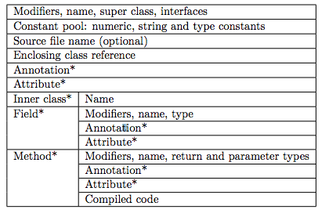

# ASM

---
## 1 ASM 介绍

ASM 和 javassist 类似，都是 Java 字节码操作类库，ASM是一个通用的Java字节码操作和分析框架。它可以用来修改现有的类或直接以二进制形式动态生成类。ASM提供了一些常用的字节码转换和分析算法，从中可以构建自定义的复杂转换和代码分析工具。ASM提供与其他Java字节码框架相似的功能，但它更专注于性能。因为它的设计和实施尽可能地小和尽可能快，它非常适合在动态系统中使用（但当然也可以静态方式使用，例如在编译器中）。

ASM被用于许多项目，包括：

- OpenJDK
- Groovy编译器和Kotlin编译器
- Cobertura和Jacoco
- CGLIB，动态生成代理类
- Mockito和EasyMock
- Gradle


<br><br>在项目中集成 ASM：

```groovy
    compile 'org.ow2.asm:asm:5.1'
    compile 'org.ow2.asm:asm-commons:5.1'
    compile 'org.ow2.asm:asm-util:5.1'
```

---
## 2 类的结构简介

>对于 ASM 来说，Java class 被描述为一棵树；使用 “Visitor” 模式遍历整个二进制结构；事件驱动的处理方式使得用户只需要关注于对其编程有意义的部分，而不必了解 Java 类文件格式的所有细节：ASM 框架提供了默认的 “response taker” 处理这一切。

### 字节码文件

为了更好的使用 ASM API，需要对类的结构有一个基本的掌握，字节码中包括：

- 类的作用域（例如 public 或 private），名字，父类，接口和注解。
- 类中的每一个变量。包括每一个变量的作用域，名称，类型和注解。
- 类中的每一个方法和构造函数。每一个部分包括作用域，名称，返回值，参数和注解。并且也包括方法编译后的字节码。

字节码与类文件的不同：

- 一个字节码文件仅描述一个类
- 字节码文件并不包含注释
- 字节码不包含 package 和 import 的部分，所以所有的类型引用名称都要用完整的名称。
- 字节码中包含常量池。常量池是一个包括所有这个类中的numeric，string或者其他类型的常量的array。这些常量仅仅被定义一次，并且被类的全局持有引用。



### 内部名称

类型在字节码中用内部名称表示。内部名称就是一个类的标准名称，点会被替换为斜杠。比如 String 会被替换为`java/lang/String`。

类型描述符，用于描述变量的类型：


方法描述符，用于描述方法的类型：


>关于类文件结构可以参考《深入理解Java虚拟机》

---
## 2 ASM 核心 API


### 2.1 核心组件介绍

---
#### ClassReader

`ClassReader` 用于从字节数组或由 class 文件间接读取类的字节码数据，通过调用它的 `accept`方法，传入一个实现了 `ClassVisitor` 接口的对象实例作为参数，以访问者的模式来访问类结构的每一个部分。`ClassReader` 会将相应区域的内容对象传递给 ClassVistor 实例中相应的 visitXXX 方法，ClassReader 可以看作是一个事件生产者。**ClassReader 用来解析类，如果仅仅是查看类的结构，只需要使用 ClassReader即可。**

---
#### ClassVisitor

ASM API 构造和处理字节码基于 `ClassVisitor` 抽象类，ClassVisitor 类中的每一个方法都对应字节码中的一个结构。`ClassVisitor` 是类结构的访问者抽象，它定义了不同的 visit 方法，开发者可以通过实现这些方法来访问类的特定部分。`ClassVisitor`会产生一些**子过程**，比如 `visitMethod`会返回一个实现 `MethordVisitor`接口的实例，`visitField`会返回一个实现 `FieldVisitor`接口的实例，完成子过程后控制返回到父过程，继续访问下一节点。

ClassVisitor 定义：

```java
//按照class文件格式，按次序访问类文件每一部分
public abstract class ClassVisitor {

    public ClassVisitor(int api);
    public ClassVisitor(int api, ClassVisitor cv);

    //访问开始
    public void visit(int version, int access, String name,String signature, String superName, String[] interfaces);

    public void visitSource(String source, String debug);
    public void visitOuterClass(String owner, String name, String desc);
    public void visitAttribute(Attribute attr);
    public void visitInnerClass(String name, String outerName,String innerName, int access);

    //返回 FieldVisitor 继续子过程
    public FieldVisitor visitField(int access, String name, String desc,String signature, Object value);
    //返回 MethodVisitor 继续子过程
    public MethodVisitor visitMethod(int access, String name, String desc,String signature, String[] exceptions);
    //返回 AnnotationVisitor 继续子过程
    public AnnotationVisitor visitAnnotation(String desc, boolean visible);

    //整个过程结束
    void visitEnd();
}
```

- ClassVisitor
 - AnnotationVisitor
 - FieldVisitor
 - MethodVisitor

**不管是 ClassVisitor 还是其他的 Visitor，最终都以一个 `visitEnd()` 方法结束该部分的访问**

---
#### ClassWriter

`ClassWriter` 继承自 `ClassVistor` 抽象类，负责将对象化的 class 文件内容重构成一个二进制格式的 class 字节码文件，`ClassWriter` 可以看作是一个事件消费者。继承自 `ClassVistor` 抽象类的自定义类负责 class 文件各个区域内容的修改和生成，它可以看作是一个事件过滤器，一次生产消费过程中这样的事件过滤器可以有`N个（0<=N）`。

**ClassWriter 提供了字节码的改写功能，用来编译修改好的字节码。它生产了一个包含了编译好的类的二进制的数组，ClassWriter可以单独使用，用来构造出一个全新的类**

---
#### 调用流程

ClassVisitor中方法的顺序必须按照顺序调用，Java文档中规定：

```
visit visitSource? visitOuterClass? ( visitAnnotation | visitAttribute )* ( visitInnerClass | visitField | visitMethod )* visitEnd
```

- visit 方法会被最先调用
- 然后多数情况会调用 visitSource
- 然后多数情况会调用 visitOuterClass
- 然后调用任意数量的 visitAnnotation 和 visitAttribute 方法
- 然后调用任意数量的 visitInnerClass，visitField 和 visitMethod 方法
- 最后会调用一次 visitEnd 方法

ASM 基于ClassVisitor API提供了三种核心组件去构造和更改字节码：

- ClassReader 会将字节码转化为一个 byte 数组，它是事件的生产者，可以把使用 push 给 ClassVisitor。
- ClassWriter 是 ClassVisitor 抽象类的子类，用来编译修改好的字节码。它生产了一个包含了编译好的类的二进制的数组，可以用 toByteArray 方法获取。ClassWriter 是事件的消费者。
- ClassVisitor 代理了所有来自其它 ClassVisitor 实例的方法调用，ClassVisitor是事件过滤器


### 2.2 示例

只了解 API 是非常抽象的，通过示例可以很好的掌握 ASM 的基本用法。（推荐配合使用 `jdk instrumentation` 调试）

#### 解析一个类

解析一个类可以理解为遍历一个类的结构，而不去修改该类，此时只需要使用 ClassReader 和 ClassVisitor即可。下面代码演示通过 ClassVisitor 打印一个类的结构：

```java
/**
 * 类的解析过程：遍历一个类的结构
 */
public class ClassPrinter extends ClassVisitor {

    //程序入口
    public static void main(String... args) throws IOException {
        ClassPrinter cp = new ClassPrinter();
        ClassReader cr = new ClassReader("java.lang.Runnable");
        cr.accept(cp, 0);
    }

    private ClassPrinter() {
        super(Opcodes.ASM5);
    }

    public void visit(int version, int access, String name, String signature, String superName, String[] interfaces) {
        System.out.println(name + " extends " + superName + " {");
    }

    public void visitSource(String source, String debug) {
    }

    public void visitOuterClass(String owner, String name, String desc) {
    }

    public AnnotationVisitor visitAnnotation(String desc, boolean visible) {
        return null;
    }

    public void visitAttribute(Attribute attr) {
    }

    public void visitInnerClass(String name, String outerName, String innerName, int access) {
    }

    public FieldVisitor visitField(int access, String name, String desc, String signature, Object value) {
        System.out.println("    " + desc + " " + name);
        return null;
    }

    public MethodVisitor visitMethod(int access, String name, String desc, String signature, String[] exceptions) {
        System.out.println(" " + name + desc);
        return null;
    }

    public void visitEnd() {
        System.out.println("}");
    }

}
```

最终的执行结果为：

```
java/lang/Runnable extends java/lang/Object {
 run()V
}
```

#### 创建一个类

构造一个类，只需要用到 ClassWriter，通过调用不同的 visitXXX 方法来创建类的各个部分，下面代码创建一个接口：

```java
package pkg;
public interface Comparable  {
    int LESS = -1;
    int EQUAL = 0;
    int GREATER = 1;
    int compareTo(Object o);
}
```

然后通过一个自定义的类加载器来加载这个类的字节码：

```java
/**
 * 类的创建：构建一个新的类
 */
public class AsmCreateClass {

    public static void main(String... args) throws ClassNotFoundException {

        final byte[] aClass = createClass();

        Class exampleClass = new ClassLoader() {
            @SuppressWarnings("unchecked")
            protected Class findClass(String name) {
                return defineClass(name, aClass, 0, aClass.length);
            }
        }.loadClass("pkg.Comparable");

        System.out.println(exampleClass);
    }

    private static byte[] createClass() {

        ClassWriter cw = new ClassWriter(0);

        //类的声明，V1_5表示java字节码的版本
        cw.visit(V1_5, ACC_PUBLIC + ACC_ABSTRACT + ACC_INTERFACE,
                "pkg/Comparable",
                null,
                "java/lang/Object",
                null);

        //创建字段，每一个部分都是一个子过程，所以也对于这一个visitEnd方法
        cw.visitField(ACC_PUBLIC + ACC_FINAL + ACC_STATIC, "LESS", "I",
                null, -1).visitEnd();
        cw.visitField(ACC_PUBLIC + ACC_FINAL + ACC_STATIC, "EQUAL", "I",
                null, 0).visitEnd();
        cw.visitField(ACC_PUBLIC + ACC_FINAL + ACC_STATIC, "GREATER", "I",
                null, 1).visitEnd();

        //创建方法
        cw.visitMethod(ACC_PUBLIC + ACC_ABSTRACT, "compareTo",
                "(Ljava/lang/Object;)I", null, null).visitEnd();

        //创建结束
        cw.visitEnd();
    
        //返回字节码
        return cw.toByteArray();
    }
    
}
```

#### 修改现有的类

修改现有的类包括：

- 修改类或字段的名称
- 添加/删除字段
- 添加/删除方法

一般 ClassReader 作为事件事件源，解析一个类的每一个部分，一个或多个 ClassVisitor(以及其子过程) 构成一个链条，以访问者模式去遍历类的每一个部分，这个过程可以有过滤(删除类的某一个部分)、转换(修改类的某一个部分)、添加(添加新的部分)，最后 ClassWriter 作为链条的最后一部分，把修改好的类重新组合编程成字节码，通过其 `toByteArray()`方法获取。下面代码演示了这个链条的组成：

```java
byte[] b1 = ...;//某一个类的原始字节码

ClassWriter cw = new ClassWriter(0);//事件消费者

// cv forwards all events to cw
ClassVisitor cv = new ClassVisitor(ASM4, cw) { };//事件的处理：过滤、修改、新增

ClassReader cr = new ClassReader(b1);//事件消费者

cr.accept(cv, 0);//调用过程

byte[] b2 = cw.toByteArray(); //处理完成，返回新的字节码
```

**可以看到 ClassWriter 本身就支持责任链设计，其构造函数接收一个ClassWriter，作为其访问到事件的下一个访问者**。要明确一点，修改的类只由 ClassWriter 生成，ClassWriter 最终收到了什么样的类信息，就会生成什么样的类，ClassWriter 处理访问链的最后端，那么它签名的 ClassVisitor 可以对访问信息做各种过滤或修改。

- 修改类的信息：在把事件转发到下一个访问者时，修改传给下一个访问者的参数
- 移除类的成员：在把事件转发到下一个访问者时，过滤某些类结构(方法或字段等)，这样 ClassWriter 就收不到这部分结构的信息，就不会把它写入到新的类中
- 添加类的成员：一般选择在visitEnd函数中添加变量，这总会添加成功，这个方法总会被调用，切总被调用一次

下面演示如何创建一个 ClassVisitor 用来给类添加字段：

```java
public class AddFieldAdapter extends ClassVisitor {

    private int fAcc;
    private String fName; //字段名称
    private String fDesc; //字段类型
    private boolean isFieldPresent;

    public AddFieldAdapter(ClassVisitor cv, int fAcc, String fName, String fDesc) {
        super(ASM5, cv);
        this.fAcc = fAcc;
        this.fName = fName;
        this.fDesc = fDesc;
    }

    @Override
    public FieldVisitor visitField(int access, String name, String desc, String signature, Object value) {
        if (name.equals(fName)) {
            isFieldPresent = true;
        }
        return cv.visitField(access, name, desc, signature, value);
    }

    //对于每一个类的遍历visitEnd方法只会被调用一次
    @Override
    public void visitEnd() {
        // 不存在这个字段就添加这个字段
        if (!isFieldPresent) {
            FieldVisitor fv = cv.visitField(fAcc, fName, fDesc, null, null);
            if (fv != null) {
                fv.visitEnd();
            }
        }
        cv.visitEnd();
    }
}
```

---
### 2.3 工具类

除了 ClassVisitor 和 ClassReader 等组件，ASM在 `org.objectweb.asm.util` 包中提供了很多在开发时提供帮助的工具去初始化和适配一个类。

---
#### Type

ASM API 公开了存储在字节码中的类型，即内部名称和类型描述符。而没有使用更加接近源码的方式去暴露它们，让它们有更好的可读性。在使用 ASM 时我们需要使用 Java 类型的内部名称，不过 ASM 提供了 Type 类来帮助我们做转换。

一个Type对象代表一个Java 类型，它可以从一个类型描述符或者一个 Class 对象构建获得。Type 类也包含静态的表示原始类型的常量。例如Type.INT_TYPE是表示int类型的对象。

- **getInternalName**：方法返回了一个 Type 的内部名称。例如，`Type.getType(String.class).getInternalName()` 提供了 String 类的内部名称，即`java/lang/String`。
- **getDescriptor**：返回了 Type 的描述符。所以，可以用 `Type.getType(String.class).getDescriptor()`来替代 `Ljava/lang/String;`，可以用 `Type.INT_TYPE.getDescriptor()` 代替`I`

Type 对象也可以表示一个方法类型。一个 Type 对象可以从一个方法描述符或者一个 Method 对象构建获得。

- **getDescriptor**：返回方法描述符的类型。
- **getArgumentTypes**：获取参数类型，例如 `Type.getArgumentTypes(“(I)V”)` 返回的是 Type.INT_TYPE
- **getReturnType**：获取返回值类型，例如 `Type.getReturnType(“(I)V”)` 返回的是 Type.VOID_TYPE

---
#### TraceClassVisitor

TraceClassVisitor 可以检查一个构建和转换的类是否符合你的期望，TraceClassVisitor 可以将字节码转换为文字表示：

```java
ClassWriter cw = new ClassWriter(0);
PrintWriter printWriter = new PrintWriter(System.out);
TraceClassVisitor cv = new TraceClassVisitor(cw, printWriter);
cv.visit(...);
...
cw.toByteArray();
```

---
#### CheckClassAdapter

ClassWriter 类并不能检查一个方法是否用正确的顺序和参数被调用，因此，可能会因为初始化一个错误的类从而被Java虚拟机验证拒绝，为了避免这些错误。可以使用 CheckClassAdaoter 类。TraceClassVisitor 也继承自 ClasVisitor，并且分发所有的请求给另一个 ClassVisitor 实例。这个类的作用是在分发给下一个 visitor 之前检查方法调用顺序和参数，如果出错就会抛出 IllegalStateException 或者 IllegalArgumentException异常。

```java
//为了检查一个类，打印这个类，最后获取这个类的byte数组
ClassWriter cw = new ClassWriter(0);
PrintWriter printWriter = new PrintWriter(System.out);
TraceClassVisitor tcv = new TraceClassVisitor(cw, printWriter);
CheckClassAdapter cv = new CheckClassAdapter(tcv);
cv.visit(...);
...
cv.visitEnd();
byte b[] = cw.toByteArray();

//或者把检测流程放到最后
ClassWriter cw = new ClassWriter(0);
CheckClassAdapter cca = new CheckClassAdapter(cw);
TraceClassVisitor cv = new TraceClassVisitor(cca, printWriter);
```

---
#### ASMifier

通过 ASMifier 可以获取一个已存在的类的 ASM 代码。ASMifier类可以使用下面的命令行来调用：

```
java -classpath asm.jar:asm-util.jar \
  org.objectweb.asm.util.ASMifier \
  java.lang.Runnable
```

之后会产生出下面的代码：

```java
package asm.java.lang;
import org.objectweb.asm.*;

public class RunnableDump implements Opcodes {

    public static byte[] dump() throws Exception {
        ClassWriter cw = new ClassWriter(0);
        FieldVisitor fv;
        MethodVisitor mv;
        AnnotationVisitor av0;
        cw.visit(V1_5, ACC_PUBLIC + ACC_ABSTRACT + ACC_INTERFACE,
            "java/lang/Runnable", null, "java/lang/Object", null); 
        {
            mv = cw.visitMethod(ACC_PUBLIC + ACC_ABSTRACT, "run", "()V", null, null);
            mv.visitEnd();
        }
        cw.visitEnd();
        return cw.toByteArray();
    }

}
```

---
## 3 深入字节码指令与 ASM API

### 3.1 字节码指令

想要很好的理解和使用 ASM 的相关API，必须对Java字节码指令有一定的了解， ASM 操作类的 API 是完全基于 字节码指令设计的。关于字节码指令可以参考各个版本《深入理解Java虚拟机》的第六、七章。

### 3.2 ClassVisitor 接口

ClassVisitor 主要负责访问类成员信息。其中包括（标记在类上的注解，类的构造方法，类的字段，类的方法，静态代码块），ClassVisitor 中每个方法都对应类的一个结构：

```
  class————ClassVisitor
    |-->Annotation————AnnotationVisitor
    |
    |-->Field————FieldVisitor
    |
    |-->Method————MethodVisitor
```

ClassReader 在读取 `.class` 文件内容时会按照顺序进行调用：

- class
- Field
- Method
- AnnotationVisitor

ClassVisitor 方法解析：

```java
visit(int , int , String , String , String , String[])：当扫描类时第一个调用的方法，主要访问用于类声明。参数说明列表：类版本、修饰符、类名泛型信息、继承的父类、实现的接口

visitAnnotation(String , boolean)：当扫描器扫描到类注解声明时进行调用，参数列表：注解类型、注解是否可以在 JVM 中可见

visitField(int , String , String , String , Object)：当扫描器扫描到类中字段时进行调用，参数列表：修饰符 、 字段名、字段类型、泛型描述、默认值

visitMethod(int , String , String , String , String[])：当扫描器扫描到类的方法时进行调用。参数列表：修饰符 、方法名 、方法签名、泛型信息 、抛出的异常
```

### MethodVisitor

与 ClassVisitor 相比，MethodVisitor 显得比较复杂，MethodVisitor 中每个方法都对应字节码指令，如果需要查看一个类的字节码指令，可以使用 Javap 命令反编译，下面是 MethodVisitor 的方法列表。


---
## 4 Tree API

todo


---
## 5 使用插件

使用 IDEA 插件可以帮助我们快速的生成 ASM 代码，下面两个都是可以使用的插件：

- ASM ByteCode Outline 2017
- ASM ByteCode Viewer

---
## 引用

- [ASM 主页](http://asm.ow2.io/index.html)
- [AOP 的利器：ASM 3.0 介绍](https://www.ibm.com/developerworks/cn/java/j-lo-asm30/index.html)
- [使用ASM Core API修改类](https://smallsoho.com/android/2017/08/07/%E8%AF%91-%E4%BD%BF%E7%94%A8ASM-Core-API%E4%BF%AE%E6%94%B9%E7%B1%BB/)
- [深入字节码 -- 使用 ASM 实现 AOP](https://my.oschina.net/u/1166271/blog/162796)
- [ASM-clickdebounce](https://github.com/SmartDengg/asm-clickdebounce)
