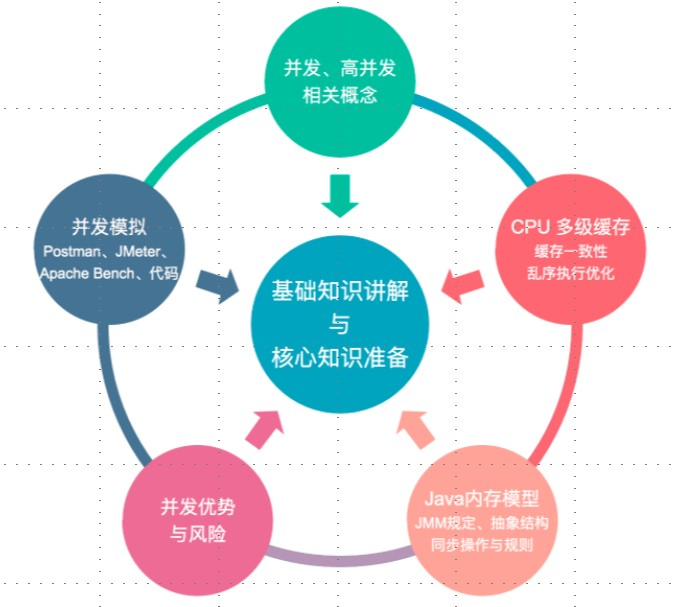
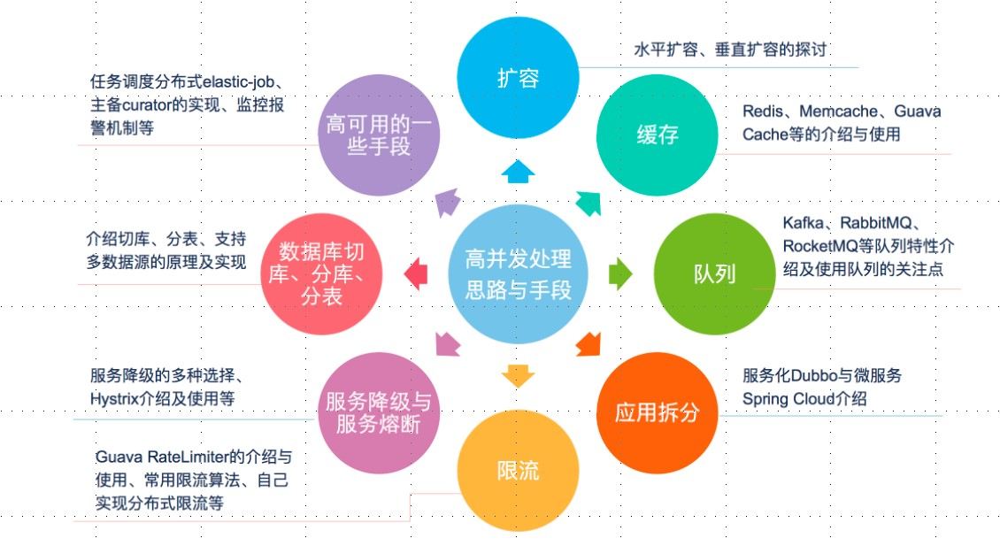

# 并发与高并发概念

---
## 1 概念

- **并发**：同时拥有两个或者多个线程，如果程序在单核处理器上运行，多个线程交替得换入或者换出内存，这些线程是同时“存在”的，每个线程都处于执行过程中的某个状态，如果运行在多核处理器上，此时，程序中的每个线程都将分配到一个处理器核上，因此可以同时运行
- **高并发**：高并发（High Concurrency）是互联网分布式系统架构设计中必须考虑的因素之一，通常是指，通过设计保证系统能够`同时并行处理`很多请求

并发与高并发不是同一个概念：

- 谈并发时：是指多个线程操作相同的资源，保证线程安全，合理利用资源
- 谈高并发时：是指服务能同时处理很多请求提高程序性能（如果高并发处理不好，不光会导致用户体验不好，还可能会使服务器宕机，出现OOM等）

---
## 2 并发知识架构

---
## 3 Java 并发基础知识点

---
## 4 Java WEB 开发高并发方案

