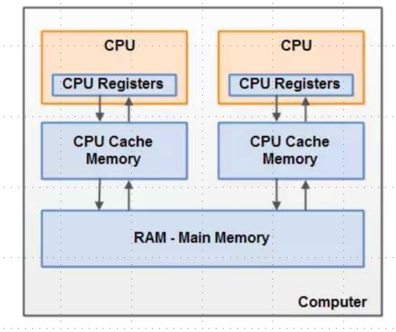
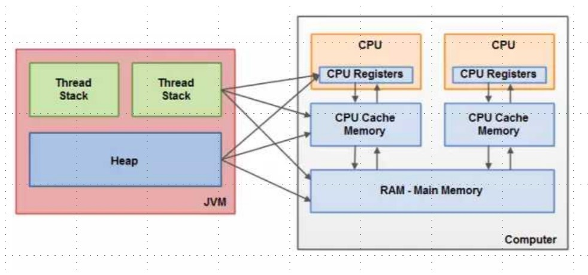

# 并发基础

---
## 1 CPU多级缓存-缓存一致性

---
## 2 CPU 多级缓存-乱序执行优化

参考下图

- 左侧为最简单的高速缓存的配置，数据的读取和存储都经过高速缓存，CPU核心与高速缓存有一条特殊的快速通道(内存总线)；主存与高速缓存都连在系统总线上（BUS）这条总线还用于其他组件的通信。
- 在高速缓存出现后不久，系统变得越来越复杂，出现了一级缓存、二级缓存、三级缓存，数字越大，空间更大，但是访问越慢，高速缓存与主存之间的速度差异被拉大。

**为什么需要 CPU cache：**

- CPU的频率太快了，快到主存跟不上，这样在处理器时钟周期内，CPU常常需要等待主存，浪费资源，所以cache的出现，是为了缓解CPU和内存之间速度的不匹配问题（结构：cpu->cache->memort）

**CPU cache 有什么意义：**

1. 时间局部性：如果某个数据被访问，那么在不久的将来他很可能被再次访问
2. 空间局部性：如果某个数据被访问，那么与他相邻的数据很快也可能被访问
3. 所以使用缓存做一定预读优化，可以提高 CPU 的运行效率

### 缓存一致性（MESI）

MESI 用于保证多个 CPU cache 之间缓存共享数据的一致。MESI 的含义为：

- **M**: Modified 修改，指的是该缓存行只被缓存在该 CPU 的缓存中，并且是被修改过的，因此它与主存中的数据是不一致的，该缓存行中的数据需要在未来的某个时间点（允许其他 CPU 读取主存相应中的内容之前）写回主存，然后状态变成 E（独享）
- **E**：Exclusive 独享，缓存行只被缓存在该 CPU 的缓存中，是未被修改过的，与主存的数据是一致的，可以在任何时刻当有其他 CPU 读取该内存时，变成S（共享）状态，当 CPU 修改该缓存行的内容时，变成 M（被修改）的状态
- **S**：Share 共享，意味着该缓存行可能会被多个 CPU 进行缓存，并且该缓存中的数据与主存数据是一致的，当有一个 CPU 修改该缓存行时，其他 CPU 的该缓存是可以被作废的，将变成I(无效的)
- **I**：Invalid 无效的，代表这个缓存是无效的，可能是有其他 CPU 修改了该缓存行

各种状态转换图：

缓存的四种操作：

- local read：读本地缓存的数据
- local write：将数据写到本地缓存里面
- remote read：将内（主）存中的数据读取到缓存中来
- remote write：将缓存中的数据写会到主存里面

在一个典型的多核系统中，每一个核都会有自己的缓存来共享主存总线，每一个CPU会发出读写（I/O）请求，而缓存的目的是为了减少CPU读写共享主存的次数。关于缓存一致性可以参考[缓存一致性（Cache Coherency）入门](http://www.infoq.com/cn/articles/cache-coherency-primer)

### 乱序优化（重排序）

处理器为提高运算速度而做出违背代码原有顺序的优化，导致的问题，如果不做任何处理，在多核的情况下CPU运行的实际结果可能和逻辑运行结果大不相同。

---
## 3 Java 内存模型

为了屏蔽掉各种硬件和操作系统的内存访问差异以实现让 java 程序在各种平台下都能达到一致的并发效果，JVM 规范中定义了 JMM，JMM也是一种规范。JMM 的规范了以下内容：

1. 规定了一个线程如何以及何时可以看到其他线程修改过后的共享变量的值
2. 规范了如何以及何时同步的访问共享变量

### Java 内存划分

### 计算机内存硬件架构

- CPU：一个计算机一般有多个 CPU，一个 CPU 还会有多核
- CPU Registers（寄存器）：每个 CPU 都包含一系列的寄存器，它们是 CPU 内存的基础，CPU 在寄存器上执行的速度远大于在主存上执行的速度。
- CPU Cache（高速缓存）：由于计算机的存储设备与处理器的处理设备有着几个数量级的差距，所以现代计算机都会加入一层读写速度与处理器处理速度接近的高级缓存，高级缓存作为内存与处理器之间的缓冲，将运算使用到的数据复制到缓存中，让运算能够快速的执行，当运算结束后，再从缓存同步到内存之中，这样，CPU就不需要等待缓慢的内存读写了
- 主内存(对应内存条)：一个计算机包含一个主存，所有的 CPU 都可以访问主存，主存比缓存容量大的多

通常情况下，当一个CPU要读取主存的时候，它会将主存中的数据读取到 CPU 缓存中，甚至将缓存中的内容读到内部寄存器里面，然后再寄存器执行操作，当运行结束后，会将寄存器中的值刷新回缓存中，并在某个时间点刷新回主存

### JMM 规范如果读写变量

线程不能直接修改主内存中的变量，只能把主存中的变量读取到工作内存作为主内存中该变量的副本，线程只能修改工作内存的副本，当修改变量后，会在之后的某段时间把更新的副本同步到主内存中。

### JMM 内存模型与硬件内存的关系

### 八个同步指令

指令列表：

1. lock（锁定）：作用于主内存的变量，把一个变量标识变为一条线程独占的状态
2. unlock（解锁）：作用于主内存的变量，把一个处于锁定状态的变量释放出来，释放后的变量才可以被其他线程锁定
3. read（读取）：作用于主内存的变量，把一个变量值从主内存传输到线程的工作内存中，以便随后的 load 动作使用
4. load（载入）：作用于工作内存的变量，它把 read 操作从主内存中得到的变量值放入工作内存的变量副本中
5. use（使用）：作用于工作内存的变量，把工作内存中的一个变量值传递给执行引擎
6. assign（赋值）：作用于工作内存的变量，它把一个从执行引擎接受到的值赋值给工作内存的变量
7. store（存储）：作用于工作内存的变量，把工作内存中的一个变量的值传送到主内存中，以便随后的write的操作
8. write（写入）：作用于主内存的变量，它把 store 操作从工作内存中一个变量的值传送到主内存的变量中

同步规则：

1. 如果要把一个变量从主内存中赋值到工作内存，就需要按顺序得执行 read 和 load 操作，如果把变量从工作内存中同步回主内存中，就要按顺序得执行 store 和 write 操作，但 java 内存模型只要求上述操作必须按顺序执行，没有保证它们必须是连续执行
2. 不允许 read 和 load、store 和 write 操作之一单独出现
3. 不允许一个线程丢弃它最近 assign 的操作，即变量在工作内存中改变了之后必须同步到主内存中
4. 不允许一个线程无原因地（没有发生过任何 assign 操作）把数据从工作内存同步到主内存中
5. 一个新的变量只能在主内存中诞生，不允许在工作内存中直接使用一个未被初始化（load 或 assign）的变量。即就是对一个变量实施 use 和 store 操作之前，必须先执行过了 load 和 assign 操作
6. 一个变量在同一时刻只允许一条线程对其进行 lock 操作，但 lock 操作可以同时被一条线程重复执行多次，多次执行 lock 后，只有执行相同次数的 unlock 操作，变量才会解锁，lock 和unlock 必须成对出现
7. 如果一个变量执行 lock 操作，将会清空工作内存中此变量的值，在执行引擎中使用这个变量前需要重新执行 load 或 assign 操作初始化变量的值
8. 如果一个变量事先没有被 lock 操作锁定，则不允许它执行 unlock 操作，也不允许去 unlock 一个被其他线程锁定的变量
9. 对一个变量执行 unlock 操作之前，必须先把此变量同步到主内存中（执行 store 和 write 操作）

这些规则都是 JVM 运行时必须遵守相关的规则

---
## 4 并发的优势与风险

