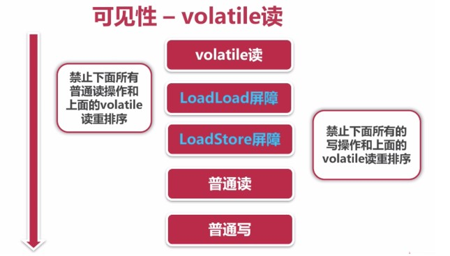

#  线程安全基础

当多个线程访问某个类时，不管运行时环境采用**何种调度方式**或者这些进程将如何交替执行，并且在主调代码中**不需要额外的同步或协同**，这个类都能表现出**正确行为**，那么就称这个类是线程安全的。

线程安全性主要表现在三个方面：

- 原子性：互斥访问，同一个时刻，只能有一个线程对原子变量进行操作
- 可见性：一个线程对主内存中的变量进行修改后，其他线程可以观察到
- 有序性：程序执行的执行结果符合代码逻辑的顺序执行的预期结果

---
## 1 原子性：Atomic包

Java 在`java.util.concurrent.atomic`包中，提供了一系列的原子类，用以保证变量的原子操作。

### Unsafe 的 CAS

Atomic 类的原子性都依赖于 `sun.misc.Unsafe` 类，Unsafe 使用的 CAS 算法，其依赖于 CPU 提供的指令。

```java
public final native boolean compareAndSwapInt(Object var1, long var2, int var4, int var5);
```

CAS 即先比较后替换，CAS 涉及三个变值，变量的预期旧值，变量真实旧值，将要赋值给变量的新值，如果预期旧值和真实旧值一致，就将变量赋值为新值。可以认为预期旧值存储在线程工作内存，而该变量在主内存中的副本，而真实旧值从主内存中读取。

参考下面 AtomicInteger 部分源码：

```java
    ////原子自增
    public final int incrementAndGet() {
        return unsafe.getAndAddInt(this, valueOffset, 1) + 1;
    }

    //Unsafe 的 getAndAddInt，
    public final int getAndAddInt(Object var1, long var2, int var4) {
        int var5;
        do {
            // 获取底层的该对象当前的值
            var5 = this.getIntVolatile(var1, var2);
            // 获取完底层的值和自增操作之间，可能系统的值已经又被其他线程改变了
            //如果又被改变了，则重新计算系统底层的值，并重新执行本地方法
        } while(!this.compareAndSwapInt(var1, var2, var5, var5 + var4));

        return var5;
    }

    /*
        本地的CAS方法核心
        var1 需要操作的AtomicInteger 对象
        var2 当前本地变量中的的值 
        var4 当前系统从底层传来的值
        var5 要更新后的值
        如果当前本地变量的值（var2）与底层的值(var4)不等，则返回false，否则更新为var5的值并返回True
    */
    public final native boolean compareAndSwapInt(Object var1, long var2, int var4, int var5);
```

###  AtomicLong、LongAdder

查看 AtomicLong 的实现，在执行CAS操作的时候，是用死循环的方式，如果竞争非常激烈，那么失败量就会很高，性能会受到影响。因此在 JDK8 后，提供了 LongAdder 类。

LongAdder 类的原理：将热点数据分离，将内部数据 value 分成一个数组，每个线程访问时，通过 hash 等算法映射到其中一个数字进行技术，而最终计数结果为这个数组的求和累加，其中热点数据 value 会被分离成多个热点单元的数据 cell，每个 cell 独自维护内部的值，当前 value 的实际值由所有的 cell 累积合成，从而使热点进行了有效的分离，提高了并行度，LongAdder 在低并发的时候通过直接操作 base，可以很好的保证和 Atomic 的性能基本一致，在高并发的场景，通过热点分区来提高并行度，**LongAdder 也存在则缺点，即在统计的时候如果有并发更新，可能会导致结果有些误差**。实际应用中，如果处理高并发计算是，可以选择 LongAdder，其他情况，比如序列号生成，需要准确的数组的话，还是需要使用 AtomicLong。

```java
public class AtomicExample3 {

    // 请求总数
    public static int clientTotal = 5000;

    // 同时并发执行的线程数
    public static int threadTotal = 200;

    public static LongAdder count = new LongAdder();

    public static void main(String[] args) throws Exception {
        ExecutorService executorService = Executors.newCachedThreadPool();
        final Semaphore semaphore = new Semaphore(threadTotal);
        final CountDownLatch countDownLatch = new CountDownLatch(clientTotal);
        for (int i = 0; i < clientTotal ; i++) {
            executorService.execute(() -> {
                try {
                    semaphore.acquire();
                    add();
                    semaphore.release();
                } catch (Exception e) {
                    log.error("exception", e);
                }
                countDownLatch.countDown();
            });
        }
        countDownLatch.await();
        executorService.shutdown();
        log.info("count:{}", count);
    }

    private static void add() {
        count.increment();
    }
}
```

关于 LongAdder 的原理，可以参考[Java并发工具类之LongAdder原理总结](https://github.com/aCoder2013/blog/issues/22)

### AtomicReference、AtomicReferenceFieldUpdater

AtomicReference: 用法同AtomicInteger一样，但是可以放各种对象：

```java
public class AtomicExample4 {

    private static AtomicReference<Integer> count = new AtomicReference<>(0);

    public static void main(String[] args) {
        count.compareAndSet(0, 2); // 2
        count.compareAndSet(0, 1); // no
        count.compareAndSet(1, 3); // no
        count.compareAndSet(2, 4); // 4
        count.compareAndSet(3, 5); // no
        log.info("count:{}", count.get());
    }
}
```

AtomicReferenceFieldUpdater 用于原子更新某个引用的 Field，切要求该 Filed 为非 static 且是 volatile 的：

```java
public class AtomicExample5 {

    private static AtomicIntegerFieldUpdater<AtomicExample5> updater =
            AtomicIntegerFieldUpdater.newUpdater(AtomicExample5.class, "count");

    @Getter
    public volatile int count = 100;

    public static void main(String[] args) {

        AtomicExample5 example5 = new AtomicExample5();

        if (updater.compareAndSet(example5, 100, 120)) {
            log.info("update success 1, {}", example5.getCount());
        }

        if (updater.compareAndSet(example5, 100, 120)) {
            log.info("update success 2, {}", example5.getCount());
        } else {
            log.info("update failed, {}", example5.getCount());
        }
    }
}

//运行结果
10:53:01.947 [main] INFO com.mmall.concurrency.example.atomic.AtomicExample5 - update success 1, 120
10:53:01.950 [main] INFO com.mmall.concurrency.example.atomic.AtomicExample5 - update failed, 120
```

### CAS 的 ABA 问题

- ABA问题：在 CAS 操作的时候，其他线程将变量的值 A 改成了 B 又改成了 A，本线程使用期望值 A 与当前变量进行比较的时候，发现 A 变量值没有变，于是 CAS 就将 A 的值进行了交换操作，这个时候实际上 A 的值已经被其他线程改变过，这与设计思想是不符合的
- 解决思路：每次变量更新的时候，把变量的版本号**加 1**，这样只要变量被某一个线程修改过，该变量版本号就会发生递增操作，从而解决了 ABA 变化

AtomicStampedReference 解决了 ABA 问题：

```java
    public boolean compareAndSet(V   expectedReference,
                                 V   newReference,
                                 int expectedStamp,
                                 int newStamp) {
        Pair<V> current = pair;
        return
            expectedReference == current.reference &&
            expectedStamp == current.stamp &&
            ((newReference == current.reference &&
              newStamp == current.stamp) ||
             casPair(current, Pair.of(newReference, newStamp)));
    }
```

### AtomicLongArray

AtomicLongArray 可以指定更新一个数组指定索引位置的值

### AtomicBoolean

使用场景，并发环境下， 让某个方法只执行一次：

```java
public class AtomicExample6 {

    private static AtomicBoolean isHappened = new AtomicBoolean(false);

    // 请求总数
    public static int clientTotal = 5000;

    // 同时并发执行的线程数
    public static int threadTotal = 200;

    public static void main(String[] args) throws Exception {
        ExecutorService executorService = Executors.newCachedThreadPool();
        final Semaphore semaphore = new Semaphore(threadTotal);
        final CountDownLatch countDownLatch = new CountDownLatch(clientTotal);
        for (int i = 0; i < clientTotal ; i++) {
            executorService.execute(() -> {
                try {
                    semaphore.acquire();
                    test();
                    semaphore.release();
                } catch (Exception e) {
                    log.error("exception", e);
                }
                countDownLatch.countDown();
            });
        }
        countDownLatch.await();
        executorService.shutdown();
        log.info("isHappened:{}", isHappened.get());
    }

    private static void test() {
        if (isHappened.compareAndSet(false, true)) {
            log.info("execute");
        }
    }
```

---
## 2 原子性：锁

Java 中的锁：

- synchronized：依赖 JVM 实现
- Lock：依赖特殊的CPU指令，比如常用的 ReentrantLock


原子性、synchronized、Lock 对比：

- synchronized，不可中断、适用于竞争不激烈的场景，代码可读性好
- Lock，可中断锁，多样化同步，竞争激烈时能维持常态
- Atomic，竞争激烈时能维持常态，性能比 Lock 好，只能同步一个值


---
## 3 可见性：volatile

导致共享变量在线程中不可见的原因：

- 线程交叉执行
- 重排序结合线程交叉执行
- 共享变量更新后的值没有在工作内存与主内存间及时更新

Java 提供了 synchronized 和 volatile 两种方法来确保可见性

### synchronized 实现的可见性

JMM（java内存模型）关于 synchronized 的两条规定：

- 线程解锁前，必须把共享变量的最新值刷新到主内存
- 线程加锁时，将清空工作内存中共享变量的值，从而使用共享变量时需要从主内存中重新读取最新的值（注意，加锁和解锁是同一把锁）

### volatile 实现的可见性

volatile 通过加入内存屏障和禁止重排序优化来实现：

- 对 volatile 变量写操作时，会在写操作后加入一条 store 屏障指令，将本地内存中的共享变量值刷新到主内存
- 对 volatile 变量读操作时，会在读操作前加入一条 load 屏障指令，从主内存中读取共享变量




### volatile 使用条件

volatile 不具备原子性，所以 volatile 的使用条件如下：

1. 对变量写操作不依赖于当前值
2. 该变量没有包含在具有其他变量的不必要的式子中

综上，可见 volatile 特别适合用来做线程标记量。


---
## 4 有序性

Java 内存模型中，允许编译器和处理器对指令进行重排序，重排序不会影响单个现场下的程序执行结果，但是会影响多线程环境下的程序执行结果。

### Happens-before 原则

Happens-before 即先行发生原则。就是什么一定发生在什么之前，jsr133采用 happens-before 概念来说明操作之间的可见性。在 JMM 中如果一条操作要对另一条操作可见，那么它们一定存在 happens-before 关系。

### 先天有序性

先天有序性即不需要任何额外的代码控制即可保证有序性，JMM 一个列出了八种 Happens-before 规则，如果两个操作的次序不能从这八种规则中推倒出来，则不能保证有序性。

八种 Happens-before 规则：

- 程序次序规则：一个线程内，按照代码顺序执行，书写在前面的操作先行发生于书写后面的操作(其实 JMM 只会保证程序的执行结果符合代码书写顺序的预期执行结果，即保证在保证正确执行结果的前提下，对指令做一些重排序，这个过程对程序员是透明的)
- 锁规定原则：一个 unlocl 操作先行发生于后面对同一个锁的 lock 操作
- volatile 变量规则：对一个变量的写操作先行发生于后面对这个变量的读操作
- 传递性规则：如果 A 操作先行发生于后面 B，而 B 操作先行发生于后面 C，则 A 操作先行发生于 C
- 线程启动规则：Thread 对象的 `start()` 方法先行发生于此线程执行的每一个动作
- 线程中断规则：对线程的 `interrupt()` 方法的调用先行发生于被中断线程的代码检测到中断事件的发生
- 线程终结规则：线程中所有的操作都先行发生于线程的终止检测，可以通过 join 方法介绍、isAlive 方法的返回值手段检测到现场是否已经终止执行
- 对象终结规则：一个对象的初始化完成先行发生于它的 finalize 方法开始

