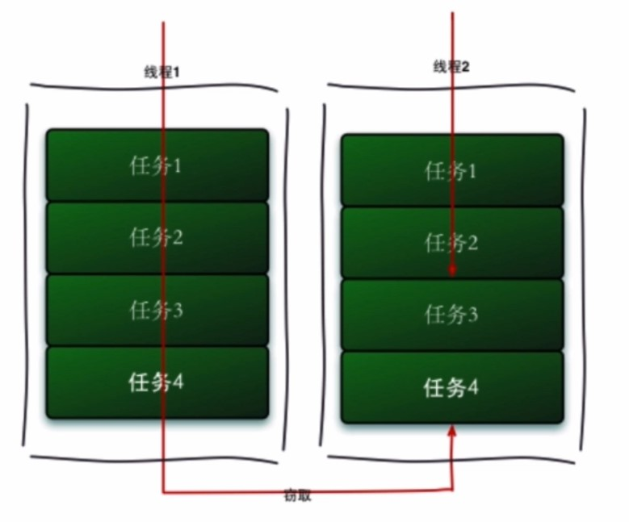

# JUC 组件拓展

---
## 1 FutureTask

FutureTask 是 JUC 中的类，是一个可被取消的异步计算类。这个类提供了 Future 接口的的基本实现，使用相关方法启动和取消计算，查询计算是否完成，并检索计算结果。只有在计算完成时才能使用 get 方法检索结果，如果计算尚未完成，get 方法将会阻塞。一旦计算完成，计算就不能重新启动或取消(除非使用 runAndReset 方法调用计算)。

Runnable 与 Callable 对比，Callable 用于封装有执行结果的异步任务，一般使用 FutureTask 来保证一个 Callable。

### Future 接口

Future接口提供了一系列方法用于控制线程执行计算：

```java
public interface Future<V> {
    boolean cancel(boolean mayInterruptIfRunning);//取消任务
    boolean isCancelled();//是否被取消
    boolean isDone();//计算是否完成
    V get() throws InterruptedException, ExecutionException;//获取计算结果，在执行过程中任务被阻塞
    V get(long timeout, TimeUnit unit) throws InterruptedException, ExecutionException, TimeoutException;////timeout等待时间、unit时间单位
}
```

当向 Executor 提交一个异步任务时，会返回一个代表该任务异步计算的结果的 Future，可是通过 Future 对象管理提交的任务：

```java
public class FutureExample {

    static class MyCallable implements Callable<String> {

        @Override
        public String call() throws Exception {
            log.info("do something in callable");
            Thread.sleep(5000);
            return "Done";
        }
    }

    public static void main(String[] args) throws Exception {
        ExecutorService executorService = Executors.newCachedThreadPool();
        Future<String> future = executorService.submit(new MyCallable());
        log.info("do something in main");
        Thread.sleep(1000);
        String result = future.get();
        log.info("result：{}", result);
    }
}

```

### FutureTask

FutureTask 实现了 RunnableFuture 接口，而 RunnableFuture 接口继承了 Runnable 与 Future 接口，所以它既可以作为 Runnable 被线程中执行，又可以作为 Callable 获得返回值。

```java
public class FutureTaskExample {

    public static void main(String[] args) throws Exception {
        FutureTask<String> futureTask = new FutureTask<String>(new Callable<String>() {
            @Override
            public String call() throws Exception {
                log.info("do something in callable");
                Thread.sleep(5000);
                return "Done";
            }
        });

        new Thread(futureTask).start();
        log.info("do something in main");
        Thread.sleep(1000);
        String result = futureTask.get();
        log.info("result：{}", result);
    }
}
```

---
## 2 Fork/Join 框架

ForkJoin 是 JDK7 提供的一个并行执行任务的框架，是把大任务分割成若干个小任务，待小任务完成后将结果汇总成大任务结果的框架。主要采用的是**工作窃取算法**，工作窃取算法是指某个线程从其他队列里窃取任务来执行。



在窃取过程中两个线程会访问同一个队列，为了减少窃取任务线程和被窃取任务线程之间的竞争，使用了双端队列来实现工作窃取算法。被窃取任务的线程永远从队列的头部拿取任务，窃取任务的线程从队列尾部拿取任务。**双端队列依然会存在竞争**，比如双端队列中只有一个任务时。

Fork/Join 框架的局限性：

- 任务只能使用 fork 和 join 作为同步机制，如果使用了其他同步机制，当它们在同步操作时，工作线程就不能执行其他任务了。比如在 fork 框架使任务进入了睡眠，那么在睡眠期间内正在执行这个任务的线程将不会执行其他任务了。
- 所拆分的任务不应该去执行 I/O 操作，如读和写数据文件。
- 任务不能抛出检查异常。必须通过必要的代码来处理它们。

Fork/Join 框架的框架核心：

- ForkJoinPool：负责来做实现，包括工作窃取算法、管理工作线程和提供关于任务的状态以及它们的执行信息。
- ForkJoinTask：提供在任务中执行 fork 和 join 的机制。

示例代码：

```java
//RecursiveTask 继承自 ForkJoinTask，表示一个递归任务
public class ForkJoinTaskExample extends RecursiveTask<Integer> {

    public static final int threshold = 2;
    private int start;
    private int end;

    public ForkJoinTaskExample(int start, int end) {
        this.start = start;
        this.end = end;
    }

    @Override
    protected Integer compute() {
        int sum = 0;

        //如果任务足够小就计算任务
        boolean canCompute = (end - start) <= threshold;
        if (canCompute) {
            for (int i = start; i <= end; i++) {
                sum += i;
            }
        } else {
            // 如果任务大于阈值，就分裂成两个子任务计算
            int middle = (start + end) / 2;
            ForkJoinTaskExample leftTask = new ForkJoinTaskExample(start, middle);
            ForkJoinTaskExample rightTask = new ForkJoinTaskExample(middle + 1, end);

            // 执行子任务
            leftTask.fork();
            rightTask.fork();

            // 等待任务执行结束合并其结果
            int leftResult = leftTask.join();
            int rightResult = rightTask.join();

            // 合并子任务
            sum = leftResult + rightResult;
        }
        return sum;
    }

    public static void main(String[] args) {
        ForkJoinPool forkjoinPool = new ForkJoinPool();

        //生成一个计算任务，计算1+2+3+4
        ForkJoinTaskExample task = new ForkJoinTaskExample(1, 100);

        //执行一个任务
        Future<Integer> result = forkjoinPool.submit(task);

        try {
            log.info("result:{}", result.get());
        } catch (Exception e) {
            log.error("exception", e);
        }
    }
}
```

---
## 3 BlockingQueue

阻塞队列用于生产者和消费者模型：


阻塞情况：

1. 当队列满了进行入队操作
2. 当队列空了的时候进行出队列操作

阻塞队列操作：


- Throws Exceptions ：如果不能立即执行就抛出异常。
- Special Value：如果不能立即执行就返回一个特殊的值。
- Blocks：如果不能立即执行就阻塞
- Times Out：如果不能立即执行就阻塞一段时间，如果过了设定时间还没有被执行，则返回一个值

实现类：

- ArrayBlockingQueue：它是一个有界的阻塞队列，内部实现是数组，初始化时指定容量大小，一旦指定大小就不能再变。采用 FIFO 方式存储元素。
- DelayQueue：内部元素必须实现 Delayed 接口，Delayed 接口又继承了 Comparable 接口，原因在于 DelayQueue 内部元素需要排序，一般情况按过期时间优先级排序。DalayQueue 内部采用 PriorityQueue 与 ReentrantLock 实现
- LinkedBlockingQueue：如果初始化时指定了大小，那么它就是有边界的。不指定就无边界（Integer.MAX_VALUE）。内部实现是链表，采用 FIFO 形式保存数据。
- PriorityBlockingQueue：带优先级的阻塞队列。无边界队列，允许插入null。插入的对象必须实现 Comparator 接口，队列优先级的排序规则就是按照元素对 Comparable 接口的实现来指定的。可以从 PriorityBlockingQueue 中获取一个迭代器，但这个迭代器并不保证能按照优先级的顺序进行迭代。
- SynchronusQueue：当一个线程插入或获取一个元素时就会被阻塞，只有当另一个现场获取或插入一个元素时才会从阻塞中释放，SynchronusQueue 不存储元素。仅用于两个线程交换数据。
- LinkedTransferQueue：一个由链表结构组成的无界阻塞 TransferQueue 队列。相对于其他阻塞队列，LinkedTransferQueue 多了 tryTransfer 和 transfer 方法。