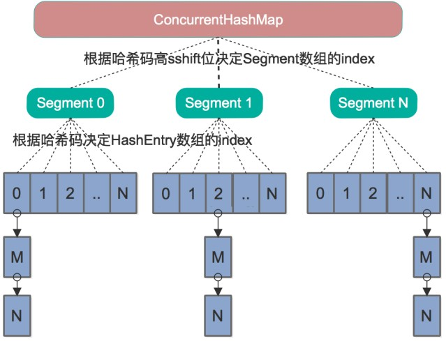
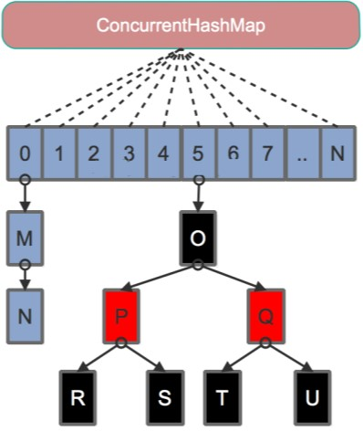

# 多线程并发拓展


## 1 死锁

死锁就是两个或者多个线程，相互占用对方需要的资源，而都不进行释放，导致彼此之间都相互等待对方释放资源，产生了无限制等待的现象。死锁一旦发生，如果没有外力介入，这种等待将永远存在，从而对程序产生严重影响。

死锁产生的必要条件：

- 互斥条件：进程对锁分配的资源进行排他性使用
- 请求和保持条件：线程已经保持了一个资源，但是又提出了其他请求，而该资源已被其他线程占用
- 不剥夺条件：在使用时不能被剥夺，只能自己用完释放
- 环路等待条件：资源调用是一个环形的链

代码示例：

```java
/**
 * 一个简单的死锁类
 * 当DeadLock类的对象flag==1时（td1），先锁定o1,睡眠500毫秒
 * 而td1在睡眠的时候另一个flag==0的对象（td2）线程启动，先锁定o2,睡眠500毫秒
 * td1睡眠结束后需要锁定o2才能继续执行，而此时o2已被td2锁定；
 * td2睡眠结束后需要锁定o1才能继续执行，而此时o1已被td1锁定；
 * td1、td2相互等待，都需要得到对方锁定的资源才能继续执行，从而死锁。
 */
public class DeadLock implements Runnable {
    public int flag = 1;
    //静态对象是类的所有对象共享的
    private static Object o1 = new Object(), o2 = new Object();

    @Override
    public void run() {
        log.info("flag:{}", flag);
        if (flag == 1) {
            synchronized (o1) {
                try {
                    Thread.sleep(500);
                } catch (Exception e) {
                    e.printStackTrace();
                }
                synchronized (o2) {
                    log.info("1");
                }
            }
        }
        if (flag == 0) {
            synchronized (o2) {
                try {
                    Thread.sleep(500);
                } catch (Exception e) {
                    e.printStackTrace();
                }
                synchronized (o1) {
                    log.info("0");
                }
            }
        }
    }

    public static void main(String[] args) {
        DeadLock td1 = new DeadLock();
        DeadLock td2 = new DeadLock();
        td1.flag = 1;
        td2.flag = 0;
        //td1,td2都处于可执行状态，但JVM线程调度先执行哪个线程是不确定的。
        //td2的run()可能在td1的run()之前运行
        new Thread(td1).start();
        new Thread(td2).start();
    }
}
```

死锁调试：

1. 使用 jps 命令获取运行的类的类名以及对应的进程ID
1. jstack pid 命令查看死锁信息


## 2 并发实践

- 使用本地变量
- 使用不可变变量
- 最小化的作用域范围，阿姆达尔定律
- 使用线程池 Executor，而不是直接 new Thread
- 宁可使用同步(CountDownLatch等同步工具)也不要使用现场的 wait 和 notify
- 使用 BlockingQueue 实现生产者消费者模型
- 使用并发集合而不加了锁的同步集合
- 使用 Semaphore 创建有界访问
- 宁可使用同步代码块也不要使用同步方法
- 避免使用静态变量

### 阿姆达尔定律

增加处理器数、计算负载分布到更多处理器上，以此来提高计算速度，而程序中**可并行代码的比例**决定你增加处理器（总核心数）所能带来的速度提升的上限，公式：

```
//a：并行计算部分所占比例。
//n：并行处理结点个数。
S= 1/(1- a + a/n)
```

- 当 `1-a=0` 时，(即没有串行，只有并行)最大加速比 `s=n`；
- 当 `a=0` 时（即只有串行，没有并行），最小加速比 `s=1`；
- 当 `n→∞` 时，极限加速比 `s→ 1/(1-a)`，这也就是加速比的上限。
- 若串行代码占整个代码的 `25%`，则并行处理的总体性能不可能超过 4


---
## 3 HashMap 和 ConcurrentHashMap 数据结构

### HashMap 数据结构


- 容量，必须为 2^n，由 tableSizeFor 方法保证
- 加载因子
- 寻址方式：根据 key 的 hash 值进行一定规则的运算，然后对数组的长度取模得出 index。取模的代价远远高于位运算的代价，因此 HashMap 要求数组的长度必须为 2^n，使用 hash 值与 2^n -1 进行与运算与取模的运算结果是一致的。

### HashMap rehash


多线程下会造成 rehash 死循环

### ConcurrentHashMap

- 支持多线程访问
- 支持并发修改

之前的结构：分段锁 + 链表



Java 8：废弃分段锁，采用单一数组 + 红黑树



---
## 4 多线程并发实践总结


