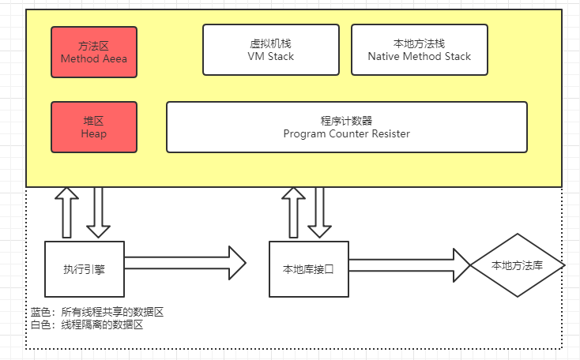

# Java 内存区域与内存异常异常

**Java与C++之间有一堵内存动态分配和垃圾啊收集技术所围成的高墙，墙外的人想进去，墙外的人想出来。** 

---
## 1 Java内存区域划分

Java虚拟机在执行Java程序的过程中，会把它所管理的内存划分位若干个不同的数据区域，这些区域各有用途、以及创建和销毁的时间，有的区域随着虚拟机进程的启动而存在，有些区域则依赖着用户线程的启动和结束而建立和销毁。

根据《Jav虚拟机规范 SE 7版》的规定，Java虚拟机所管理的内存将会包括以下几个运行时数据区域：

### 1.1 程序计数器

**程序计数器(Program Counter Resister)**是一块较小的内存空间，可以看作是当前线程所执行字节码的的行号指示器。

学过计算机组成原理的人都会知道在CPU的寄存器中有一个PC寄存器，存放下一条指令地址，这里，虚拟机不使用CPU的程序计数器，自己在内存中设立一片区域来模拟CPU的程序计数器。只有一个程序计数器是不够的，当多个线程切换执行时，那就单个程序计数器就没办法了，虚拟机规范中指出，**每一条线程都有一个独立的程序计数器**。注意，Java虚拟机中的程序计数器指向正在执行的字节码地址，而不是下一条。

Java虚拟机规范没有在这个内存区域规定任何的异常。

### 1.2 Java 虚拟机栈

Java虚拟机栈(Java Virtual Machine Stacks)也是线程所私有的，其生命周期与线程的生命周期相同，虚拟机栈描述的是Java方法执行的内存模型：每个方法执行的时候都会创建一个**栈帧(Stack Frame)**（我觉得可以把它看作是一个快照，记录下进入方法前的一些参数，实际上是**方法运行时的基础数据结构**），用于存放局部变量表，操作数栈，动态链接，方法出口等信息。**每一个方法从调用直到执行完成的过程都对应着一个栈帧在虚拟机中的入栈到出栈的过程**。我们平时把内存分为堆内存和栈内存，其中的栈内存就指的是虚拟机栈的局部变量表部分。局部变量表存放了编译期可以知道的基本数据类型，对象引用，和返回后所指向的字节码的地址。

局部变量表所需的内存空间在编译期完成分配，**当进入一个方法需要在栈上分配多大的局部变量空间是完全确定的**。在方法的运行期不会改变局部变量表的大小。

Java虚拟机规范在这个区域规定了两种异常状况：

1. 如果线程的栈深度大于虚拟机允许的深度，将抛出StackOverflowError异常
2. 如果虚拟机栈可以动态扩展，当扩展到无法申请到足够的内存，就会抛出OutOfMemoryError异常

---
### 1.3 本地方法栈

**`本地方法区`** 与 **`虚拟机栈`** 所发挥的作用很类似，但是要注意一下，虚拟机规范中没有对本地方法区中的方法作强制规定，虚拟机可以自由实现，即可以不是字节码。但是也可以是字节码，这样虚拟机栈和本地方法区就可以合二为一，事实上，`OpenJDK`和`SunJDK`所自带的`HotSpot虚拟机`就直接将虚拟机栈和本地方法区合二为一。

---
### 1.4 Java 堆

**`堆区`**是理解Java GC机制最重要的区域，没有之一。在JVM所管理的内存中，堆区是最大的一块，堆区也是Java GC机制所管理的主要内存区域，堆区**由所有线程共享**，在虚拟机启动时创建。堆区的存在是为了**存储对象实例**，原则上讲，所有的对象都在堆区上分配内存（不过现代技术里，也不是这么绝对的，也有栈上直接分配的）

根据Java虚拟机规范的规定，Java堆可以处于物理上不连续的内存空间中，只要逻辑上是连续的即可，当堆中没有足够的内存来完成实例分配时，将会抛出StackOverflowError异常

---
### 1.5 方法区

**`方法区`** 也是各个线程共享的区域，它用于存储已经被虚拟机加载过的类信息，常量，静态变量，及时编译期编译后的代码（类方法）等数据。

>注意，class常量仅仅与使用final修饰的变量没有关系，仅仅使用final修饰的变量依然是实例对象的数据，存储在堆中。static在Java里是一种storage modifier（存储修饰符），它会影响变量的存储种类；final在Java里则不是一种存储修饰符，不影响变量的存储种类。

当虚拟机装载一个class文件时，它会从这个Class文件包含的二进制数据中解析类型信息，然后把这些类型信息（包括类信息、常量、静态变量等）放到方法区中，该内存区域被所有线程共享。

#### 运行时常量池

运行时常量池是方法区的一部分

Java中的常量池，实际上分为两种形态：**静态常量池**和**运行时常量池**。

- 所谓**静态常量池**，即`*.class`文件中的常量池，Class文件中的除了有类的版本、方法、字段、接口等描述信息外，还有一项信息是常量池，用于存放编译期生成的各种字面量和符号引用，这部分内存将在类加载后进入方法区的运行时常量池进行存放。

- 而**运行时常量池**，则是jvm虚拟机在完成类装载操作后，将class文件中的常量池载入到内存，并保存在**方法区**中，我们常说的常量池，就是指方法区中的运行时常量池。

运行时常量池相对于Class文件的另外一个重要的特征是具备动态性，运行期间也可以将新的常量放入池中，比如String的`intern()`方法。

**关于intern方法**

- 在JDK1.6中：intern方法会把首次遇到的字符串实例复制到永久代中去，返回的也是永久代中这个字符串实例的引用
- 在JDK1.7中(以及部分虚拟机实现)：intern方法不会再复制实例，只是在常量池中记录首次出现的实例引用。

>除了字符串常量池，还有整型常量池、浮点型常量池等等，但都大同小异，只不过数值类型的常量池不可以手动添加常量，**程序启动时常量池中的常量就已经确定了**，比如整型常量池中的常量范围：-128~127，只有这个范围的数字可以用到常量池。

当方法区的常量池无法再申请到更多的内存时会抛出OutOfMemoryError异常

---
### 1.6 直接内存

在JDK1.4版本中加入了NIO类，引入了基于通道（Channel）与缓冲区（Buffer）的I/O方式，也就是说通过这种方式，不会在运行时数据区域分配内存，这样就避免了在运行时数据区域来回复制数据，直接调用外部内存。虽然不受Java虚拟机内存分配的限制，但是还是会受到本机总内存大小的限制，所有也有可能发生OutOfMemoryError异常。

---
## 2 JVM 内存划分与计算机内存架构

### 2.1 Java 内存模型

Java内存模型将内存分为`共享内存`和`本地内存`。共享内存又称为堆内存，指的就是线程之间共享的内存，包含所有的**实例域、静态域和数组元素**。而每个线程都有一个私有的，只对自己可见的内存，称之为**本地内存**。本地内存涵盖：缓存、写缓冲区、寄存器以及其他的硬件和编译器优化。所有线程拥有的资源是由cpu分配的

### 2.2 JVM 中内存划分与实际的计算机系统内存架构有何关联

#### 什么是内存模型

多处理器系统中，处理器都会有多级缓存，就像前面说的这些高速缓存离处理器很近并且可以存储一部分数据，所以高速缓存可以改善处理器获取数据的速度和减少对共享内存数据总线的占用。虽然缓存能极大的提高性能，但是同时也带来了挑战。比如：当两个处理器同时操作同一个内存地址的时候，该如何处理？这两个处理器在什么条件下才能看到相同的值？

而内存模型就是：**定义一些充分必要的规范，这些规范使得其他处理器对内存的写操作对当前处理器可见，或者当前处理器的写操作对其他处理器可见。**

#### Java 内存模型和操作系统内存模型的关系

JMM源于物理机器CPU架构的内存模型，最初用于解决MP(多处理器架构)系统中的缓存一致性问题，**而JVM为了屏蔽各个硬件平台和操作系统对内存访问机制的差异化**，提出了JMM的概念。

JMM规定了所有的变量都存储在主内存（Main Memory）中。每个线程还有自己的工作内存（Working Memory）,线程的工作内存中保存了该线程使用到的变量的主内存的副本拷贝，线程对变量的所有操作（读取、赋值等）都必须在工作内存中进行，而不能直接读写主内存中的变量。不同的线程之间也无法直接访问对方工作内存中的变量，线程之间值的传递都需要通过主内存来完成。

JMM只是一个规范，与实际的操作系统内存模型并没有直接的关系，Java中的线程如何访问内存是由JVM根据JMM规范实现的，JVM屏蔽了各个硬件平台和操作系统中Java现场对内存访问机制的差异化，Java线程中的本地内存是概念上的东西。它既可以在CPU寄存器和缓存中，也可以在物理主内存中。当然JVM会根据各种内存区域的特点来优化各种内存分配。

- JMM是Java内存模型
- JVM中是实现了JMM规范，把内存分成各个区域
- JVM屏蔽各个硬件平台和操作系统对内存访问机制的差异化

---
## 引用

- [触摸常量池](http://www.cnblogs.com/iyangyuan/p/4631696.html) 
- [Java的永久代去哪了](http://www.infoq.com/cn/articles/Java-PERMGEN-Removed)
- [Java Memory Model](http://tutorials.jenkov.com/java-concurrency/java-memory-model.html#javas-logic-memory-model)