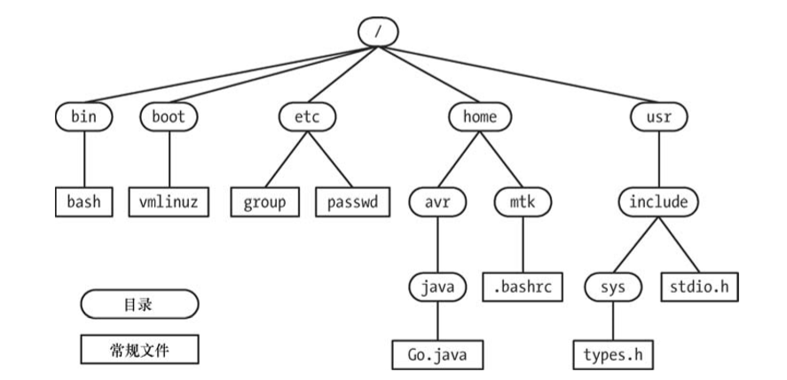

# 二、基本概念

任务：

- 熟悉一系列与Linux系统编程相关的基本概念。理解这些基本概念将为学习系统编程提供足够的背景知识。

## 2.1 操作系统核心：内核

### 操作系统

操作系统的两个含义:

1. 指完整的软件包，这包括用来管理计算机资源的核心层软件，以及附带的所有标准软 件工具，诸如命令行解释器、图形用户界面、文件操作工具和文本编辑器等。
2. 在更狭义的范围内，是指管理和分配计算机资源（即CPU、RAM和设备）的核心层软件。 术语“内核”通常是第二种含义。

### 内部的职责

内核所能执行的主要任务如下：

- **进程调度**：计算机内均配备有一个或多个 CPU（中央处理单元），以执行程序指令。 与其他 UNIX 系统一样，Linux 属于抢占式多任务操作系统。“多任务”意指多个进 程（即运行中的程序）可同时驻留于内存，且每个进程都能获得对 CPU 的使用权。 “抢占”则是指一组规则。这组规则控制着哪些进程获得对 CPU 的使用，以及每个 进程能使用多长时间，这两者都由内核进程调度程序（而非进程本身）决定。
- **内存管理**：物理内存（RAM）属于有限资源，内核必须以公平、高效地方式在进程间共享这一资源。与大多数现代操作系统一样，Linux 也采用了虚拟内存管理机制，其有如下优势：
  - 进程与进程之间、进程与内核之间彼此隔离，因此一个进程无法读取或修改内核 或其他进程的内存内容。
  - 只需将进程的一部分保持在内存中（其他可以序列化到磁盘），这不但降低了每个进程对内存的需求量，而 且还能在 RAM 中同时加载更多的进程。
- **提供文件系统**：内核在磁盘之上提供有文件系统，允许对文件执行创建、获取、更新 以及删除等操作。
- **创建和终止进程**：内核可将新程序载入内存，为其提供运行所需的资源（比如，CPU、 内存以及对文件的访问等）。。一旦进程执行 完毕，内核还要确保释放其占用资源，以供后续程序重新使用。
- **对设备的访问**：计算机外接设备（鼠标、键盘、磁盘和磁带驱动器等）可实现计算机与 外部世界的通信，这一通信机制包括输入、输出或是两者兼而有之。内核既为程序访问设备提供了简化版的标准接口，同时还要仲裁多个进程对每一个设备的访问。
- **联网**：内核以用户进程的名义收发网络消息（数据包）。该任务包括将网络数据包路 由至目标系统。
- **提供系统调用应用编程接口（API）**：进程可利用内核入口点（也称为系统调用）请求 内核去执行各种任务。

一般而言，诸如 Linux 之类的多用户操作系统会为每个用户营造一种抽象：**虚拟私有计算机（virtual private computer）**。每个用户都可以登录进入系 统，独立操作，而与其他用户大致无干。

### 内核态和用户态

现代处理器架构一般允许 CPU 至少在两种不同状态下运行，执行硬件指令可使 CPU 在两种状态间来回切换：

- 用户态
- 核心态（监管态 supervisor mode）

与用户态和核心态对应，可将虚拟内存区域划分（标记）为

- 用户空间部分：在用户态下运行时，CPU 只能访问被标记为用户空间的内存，试图访问属于内核空间的内存会引发硬件异常。
- 内核空间部分：运行于核心态时，CPU 既能访问用户空间内存，也能访问内核空间内存。

仅当处理器在核心态运行时，才能执行某些特定操作，比如：

- 执行宕机（halt）指令去关闭系统
- 访问内存管理硬件
- 设备 I/O 操作的初始化

实现者们利用这一硬件设计，**将操作系统置于内核空间，确保用户进程既不能访问内核指令和数据结构，也无法执行不利于系统运行的操作**。

### 以进程及内核视角检视系统

**以进程视角检视系统**：一个运行系统通常会有多个进程并行其中。

- 对进程来说，许多事件的发生都无法预期。 执行中的进程不清楚自己对 CPU 的占用何时“到期”，系统随之又会调度哪个进程来使用 CPU（以及以何种顺序来调度），也不知道自己何时会再次获得对 CPU 的使用。
- 信号的传递和进程间通信事件的触发由内核统一协调，对进程而言，随时可能发生。
- 进程内存空间的某块特定部分如今到底是驻留在内存中还是被保存在交换空间（磁盘空间中的保留区域，作为计算机 RAM 的补充）里，进程本身并不知晓。
- 进程也无法分清自己所访问的文件 “居于” 磁盘驱动器的何处，只是通过名称来引用文件而已。
- 进程间彼此不能直接通信。进程本身无法创建出新进程，甚至无法自杀。
- 进程不能与计算机外接的输入输出设备直接通信。

**以内核视角检视系统**：进程对于系统的一切无所不知、无所不能，为系统上所有进程的运行提供便利。

- 内核控制由哪个进程来接掌对 CPU 的使用，何时开始使用，能使用多久。
- 在内核维护的数据结构中，包含了与所有正在运行的进程有关的信息。随着进程 的创建、状态发生变化或者终结，内核会及时更新这些数据结构。
- 内核所维护的底层数据结构可 将程序使用的文件名转换为磁盘的物理位置。
- 每个进程的虚拟内存与计算机物理内存及磁 盘交换区之间的映射关系，也在内核维护的数据结构之列。
- 进程间的所有通信都要通过内核提供 的通信机制来完成。
- 响应进程发出的请求，内核会创建新的进程，终结现有进程。
- 与输入/输出设备之间的所有直接通信，按需与用户进程交互信息，也内核 （特别是设备驱动程序）来执行。

## 2.2 Shell

shell 是一种具有特殊用途的程序，主要用于读取用户输入的命令，并执行相应的程序以 响应命令。有时，人们也称之为命令解释器。

设计 shell 的目的不仅仅是用于人机交互，对 shell 脚本进行解释也是其用途之一。为实现这一目的，每款 shell 都内置有许多通常与编程语言相关的功能，其中包括变量、循环和条件语句、I/O 命令以及函数等。

## 2.3 用户和组

系统会对每个用户的身份做唯一标识，用户可隶属于多个组。

- 系统的每个用户都拥有唯一的登录名（用户名）和与之相对应的整数型用户 ID（UID）。
- 系统密 码文件 `/etc/passwd` 为每个用户都定义有一行记录，包含如下信息：
  - 用户名
  - 组 ID：用户所属第一个组的整数型组 ID
  - 主目录：用户登录后所居于的初始目录
  - 登录 shell：执行以解释用户命令的程序名称。
- **用户组**：出于管理目的，尤其是为了控制对文件和其他资源的访问，将多个用户分组是非常实用的做法。
- 每个用户 组都对应着系统组文件 `/etc/group` 中的一行记录，包含如下信息：
  - 组名：（唯一的）组名称。
  - 组 ID（GID）：与组相关的整数型 ID。
  - 用户列表：隶属于该组的用户登录名列表
- **超级用户**：超级用户在系统中享有特权。超级用户账号的用户 ID 为 0，通常登录名为 root。

### 2.4 单根目录层级、目录、链接及文件

内核维护着一套单根目录结构，以放置系统的所有文件。这一目录层级 根基就是名为 `“/”` 的根目录。所有的文件和目录都是根目录的“子孙”。(对应的 Windows 系统的每个磁盘设备都有各自的目录层级)



- **文件类型**：术语“文件”常用来指代任意类型的文件，不仅仅指普通文件，在 Linux 中包括*设备、管道、套接字、目录以及符号链接*等都抽象为文件。
- **路径和链接**：目录是一种特殊类型的文件，内容采用表格形式，数据项包括文件名以及对相应文件的 引用。这一`“文件名+引用”`的组合被称为链接。每个目录至少包含两条记录：`.`和`..`，前者是指向目录自身的链接，后者是指向其上级目录—父目录的链接。根目录中 `..` 也只向当前目录。
- **符号链接**：类似于普通链接，符号链接给文件起了一个“别号（alternative name）” 。在目录列表中，普通链接是内容为`“文件名+指针”`的一条记录，而符号链接则是经过特殊标记的文件，内容包含了另一文件的名称。分别使用*硬链接（hard link）或软链接（soft link）*这样的术语来指代正常链接和符号链接。
- **文件名**：在大多数 Linux 文件系统上，文件名长可达 255 个字符。文件名可以包含除`“/”`和空 字符`（\0）`外的所有字符。但是，只建议使用字母、数字、点(“.”)、下划线（“_”）以及连 字符（ “−” ）。SUSv3 将这 65 个字符的集合`[-._a-zA-Z0-9]`称为可移植文件名字符集（portable filename character set）。此外，还应避免以连字符（ “-”）作为文件名的起始字符，因为一旦在 shell 命令中使用这 种文件名，会被误认为命令行选项开关。
- **当前工作目录**：每个进程都有一个当前工作目录（有时简称为进程工作目录或当前目录）。这就是单根目录 层级下进程的“当前位置”，也是进程解释相对路径。
- **文件的所有权和权限**：每个文件都有一个与之相关的用户 ID 和组 ID，分别定义文件的属主和属组。系统根据文件的所有权来判定用户对文件的访问权限。

## 2.5 文件 I/O 模型

UNIX 系统 I/O 模型为显著的特性之一是其 I/O 通用性概念。也就是说，同一套系统调 用（`open()、read()、write()、close()`等）所执行的 I/O 操作，可应用于所有文件类型。因此，采用这些系统调用的程序能够处理任何类型的文件。就本质而言，内核只提供一种文件类型：**字节流序列**。

- **文件描述符**：I/O 系统调用使用文件描述符—（往往是数值很小的）非负整数—来指代打开的文件。 获取文件描述符的常用手法是调用 `open()`，在参数中指定 I/O 操作目标文件的路径名。
- **标准输入输出**：通常，由 shell 启动的进程会继承3 个已打开的文件描述符：描述符 0 为标准输入，指代为 进程提供输入的文件；描述符 1 为标准输出，指代供进程写入输出的文件；描述符 2 为标准 错误，指代供进程写入错误消息或异常通告的文件。
- **stdio 函数库**：C 编程语言在执行文件 I/O 操作时，往往会调用 C 语言标准库的 I/O 函数。也将这样一组 I/O 函数称为 stdio 函数库。

## 2.6 程序

程序存在的两种方式：

- 源码形式：由使用编程语言（比如，C 语言）写成的一系 列语句组成，是人类可以阅读的文本文件。
- 二进制机器语言形式：计算机可以理解的二进制机器语言指令。

**过滤器**：从 stdin 读取输入，加以转换，再将转换后的数据输出到 stdout，常常将拥有上述行为的 程序称为过滤器，`cat、grep、tr、sort、wc、sed、awk` 均在其列。

## 2.7 进程

- **进程是正在执行的程序实例**。执行程序时，内核会将程序代码载入虚拟内存，为程序变量分配空间，建立内核记账（bookkeeping）数据结构，以记录与进程有关的各种信息（比如，进程 ID、用户 ID、组 ID 以及终止状态等）。
- 在内核看来，进程是一个个实体，**内核必须在它们之间共享各种计算机资源**。
  - 对于像内存这样的受限资源来说，内核一开始会为进程分配一定数量的资源，并在进程的生命周期内， 统筹该进程和整个系统对资源的需求，对这一分配进行调整。程序终止时，内核会释放所有此类资源，供其他进程重新使用。
  - 其他资源如 CPU、网络带宽等，都属于可再生资源，但 必须在所有进程间平等共享。

**进程的内存布局**，逻辑上将一个进程划分为以下几部分（段）：

- 文本：程序的指令。
- 数据：程序使用的静态变量。
- 堆：程序可从该区域动态分配额外内存。
- 栈：随函数调用、返回而增减的一片内存，用于为局部变量和函数调用链接信息分配 存储空间。

### 创建进程和执行程序

- **fork 函数**：用于创建进程。调用 `fork()` 的进程被称为父进程，新创建的进程则被称为子进程。内核通过对父进程的复制来创建子进程。子进程从父进程处继承数 据段、栈段以及堆段的副本后，可以修改这些内容，不会影响父进程的“原版”内容。（在内存中被标记为只读的程序文本段则由父、子进程共享。）
- **exec函数族**：fork 一个子进程后，可以去执行与父进程共享代码段中的另一组不同函数，也可使用 `execve()` 函数去加载并执行一个全新程序。`execve()` 会销毁现有的文本段、数 据段、栈段及堆段，并根据新程序的代码，创建新段来替换它们。`execve` 属于 `exec` 一个函数族，它们是功能相同参数不同一组函数。
- **进程 ID 和父进程 ID**：每一进程都有一个唯一的整数型进程标识符（PID）。此外，每一进程还具有一个父进程 标识符（PPID）属性，用以标识请求内核创建自己的进程。
- **进程终止**：可使用以下两种方式之一来终止一个进程：
  - 方式1：进程可使用_`exit()` 系统调用（或相关的 `exit()`库函数），请求退出。
  - 方式2：向进程传递信号，将其“杀死”。
- **终止状态**：进程退出后都会生成“终止状态”，一个非负小整数，可供父进程的 `wait()`系统调用检测。终止状态为 0 表示进程成功退出，非 0 表示进程因错误退出，在 shell 中可通过 `$?` 获取上一个进程的退出状态。
- **进程的用户和组标识符（凭证）**，每个进程都有一组与之相关的用户 ID (UID)和组 ID (GID)：
  - 真实用户 ID 和组 ID：用来标识进程所属的用户和组。
  - 有效用户 ID 和组 ID：进程在访问受保护资源，一般情况下， 进程的有效 ID 与相应的真实 ID 值相同。
  - 补充组 ID：用来标识进程所属的额外组。
- **特权进程**：在UNIX 系统上，就传统意义而言，特权进程是指有效用户 ID 为0（超级用户）的进程。通常由内核所施加的权限限制对此类进程无效。
- **能力（Capabilities）**：始于内核 2.2，Linux 把传统上赋予超级用户的权限划分为一组相互独立的单元（称之为 “能力” ） 。每次特权操作都与特定的能力相关，仅当进程具有特定能力时，才能执行相应操作。 传统意义上的超级用户进程（有效用户 ID 为 0）则相应开启了所有能力。
- **init 进程**：系统引导时，内核会创建一个名为 init 的特殊进程，即“所有进程之父”，该进程的相应 程序文件为`/sbin/init`。。init 进程的进程号总为 1，且总是以超级用户权限运行。谁（哪怕是超级用户）都 不能“杀死” init 进程，只有关闭系统才能终止该进程。init 的主要任务是创建并监控系统运 行所需的一系列进程。`man init 8` 可以查看相关详细信息。
- **环境列表**：类似 windows 的环境变量，每个进程都有一份环境列表，即在进程用户空间内存中维护的一组环境变量。这份列表 的每一元素都由一个名称及其相关值组成，可以使用类似 `export MYVAR='hello world'` 方式配置。
- **资源限制**：每个进程都会消耗诸如打开文件、内存以及 CPU 时间之类的资源。使用系统调用 `setrlimit()`， 进程可为自己消耗的各类资源设定一个上限。此类资源限制的每一项均有两个相关值：
  - 软限制（soft limit）：限制了进程可以消耗的资源总量。
  - 硬限制（hard limit）：是软限制的调整上限。
  - 对于非特权进程，硬限制值则只能调低，不能调高。
- 由 `fork()` 创建的新进程，会继承其父进程对资源限制的设置。使用 ulimit 命令（在 C shell 中为 limit）可调整 shell 的资源限制。
- **守护进程**：守护进程指的是具有特殊用途的进程，系统创建和处理此类进程的方式与其他进程相同，但是与普通进程相比有如下特点：
  - 守护进程通常在系统引导时启动，直至系统关闭前，会一直存在。
  - 守护进程在后台运行，且无控制终端供其读取或写入数据。
- 常见的守护进程有： syslogd（在系统日志中记录消息）和 httpd（利用 HTTP 分发 Web 页面）。

## 2.8 内存映射

调用系统函数 `mmap()` 的进程，会在其虚拟地址空间中创建一个新的内存映射。 映射分为两类：

- **文件映射**：将文件的部分区域映射入调用进程的虚拟内存。映射一旦完成，对文件映射内容的访问则转化为对相应内存区域的字节操作。映射页面会按需自动从文件中加载。
- **匿名映射**：并无文件与之相对应，其映射页面的内容会被初始化为 0。

**映射共享**：由某一进程所映射的内存可以与其他进程的映射共享，达成共享的方式：

- 其一是两个 进程都针对某一文件的相同部分加以映射
- 其二是由 fork()创建的子进程自父进程处继承映射。

**对映射共享修改的可见性**：当两个或多个进程共享的页面相同时，进程之一对页面内容的改动是否为其他进程所见取决于创建映射时所传入的标志参数。

- 若传入标志为私有，则某进程对映射内容的修改对于其 他进程是不可见的，而且这些改动也不会真地落实到文件上。
- 若传入标志为共享，对映射内容 的修改就会为其他进程所见，并且这些修改也会造成对文件的改动。

**内存映射的用途**：

- 以可执行文件的相应段来初始化进程的文本段、内存（内容填充为 0）分配
- 文件 I/O（即 映射内存 I/O）
- 进程间通信（通过共享映射）

## 2.9 静态库和共享库

**目标库**：将（通常是逻辑相关的）一组函数代码加以编译，并置于一个文件中，供其他应用程序调用。这一做法有利于程序的开发和维护。

现代 UNIX 系统提 供两种类型的对象库：静态库和共享库。

### 静态库

静态库是对已编译目标模块的一种结构化整合。要使用静态库中的函数，需要在创建程序的链接命令中指定相应的库。主程序会对静态库中隶属于各目标模块的不同函数加以引用。链接器在解析了引用情况后，会从库中抽取所需目标模块的副本，将其复制到终的可执行文件中，这就是所谓静态链接。

**静态库的缺点**：对于所需库内的各目标模块，采用静态链接方式生成的程序都存有一份副本。这会引起很多不便

1. 在不同的可执行文件中，可能都存有相同目标代码的副本，这是对**磁盘空间的浪费**。
2. 调用同一库函数的程序，若均以静态链接方式生成，且又于同时加以执行，这会造成**内存浪费**，因为每个程序所调用的函数都各有一份副本驻留在内存中，
3. 如果对库函数进行了修改，需要重新加以编译、生成新的 静态库，而所有需要调用该函数“更新版”的应用，都必须与新生成的静态库重新链接。

### 共享库

设计共享库的目的是为了解决静态库所存在的问题：

- 如果将程序链接到共享库，那么链接器就不会把库中的目标模块复制到可执行文件中，而是在可执行文件中写入一条记录，以表明可执行文件在运行时需要使用该共享库。
- 一旦在运行时将可执行文件载入内存，动态链接器会确保将可执行文件所需的动态库找到， 并载入内存，随后实施运行时链接，解析可执行文件中的函数调用，将其与共享库中相应的函数定义关联起来。
- 在运行时，共享库代码在内存中只需保留一份，且可供所有运行中的程序使用。
- 经过编译处理的函数仅在共享库内保存一份，从而节约了磁盘空间。
- 共享库还能确保各类程序及时使用到函数的新版本，只需将带有函数新定义体的共享库 重新加以编译即可，程序会在下次执行时自动使用新函数。 

## 2.10 进程间通信及同步

系统中运行的多个进程往往有相互合作的需求，因此彼此之间需要建立**通信和同步机制**。

读写磁盘文件中的信息是进程间通信的方法之一，但是这种方法法既慢又缺乏灵活性。因此，像所有现代 UNIX 实现那样，Linux 也提供了丰富的进程间通信（IPC） 机制：

- **信号（signal）**，用来表示事件的发生。
- **管道和 FIFO**，用于在进程间传递数据。
- **套接字**，供同一台主机或是联网的不同主机上所运行的进程之间传递数据。
- **文件锁定**，为防止其他进程读取或更新文件内容，允许某进程对文件的部分区域加以 锁定。
- **消息队列**，用于在进程间交换消息（数据包）。
- **信号量**（semaphore），用来同步进程动作。
- **共享内存**，允许两个及两个以上进程共享一块内存。当某进程改变了共享内存的内容 时，其他所有进程会立即了解到这一变化。

## 2.11 信号

尽管信号被视为 IPC 的方法之一，但其在其他方面的广泛应用则更为普遍。

信号称为“软件中断”。进程收到信号，就意味着某一事件或异常情况的发生。 信号的类型很多，每一种分别标识不同的事件或情况。采用不同的整数来标识各种信号类型， 并以 SIGxxxx 形式的符号名加以定义。

内核、其他进程（只要具有相应的权限）或进程自身均可向进程发送信号。例如，发生 下列情况之一时，内核可向进程发送信号。 

- 用户键盘输入中断字符（通常为 Control-C）。
- 进程的子进程之一已经终止。
- 由进程设定的定时器（告警时钟）已经到期。
- 进程尝试访问无效的内存地址。

在 shell 中，可使用 kill 命令向进程发送信号。在程序内部，系统调用 `kill()` 可提供相同的功能。 收到信号时，进程会根据信号采取如下动作之一。

- 忽略信号：就大多数信号类型而言，程序可选择不采取默认的信号动作，而是忽略信号。
- 被信号“杀死”。
- 先挂起，之后再被专用信号唤醒。

**定义信号处理程序**：程序可以通过系统调用建立自己的信号处理器。信号处理器是由程序员定义的函数，会在进程收到信号时自动调用，根据信号的产生条件执行相应动作。

**挂起状态**：信号从产生直至送达进程期间，一直处于挂起状态。通常，系统会在接收进程下次获得调度时，将处于挂起状态的信号同时送达。如果接收进程正在运行，则会立即将信号送达。

**信号屏蔽**：程序可以将信号纳入所谓“信号屏蔽”以求阻塞该信号。如果产生的信号处于“信号屏蔽”之列，那么此信号将一直保持挂起状态，直至解除对该信号的阻塞（从信号屏蔽中移除）。

## 2.12 线程

每个进程都可执行多个线程。**可将线程想象为共享同一虚拟内存及一干其他属性的进程**。每个线程都会执行相同的程序代码，共享同一数据区域和堆。可是， 每个线程都拥有属于自己的栈，用来装载本地变量和函数调用链接信息。

## 2.13 进程组和 shell 任务控制

shell 执行的每个程序都会在一个新进程内发起。

```shell
ls -l | sort -k5n | less
```

对于上面管道命令，shell 会创建 3 个进程来执行：在当前的工作目录下，根据文件大小对文件进行排序并显示）。

- 除 Bourne shell 以外，几乎所有的主流 shell 都提供了一种交互式特性，名为**任务控制**，这个特性**允许用户同时执行并操纵多条命令或管道**。
- 在支持任务控制的 shell 中，会将管道内的所有进程置于一个新进程组或任务中。（如果只有单个进程执行命令，也会创建一个只包含单个进程的新进程组）
- 进程组中的每个进程都具有相同的**进程组标识符**（以整数形式），其实就是进程组中某个进程的进程 ID。该进程也称为：**进程组组长 process group leader**

## 2.14 会话、控制终端和控制进程

- **会话**：会话指的是一组进程组（任务）。会话中的所有进程都具有相同的会话标识符。会话首进程（session leader）是指创建会话的进程，其进程 ID 会成为会话 ID。使用会话最多的是支持任务控制的 shell，由 shell 创建的所有进程组与 shell 自身隶属于同一会话，shell 是此会话的会话首进程。
- **控制终端**：通常，会话都会与某个控制终端相关。控制终端建立于会话首进程初次打开终端设备之时。对于由交互式 shell 所创建的会话，控制终端恰恰是用户的登录终端。一个终端至多只能成为一个会话的控制终端。
- **控制进程**：打开控制终端会致使会话首进程成为终端的控制进程（比如 shell）。一旦断开了与终端的连接（比如，关闭了终端窗口），控制进程将会收到SIGHUP信号。

**在任一时点，会话中总有一个前台进程组（前台任务），可以从终端中读取输入，向终端发送输出。**

- 如果用户在控制终端中输入了“中断”（通常是`Control+C`）或“挂起”字符（通常是`Control+Z`），那么终端驱动程序会发送信号以终止或挂起（亦即停止）前台进程组。
- 一个会话可以拥有任意数量的后台进程组（后台任务），由以“&”字符结尾的行命令来创建。

## 2.15 伪终端

伪终端是一对相互连接的虚拟设备，也称为主从设备。在这对设备之间，设有一条 IPC 信道，可供数据进行双向传递。常见的有： telnet 和 ssh。

## 2.16 日期和时间

进程涉及两种类型的时间：

- **真实时间（real time）**：指的是在进程的生命期内，以某个标准时间点（日历时间）或固定时间点（通常是进程的启动时间）为起点测量得出的时间。
- **进程时间**：亦称为 CPU 时间，指的是进程自启动起来，所占用的 CPU 时间总量。

>在UNIX系统上，日历时间是以国际协调时间（简称UTC）1970年1月1日凌晨为起始点，按秒测量得出的时间，再进行时区调整（定义时区的基准点为穿过英格兰格林威治的经线）2。这一日期与UNIX系统的生日很接近，也被称为纪元（Epoch）。

可进一步将 CPU 时间划分为系统 CPU 时间和用户 CPU 时间。

- **内核 CPU 时间**：在内核模式中，执行代码所花费的时间（比如，执行系统调用，或代表进程执行其他的内核服务）。
- **用户 CPU 时间**：在用户模式中，执行代码所花费的时间（比如，执行常规的程序代码）。

`time` 命令会显示出真实时间、系统 CPU 时间，以及为执行管道中的多个进程而花费的用户 CPU 时间。

## 2.17 客户端/服务器架构

客户端/服务器应用由两个组件进程组成。

- 客户端：向服务器发送请求消息，请求服务器执行某些服务。
- 服务器：分析客户端的请求，执行相应的动作，然后，向客户端回发响应消息。

## 2.18 实时性

**实时性（realtime）应用程序**：是指那些**需要对输入做出及时响应的程序**。此类输入往往来自于外接的传感器或某些专门的输入设备，而输出则会去控制外接硬件。具有实时性需求的应用程序示例包括自动化装配流水线、银行 ATM 机，以及飞机导航系统等。

Linux 内核正转向对实时性应用原生而全面的支持。 为支持实时性应用，POSIX.1b 定义了多个 POSIX.1 扩展，其中包括异步 I/O、共享内存、 内存映射文件、内存锁定、实时性时钟和定时器、备选调度策略、实时性信号、消息队列等。虽然这些扩展还不具备严格意义上的“实时性”。

## 2.19  /proc 文件系统

类似于其他的几种 UNIX 实现，Linux 也提供了 `/proc` 文件系统，由一组目录和文件组成， 装配（mount）于 `/proc` 目录下。

- `/proc` 文件系统是一种虚拟文件系统，以文件系统目录和文件形式，提供一个指向内核数据结构的接口。
- `/proc` 为查看和改变各种系统属性提供了便利。此外，还能通过一组以 `/proc/PID` 形式命名的目录查看系统中运行各进程的相关信息。

`/proc` 目录下的文件内容都采取人类可读的文本形式，shell 脚本也能对其进行解析。程序可以打开、读取和写入/proc 目录下的既定文件。大多数情况下，只有特权级进程才能修改 `/proc` 目录下的文件内容。
