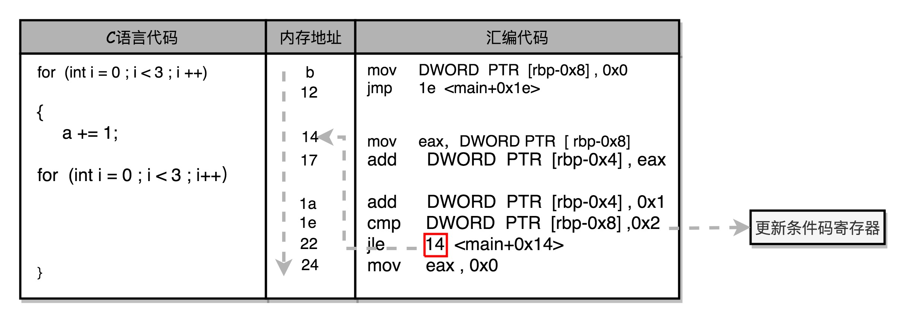

# 指令跳转：原来 `if...else` 就是 `goto`

## 1 CPU 是如何执行指令的？

### CPU 大概结构

- 现在的 CPU 差不多有几百亿个晶体管。
- CPU 其实就是由一堆寄存器组成的。而寄存器就是 CPU 内部，由多个触发器（Flip-Flop）或者锁存器（Latches）组成的简单电路。
- 触发器和锁存器，其实就是两种不同原理的数字电路组成的逻辑门。
- N 个触发器或者锁存器，就可以组成一个 N 位（Bit）的寄存器，能够保存 N 位的数据。比方说，我们用的 64 位 Intel 服务器，寄存器就是 64 位的。

### 一个 CPU 里面会有很多种不同功能的寄存器

- PC 寄存器（Program Counter Register），也叫指令地址寄存器（Instruction Address Register）。用来存放下一条需要执行的计算机指令的内存地址。
- 指令寄存器（Instruction Register），用来存放当前正在执行的指令。
- 条件码寄存器（Status Register），用里面的一个一个标记位（Flag），存放 CPU 进行算术或者逻辑计算的结果。
- 其他寄存器，比如整数寄存器、浮点数寄存器、向量寄存器、地址寄存器和通用寄存器等等。


### 指令如何执行

1. 一个程序执行的时候，CPU 会根据 PC 寄存器里的地址，从内存里面把需要执行的指令读取到指令寄存器里面执行。
2. 执行完后，根据指令长度自增，开始顺序读取下一条指令。可以看到，一个程序的一条条指令，在内存里面是连续保存的，也会一条条顺序加载。

### 指令跳转

- 一般的指令是顺序执行的。
- 有些特殊指令，比如 J 类指令，也就是跳转指令，会修改 PC 寄存器里面的地址值。
- 会修改 PC 寄存器里面的地址值后，下一条要执行的指令就不是从内存里面顺序加载的了。
- 有了指令跳转，我们才能使用 `if…else` 条件语句和 `while/for` 循环语句。

## 2 从 `if…else` 来看程序的执行和跳转

```c
// test.c

#include <time.h>
#include <stdlib.h>

int main()
{
  //用 rand 生成了一个随机数 r，r 要么是 0，要么是 1
  srand(time(NULL));
  int r = rand() % 2;
  int a = 10;
  if (r == 0)
  {
    a = 1;
  } else {
    a = 2;
  }
```

编译 test.c 后，使用 objdump 查看汇编指令：

```shell
$ gcc -g -c test.c
$ objdump -d -M intel -S test.o
```

结果为

```log
    if (r == 0)
  3b:   83 7d fc 00             cmp    DWORD PTR [rbp-0x4],0x0
  3f:   75 09                   jne    4a <main+0x4a>
    {
        a = 1;
  41:   c7 45 f8 01 00 00 00    mov    DWORD PTR [rbp-0x8],0x1
  48:   eb 07                   jmp    51 <main+0x51>
    }
    else
    {
        a = 2;
  4a:   c7 45 f8 02 00 00 00    mov    DWORD PTR [rbp-0x8],0x2
  51:   b8 00 00 00 00          mov    eax,0x0
    }
```

汇编指令执行说明：

1. `r == 0` 的条件判断，被编译成了 cmp 和 jne 这两条指令
2. cmp 指令的作用是比较了前后两个操作数的值，其中
   - DWORD PTR 代表操作的数据类型是 32 位的整数
   - `[rbp-0x4]` 则是一个寄存器的地址，cmp 的第一个操作数 r 存储在其中。
   - 第二个操作数 0x0 就是我们设定的常量 0 的 16 进制表示。
   - cmp 指令的比较结果，会存入到条件码寄存器当中去。
   - 这里比较的结果是 True，也就是 `r == 0`，会把零标志条件码（对应的条件码是 ZF，Zero Flag）设置为 1。
3. cmp 指令执行完成之后，PC 寄存器会自动自增，开始执行下一条 jne 的指令。（jne 的意思是  jump if not equal）
   1. jne 指令查看对应的零标志位。如果为 0，会跳转到后面跟着的操作数 4a 的位置。
   2. `jne 4a` 中的 4a 对应这里汇编代码的行号，也就是上面设置的 else 条件里的第一条指令。
   3. 当跳转发生的时候，PC 寄存器被直接设置成这里的 4a 这个地址。
   4. 然后，CPU 再把 4a 地址里的指令加载到指令寄存器中来执行。
4. 执行地址为 4a 的指令，实际是一条 mov 指令
   1. `[rbp-0x8]` 是一个寄存器地址，即 a 的地址。
   2. `0x2` 即代码中对应的 2 的十六进制表示。
   3. mov 指令将 `0x2` 存储到 `0x2` 中，即 2 赋值给 a。
   4. 4a 执行完后，PC 寄存器里的值继续自增，执行到 51 地址，也是 mov 指令。
5. 执行地址为 51 的指令，也是 mov 指令。
   1. mov 指令的第一个操作数 eax，代表累加寄存器
   2. 第二个操作数 0x0 则是 16 进制的 0 的表示。这条指令其实没有实际的作用，它的作用是一个占位符。
   3. 这里的 main 函数没有设定返回值，而 mov eax, 0x0 其实就是给 main 函数生成了一个默认的为 0 的返回值到累加器里面。
6. 上面的 if 条件如果成立，在赋值的 mov 指令执行完成之后，有一个 jmp 的无条件跳转指令。跳转的地址也是这一行的地址 51。


## 3 如何通过 if…else 和 goto 来实现循环？

```c
int main()
{
    int a = 0;
    for (int i = 0; i < 3; i++)
    {
        a += i;
    }
}
```

编译后使用 objdump 查看汇编代码

```log
    for (int i = 0; i < 3; i++)
   b:   c7 45 f8 00 00 00 00    mov    DWORD PTR [rbp-0x8],0x0
  12:   eb 0a                   jmp    1e <main+0x1e>
    {
        a += i;
  14:   8b 45 f8                mov    eax,DWORD PTR [rbp-0x8]
  17:   01 45 fc                add    DWORD PTR [rbp-0x4],eax
    for (int i = 0; i < 3; i++)
  1a:   83 45 f8 01             add    DWORD PTR [rbp-0x8],0x1
  1e:   83 7d f8 02             cmp    DWORD PTR [rbp-0x8],0x2
  22:   7e f0                   jle    14 <main+0x14>
  24:   b8 00 00 00 00          mov    eax,0x0
    }
```

for 循环是用 1e（`1e <main+0x1e>`）这个地址上的 cmp（`cmp DWORD PTR [rbp-0x8],0x2`）比较指令，和紧接着的 jle（`jle 14 <main+0x14>`） 条件跳转指令来实现的。



## 4 总结

1. 除了简单地通过 PC 寄存器自增的方式顺序执行外，条件码寄存器会记录下当前执行指令的条件判断状态，然后通过跳转指令读取对应的条件码，修改 PC 寄存器内的下一条指令的地址，最终实现 if…else 以及 for/while 这样的程序控制流程。
2. 像高级语言中的 if/else/while 等，回归到计算机可以识别的机器指令级别，其实都只是一个简单的地址跳转而已，也就是一个类似于 goto 的语句。
3. 在硬件层面实现这个 goto 语句，除了本身需要用来保存下一条指令地址，以及当前正要执行指令的 PC 寄存器、指令寄存器外，我们只需要再增加一个条件码寄存器，来保留条件判断的状态。这样简简单单的三个寄存器，就可以实现条件判断和循环重复执行代码的功能。

## 5 相关学习资料

- 《深入理解计算机系统》的第 3 章，详细讲解了 C 语言和 Intel CPU 的汇编语言以及指令的对应关系，以及 Intel CPU 的各种寄存器和指令集。

## 6 思考

除了 `if…else` 的条件语句和 `for/while` 的循环之外，大部分编程语言还有 `switch…case` 这样的条件跳转语句。`switch…case` 编译出来的汇编代码也是这样使用 jne 指令进行跳转吗？对应的汇编代码的性能和写很多 `if…else` 有什么区别呢？你可以试着写一个简单的 C 语言程序，编译成汇编代码看一看。
