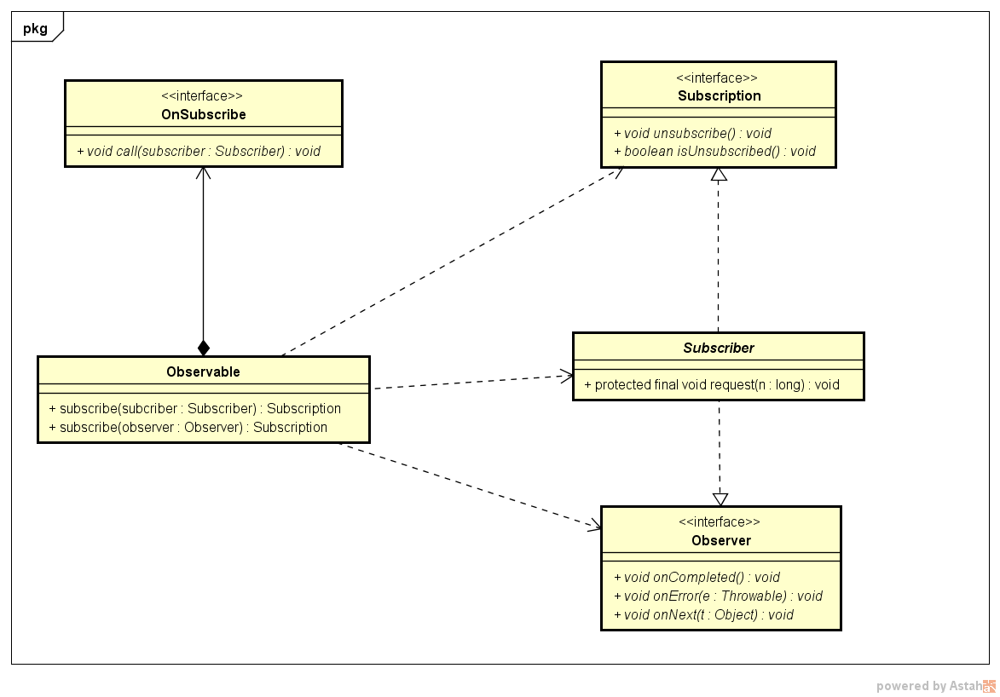

# RxJava-基本元素

---
## 1 Observable

Observable：**可观察的，被观察者**，它决定什么时候触发事件以及触发怎样的事件，可以说它是事件流中的生产者，Observable的创建有多种方式，但是都基于**create**方法

```java
       protected Observable(OnSubscribe<T> f) {
            this.onSubscribe = f;
        }
```

Observable只有一个构造方法，接收一个OnSubscribe接口，

```java
    Observable.create(new Observable.OnSubscribe<String>() {
                @Override
                public void call(Subscriber<? super String> subscriber) {
                    subscriber.onNext("A");
                    subscriber.onNext("B");
                    subscriber.onNext("B");
                    subscriber.onNext("D");
                    subscriber.onCompleted();
                }
            });
```

OnSubscribe表示当发生订阅时需要发生的事情，它只有一个call方法，当Observable被订阅的时候，OnSubscribe 的 call() 方法会自动被调用，在call方法里面去实现相关逻辑，把事件序列传递给Subscriber，比如上面的call方法中，通知Subscriber发生了四次onNext事件，最后调用Subscriber的onCompleted表示事件系列的终止。

Observable是一个重量级的类，除了构造函数外，在Observable中还定义了丰富的操作符。

### 冷和热

Observable什么时候开始发射数据序列？这取决于Observable的实现：

- 一个"热"的Observable可能一创建完就开始发射数据
- 一个"冷"的Observable会一直等待，直到有观察者订阅它才开始发射数据，因此这个观察者可以确保会收到整个数据序列。

默认的Observable实现都是冷的。

---
## 2 OnSubscribe

Observable的创建依赖于OnSubscribe，OnSubscribe表示当发生订阅时需要发生的事情，其声明如下：
```java
     public interface OnSubscribe<T> extends Action1<Subscriber<? super T>> {
            // cover for generics insanity
     }
```
在Action1中有一个call方法，OnSubscribe继承了这个call方法，这个call方法的参数一个订阅者，当Observable被订阅的时候，OnSubscribe 的call()方法会自动被调用。即在这个call方法中是发射数据。

---
## 3 Observer

Observer：即观察者，用于响应事件的发生，定义如下：

```java
    public interface Observer<T> {
        void onCompleted();
        void onError(Throwable e);
        void onNext(T t);
    }
```

这三个方法代表了事件序列中会发生的三个行为：

*   onNext(T t):Observable调用这个方法发射数据，参数类型与Observable发射数据的类型是一致的，这个方法可能会被调用多次，这取决于你的实现。
*   onCompleted(): 事件队列完结，当不会再有新的onNext() 发出时，需要触发 onCompleted() 方法作为标志。
*   onError(): 事件序列在传递和处理的过程中发生异常时。onError()会被触发，同时事件序列和订阅关系自动终止。

RxJava有如下规则：

- onNext可能会被调用零次或者很多次
- onCompleted与onError互斥，同一个事件队列只能调用其中一个
- 当调用了onCompleted或onError表示事件流结束，不会再调用onNext，并且自动取消订阅


---
## 4 Subscriber

Subscriber是一个抽象类，它是Observer的扩展，实现了Observer和Subscription。Subscription描述了Observable与Subscriber之间的订阅关系，其定义如下：

```java
    public interface Subscription {
        void unsubscribe();
        boolean isUnsubscribed();
    }
```

Subscriber实现了Subscription，并实现了它的两个方法：

*   unsubscribe：用于取消订阅。在这个方法被调用后，`Subscriber` 将不再接收事件，如果不再对事件感兴趣，需要通过此方法取消订阅，防止内存泄漏
*   isUnsubscribed：用于判断是否已经取消订阅

Subscriber定义如下：

```java
    public abstract class Subscriber<T> implements Observer<T>, Subscription {

      // 表示订阅的动作的触发
       void onStart();
       //来自Subscription，用于取消订阅
       void unsubscribe();
       //来自Subscription，用于判断是否已经取消订阅
       boolean isUnsubscribed();
       .....省略的大部分代码
    }
```

Subscriber可以理解为一个功能更加全面的订阅者。

---
## 5 Subscription

```
    Subscription subscription =  observable.subscribe(observer);
    Subscription subscription =   observable.subscribe(subscriber);
```

当observer订阅了observable后，订阅关系就就发生了，返回Subscription用于表示订阅关系，Subscription提供了用于判断和控制observer和observable之间的关系的方法。

从代码来看，是被观察者订阅了观察者，貌似这样的逻辑是不合理的，应该是观察者订阅被观察者，但是这样的设计是为了RxJava的链式调用。

---
## 6 Action和Func

在RxJava中定义了许多Action和Func，这些Action和Func都代表一个特定功能函数。用于RxJava的函数式编程风格。

### 6.1 Func

Func系列是有返回值的函数。此类型函数用于变换

```java
    @FunctionalInterface
    public interface Callable<V> {
        V call() throws Exception;
    }

    //所有的 Func 和 Action interfaces 继承Function,Function是一个标记接口，类似Cloneable，用于instanceof判断.
    public interface Function {

    }

    //代表一个不带参数的函数对象
    public interface Func0<R> extends Function, Callable<R> {
        @Override
        R call();
    }

    //表示有一个参数的函数对象，注意反省T是方法参数的泛型，R是方法返回值的泛型。
    public interface Func1<T, R> extends Function {
        R call(T t);
    }
```

### 6.2 Action

Action系列是没有返回值的函数。此类型函数表示对发生的一个事件执行的一个动作。

```java
    public interface Action extends Function {
    
    }
    
    public interface Action0 extends Action {
        void call();
    }
    
    public interface Action1<T> extends Action {
        void call(T t);
    }
```

Action和Func是RxJava中重要的组成部分，在函数式编程中它们就代表函数，它们可以作为参数传递给方法，用于指定特定的动作和变换，用Java来讲它们的实例就是函数对象。

函数式编程中，函数是"第一等公民"：函数与其他数据类型一样，处于平等地位，可以赋值给其他变量，也可以作为参数，传入另一个函数，或者作为别的函数的返回值。在RxJava中典型的就是Action和Func系列接口，按照函数式编程范式，Action和Func系列接口应该被实现为无副作用的。

---
## 7  subscribe

subscribe表示订阅，是一种行为，作为RxJava的使用者，有必要理清一下Subscribe的流程：

根据Rxjava的源码，订阅的流程简化如下：

```java
     public Subscription subscribe(Subscriber subscriber) {
        subscriber.onStart();
        onSubscribe.call(subscriber);
        return subscriber;
    }
```

1.  调用subscriber.onStart()方法，告知其订阅已经开始
2.  调用onSubscribe的call方法，在call方法中通知Subscriber发生的事件序列
3.  以Subscription的形式返回subscriber，方便订阅后的反订阅操作

接下来分析一下subscribe的源码来验证上面所说的流程：

Observable中的subscribe方法：

```java
        public final Subscription subscribe(Subscriber<? super T> subscriber) {
            return Observable.subscribe(subscriber, this);
        }

            static <T> Subscription subscribe(Subscriber<? super T> subscriber, Observable<T> observable) {
    
            if (subscriber == null) {
                throw new IllegalArgumentException("subscriber can not be null");
            }
            if (observable.onSubscribe == null) {
                throw new IllegalStateException("onSubscribe function can not be null.");
            }
            subscriber.onStart();
            if (!(subscriber instanceof SafeSubscriber)) {
                // assign to `observer` so we return the protected version
                subscriber = new SafeSubscriber<T>(subscriber);
            }
            try {
                // allow the hook to intercept and/or decorate，允许RxJava中的钩子拦截和包装
                RxJavaHooks.onObservableStart(observable, observable.onSubscribe).call(subscriber);
                return RxJavaHooks.onObservableReturn(subscriber);
                 } catch (Throwable e) {
                  //错误处理
                }
                return Subscriptions.unsubscribed();
            }
        }
```

*   首先是对subscriber的一些null判断
*   然后直接调用subscriber.onStart()方法，可以看出onStart的调用时机，其与订阅者在同一个线程中执行
*   使用SafeSubscriber包装原始的Subscriber，是用来保证RxJava的一些规定与做一些错误处理的，比如保证onComplete和onError互斥，onNext在onComplete不再发送数据等等。
*   在RxJavaHooks中返回的还是原来的onSubscribe，然后调用了onSubscribe的call方法（call方法被调用即订阅开始触发行为）。
*   最后返回的是的Subscriber，只是形态变成了Subscription，方便订阅后的反订阅操作(只返回需要的功能接口)


---
## 8 变换 lift 与 Operator

**在Observabler中定义的操作符都是通过lift来实现的**。变换（lift）就是将事件序列中的对象或整个序列进行加工处理，转换成不同的事件或事件序列，实质上是**针对事件序列的处理和再发送**

lift方法定义在Observable中：

```java
    public final <R> Observable<R> lift(final Operator<? extends R, ? super T> operator) {
            return new Observable<R>(new OnSubscribe<R>() {
                @Override
                public void call(Subscriber<? super R> o) {
                    try {
                        //hook.onLift(operator)返回的是方法参数本身
                        Subscriber<? super T> st = hook.onLift(operator).call(o);
                        try {
                            st.onStart();
                            onSubscribe.call(st);
                        } catch (Throwable e) {
                            Exceptions.throwIfFatal(e);
                            st.onError(e);
                        }
                    } catch (Throwable e) {
                        o.onError(e);
                    }
                }
            });
    }
```

lift方法本身比较简单，其只有一个Operator参数，先来看一下Operator的定义：

### Operator

```java
public interface Operator<R, T> extends Func1<Subscriber<? super R>, Subscriber<? super T>> {

}
```
Operator继承了Func1，并且它的泛型确定了其call由接受一个Subscriber返回一个新的Subscriber。Operator具有以下行为：
```java
    Operator{
        //根据Operator的反省定义，它的call方法接受一个Subscriber返回一个新的Subscriber。
        Subscriber call(Subscriber)
    }
```
### lift的原理

lift方法只做了一件事，创建并返回了一个新的Observable，当然创建Observable同时也需要创建了一个OnSubscribe，下面通过一段代码来分析一下lift的原理：

```java
     Observable.create(
                    new Observable.OnSubscribe<Integer>() {
                        @Override
                        public void call(Subscriber<? super Integer> subscriber) {
                            if (subscriber.isUnsubscribed()) {
                                return;
                            }
                            try {
                                subscriber.onNext(1);
                                subscriber.onNext(2);
                                subscriber.onNext(3);
                                subscriber.onCompleted();
                            } catch (Exception e) {
                                subscriber.onError(e);
                            }
                        }
                    })
                    .map(String::valueOf)
                    .subscribe(System.out::println);
        //map操作符是通过lift传入OperatorMap操纵符实现的。
        public final <R> Observable<R> map(Func1<? super T, ? extends R> func) {
            return lift(new OperatorMap<T, R>(func));
        }
```

可以看到上面代码中，map操作符是通过lift传入OperatorMap操纵符实现的。

假设：

- 我们通过create创建的Observable称为SourceObservable，与它对应的OnSubscribe称为SourceOnSubscribe，
- 通过map操作符返回的Observable称为MapObservable,与它对应的称之为MapOnSubscribe.
- 订阅MapObservable的Subscriber(即我们写的Subscriber)称之为OurSubscriber.

lift的流程如下：

1. OurSubscriber订阅MapObservable
2. MapOnSubscribe的call被调用
3. 以OurSubscriber为参数调用operator的call方法，并返回一个新的Subscriber：st。
4. st.onStart被调用
5. 以st为参数调用了SourceOnSubscribe的call方法，(此时算是SourceObservable被订阅了，整个事件序列开始)
6. 接下来事件序列会传递给st,而st是由OperatorMap的call方法生成的，所以需要继续分析OperatorMap的call

OperatorMap的call方法如下：

```java
    public final class OperatorMap<T, R> implements Operator<R, T> {

        final Func1<? super T, ? extends R> transformer;

        public OperatorMap(Func1<? super T, ? extends R> transformer) {
            this.transformer = transformer;
        }

        //此方法返回的就是lift中的st
        @Override
        public Subscriber<? super T> call(final Subscriber<? super R> o) {
            return new Subscriber<T>(o) {
                @Override
                public void onCompleted() {
                    o.onCompleted();
                }
                @Override
                public void onError(Throwable e) {
                    o.onError(e);
                }
                @Override
                public void onNext(T t) {
                    try {
                        o.onNext(transformer.call(t));
                    } catch (Throwable e) {
                        Exceptions.throwOrReport(e, this, t);
                    }
                }
            };
        }
    }
```

整体上逻辑还是很清晰的：

- transformer正是我们在使用map操作符时传入的函数对象func1，用于对原始上游的数据项进行转换
- 在OperatorMap的call中生成的st，逻辑是简单的把方法调用进行传递，只是在onNext中使用transformer对数据进行了一次转换而已。

至此整体流程就分析完了，事实上RxJava的链式调用中其实是一个封闭的环状，当最下游的Observable被订阅时，它会把订阅转发到上游，一直到最上游的Observable被订阅后，数据项就会往下游发射，而从lift的源码分析来看，在发射的过程中都是通过一个Subscriber把数据项转给下一个Subscriber，而在onNext的时候，可以对数据进行转换，直到把数据发射到最下游的Subscriber。lift中的Operator类是关键，Operator的call方法返回的Subscriber：st包装了我们传入的Subscriber。真正订阅上游的Observable的是st，而不是我们传入的Subscriber。

在Observable的环状结构中，往上游是通知订阅，往下游是发射数据项，而lift的原理就是在call方法中创建了一个中间人角色的Subscriber，这个中间人Subscriber把上游和下游连接起来，数据的发射必然会通过这个Subscriber转发，它就是在这个转发的过程中对数据进行了转换，至此我们明白了，**把RxJava的订阅分为往回通知订阅和往下转发数据两个阶段的话，lift作用于数据转发阶段。**

搞明白了lift原理，我们也就可以创建自己的操作符了，

---
## 9 compose

除了 `lift()` 之外， Observable还有一个变换方法叫做 `compose(Transformer)`。经过上面分析可知`lift()` 是针对事件项和事件序列的操作，而 `compose()` 是针对 Observable自身进行变换。看一下 compose 的定义：

```java
    public <R> Observable<R> compose(Transformer<? super T, ? extends R> transformer) {
            return ((Transformer<T, R>) transformer).call(this);
    }
```

方法比 lift 简单多了，compose 接受一个Transformer，通过Transformer的call方法返回一个新的Observable，所以看一下Transformer是个什么东西：

```java
     public interface Transformer<T, R> extends Func1<Observable<T>, Observable<R>> {

     }
```

Transformer与与lift的Operator类似，都是继承了Func1，但是Transformer的泛型确定了它接收一个泛型类型为T的Observable，返回一个泛型类型为R的Observable。


当需要多一个Observable进行多次lift时，代码可能如下：

```java
    Observable.just(1)
                    .lift(new Operator1())
                    .lift(new Operator2())
                    .lift(new Operator3())
                    .lift(new Operator4())
                    .subscribe(new Subscriber<Integer>() {
                        @Override
                        public void onCompleted() {
    
                        }
    
                        @Override
                        public void onError(Throwable e) {
    
                        }
    
                        @Override
                        public void onNext(Integer integer) {
    
                        }
                    });
```

这样写看起来不直观，lift来，lift去，于是我们可以使用Transformer把这些lift都包装起来，比如：

```java
      private static class DemoCompose implements Observable.Transformer<Integer, Integer> {
    
            @Override
            public Observable<Integer> call(Observable<Integer> integerObservable) {
                return integerObservable
                        .lift(new Operator1())
                        .lift(new Operator2())
                        .lift(new Operator3())
                        .lift(new Operator4());
            }
        }
    
     Observable.just(1)
                    .compose(new DemoCompose())
                    .subscribe(new Subscriber<Integer>() {
                        @Override
                        public void onCompleted() {
    
                        }
    
                        @Override
                        public void onError(Throwable e) {
    
                        }
    
                        @Override
                        public void onNext(Integer integer) {
    
                        }
                    });
```

代码清爽多了，compose即组合的意思，compose是针对Observable自身进行变换，比如Android中的RxLife就是用compose实现的。

---
## 10 类图



---
## 引用

- [给 Android 开发者的 RxJava 详解](https://gank.io/post/560e15be2dca930e00da1083)


