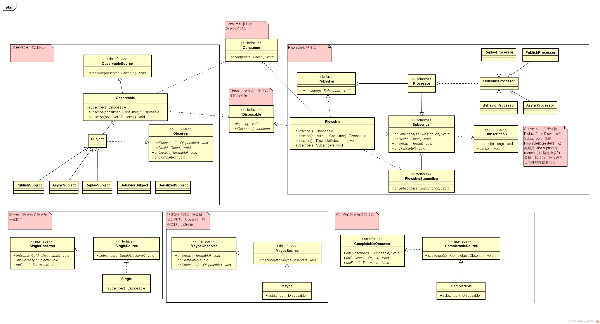

# RxJava2 new

RxJava2主要类图

## 1 响应式流规范

[`Reactive Streams`](http://www.reactive-streams.org/)规范提供一个非堵塞的异步流处理的背压(backpressure)标准；`Reactive Streams`的目标是增加抽象层，而不是进行底层的流处理，规范将这些问题留给了库实现来解决。对于JVM，目前已经有多个库实现该标准，`RxJava2, akka-streams（Playing 有使用）,Reactor(Spring Reactive有使用) 等`；统一标准的好处就是 各个实现产生的数据可以方便的转换和消费；

---
## 2 数据源

RxJava 2 中的注意元素：

- `ObservableSource`：代表一个基本的、不支持被压的Observable源基础接口，通过Observer进行观察
- `Observable`：ObservableSource的基础实现
- `Observer`：观察者，提供了基于接收推送通知机制。
- `Subject`：代表一个数据源和观察者
- `Publisher`
- `Flowable`：Flowable是支持被压的数据源
- `Subscriber`
- `Processor`：Subject在RxJava2中依然存在，但现在他们不支持backpressure。新出现的Processors支持backpressure，并且都设计为现成安全的
- `Subscription`：Subscription用于连接RxJava2中的Flowable和Subscriber，在使用Flowable的create时，必须调用Subscription的request方法指定请求的数据，请求的个数代表自己能处理数据的能力
- `CompletableSource`：可完成的数据源基础接口
- `Completable`
- `SingleSource`：发送单个数据项的数据源基础接口
- `Single`
- `MaybeSource`：能够发射0或者1个数据，要么成功，要么失败。有点类似于Optional
- `Maybe`

### 2.1 Flowable

RxJava2中把原来的`Observable`拆分成了`Flowable`和`Observable`，RxJava2中的Observable不再对Backpressure进行处理，默认缓存所有的上游数据，对Backpressure进行处理的工作交给了Flowable实现，对于Backpressure的处理Flowable实现的多种策略，使用`BackpressureStrategy`或者相关的分发(比如`onBackpressureBuffer()`标识缓存所有上游数据)进行指定

### 2.2 Processor

RxJava2中保留了Subject，但是Subject不会处理背压的情况，取而代之的是Processor，对应各种Subject都有Processor的实现。并且现在它们默认都是线程安全的设计

### 2.3 Maybe

Maybe在是RxJava2中的新概念，是Single和Completeable的结合，能够发射0或者1个数据，要么成功，要么失败。有点类似于Optional

### 2.4 Reactive Streams接口

和Flowable的接口Publisher类似，Observable、Single、Completable也有类似的基类,因此许多操作符接受的参数从以前的具体对象，变成了现在的接口由于接收的都是接口，在使用其他遵循Reactive-Streams设计的第三方库的时候，就不需要把他自定义的Flowable转换成标准Flowable了。

- Flowable --> Publisher
- Observable --> ObservableSource
- Single --> SingleSource
- Completable --> CompletableSource

---
## 3 Java8

RxJava2中的Action和Fouchtion等现在都遵守Java8中的函数式接口，比如RxJava1中的Action1现在是`Consumer`

1. 现在RxJava2的接口方法里加上了throws Exception:
2. 另外大部分接口方法都按照Java8的接口方法名进行了相应的修改，比如上面那个`Consumer<T>`接口原来叫`Action1<T>`，而`Action2<T>`改名成了BiConsumer,`Action3-Action9`被删掉了
3. Functions基本就是名字的修改和不常用类的删除

---
## 4 不再支持Null

RxJava2的流中不再支持null值，比如`Observable.just()`传入一个null会抛出`NullPointerException`，或者在使用map或者flatMap返回一个null也会抛出`NullPointerException`。

如果应对这个变化呢？

- 对于确实需要一个结果的流使用一个不可变的对象表示 NULL 值
- 使用 Completable

---
## 5 Flowable还是Observable

**什么时候用 Observable(不支持背压)：**

- 一般处理最大不超过1000条数据，并且几乎不会出现内存溢出；
- 如果是GUI鼠标事件，频率不超过1000 Hz,基本上不会背压（可以结合 sampling/debouncing 操作）；
- 如果处理的式同步流而你的Java平台又不支持Java Stream（如果有异常处理，Observable 比Stream也更适合）;

**什么时候用 Flowable(支持背压):**

- 处理以某种方式产生超过10K的元素；
- 文件读取与分析，例如 读取指定行数的请求；
- 通过JDBC 读取数据库记录， 也是一个阻塞的和基于拉取模式，并且由ResultSet.next() 控制；
- 网络IO流;
- 有很多的阻塞和/或 基于拉取的数据源，但是又想得到一个响应式非阻塞接口的。

---
## 6 Subscription命名

在RxJava1里，Subscription起到的是订阅桥梁的作用。在2中，由于Subscription本身和Reactive-Streams里的另外一个同名概念冲突。因此把RxJava2中原本的Subscription改名成了Disposable、CompositeSubscription改名成为CompositeDisposable

---
##  其他

- RxJava2可以直接获取流中的数据，比如使用`blockingGet`操作符。
- `DisposableObserver`：名为DisposableObserver的类型，它将自动处理第四个方法，并允许只用关心来自Observable本身的通知它实现了 Disposable，因此可以调用dispose方法，它会将其转发到过程链当中。
- `Subscriber`：在新版里Subscriber被赋予了更多的作用，有几个实现类可以供我们使用：
 - ResourceSubscriber：允许异步取消其订阅和相关资源。

---
## 引用

- [RxJava 2.0 有什么不同 (译)](https://juejin.im/entry/5827e1a767f35600587bbdc6)

