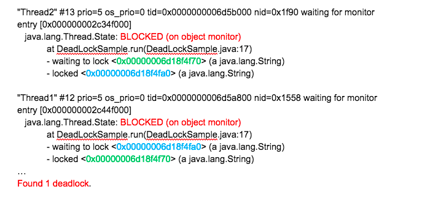

# 什么情况下Java程序会产生死锁？如何定位、修复？

今天，我会介绍一些日常开发中类似线程死锁等问题的排查经验，并选择一两个我自己修复过或者诊断过的核心类库死锁问题作为例子，希望不仅能在面试时，包括在日常工作中也能对你有所帮助。

今天我要问你的问题是，什么情况下 Java 程序会产生死锁？如何定位、修复？

---
## 1 典型回答

什么是死锁：

- 死锁是一种特定的程序状态，在实体之间，由于循环依赖导致彼此一直处于等待之中，没有任何个体可以继续前进。
- 死锁不仅仅是在线程之间会发生，存在资源独占的进程之间同样也可能出现死锁。
- 通常来说，我们大多是聚焦在多线程场景中的死锁，指两个或多个线程之间，由于互相持有对方需要的锁，而永久处于阻塞的状态。


定位死锁：

- 最常见的方式就是利用 jstack 等工具获取线程栈，然后定位互相之间的依赖关系，进而找到死锁。如果是比较明显的死锁，往往 jstack 等就能直接定位。
- JConsole 可以在图形界面进行有限的死锁检测。

解决死锁：

- 如果程序运行时发生了死锁，绝大多数情况下都是无法在线解决的，只能重启、修正程序本身问题。所以，代码开发阶段互相审查，或者利用工具进行预防性排查，往往也是很重要的。
- 大部分死锁本身并不难定位，掌握基本思路和工具使用，理解线程相关的基本概念，比如各种线程状态和同步、锁、Latch 等并发工具，就已经足够解决大多数问题了。


---
## 2 考点分析

今天的问题偏向于实用场景，大部分死锁本身并不难定位，掌握基本思路和工具使用，理解线程相关的基本概念，比如各种线程状态和同步、锁、Latch 等并发工具，就已经足够解决大多数问题了。

针对死锁，面试官可以深入考察：

- 抛开字面上的概念，让面试者写一个可能死锁的程序，顺便也考察下基本的线程编程。
- 诊断死锁有哪些工具，如果是分布式环境，可能更关心能否用 API 实现吗？
- 后期诊断死锁还是挺痛苦的，经常加班，如何在编程中尽量避免一些典型场景的死锁，有其他工具辅助吗？

---
## 3 死锁程序分析

一个死锁程序：

```java
public class DeadLockSample extends Thread {
    private String first;
    private String second;
    public DeadLockSample(String name, String first, String second) {
        super(name);
        this.first = first;
        this.second = second;
    }

    public  void run() {
        synchronized (first) {
            System.out.println(this.getName() + " obtained: " + first);
            try {
                Thread.sleep(1000L);
                synchronized (second) {
                    System.out.println(this.getName() + " obtained: " + second);
                }
            } catch (InterruptedException e) {
                // Do nothing
            }
        }
    }
    public static void main(String[] args) throws InterruptedException {
        String lockA = "lockA";
        String lockB = "lockB";
        DeadLockSample t1 = new DeadLockSample("Thread1", lockA, lockB);
        DeadLockSample t2 = new DeadLockSample("Thread2", lockB, lockA);
        t1.start();
        t2.start();
        t1.join();
        t2.join();
    }
}
```

这个程序编译执行后，几乎每次都可以重现死锁，另外，这里有个比较有意思的地方，为什么我先调用 Thread1 的 start，但是 Thread2 却先打印出来了呢？这就是因为**线程调度依赖于（操作系统）调度器**，虽然你可以通过优先级之类进行影响，但是具体情况是不确定的。

针对上面死锁程序，模拟问题定位，选取最常见的 jstack 工具：

- 首先，可以使用 jps 或者系统的 ps 命令、任务管理器等工具，确定进程 ID。
- 其次，调用 jstack 获取线程栈：

分析得到的输出，具体片段如下：



结合代码分析线程栈信息。上面这个输出非常明显，找到处于 BLOCKED 状态的线程，按照试图获取（waiting）的锁 ID（请看我标记为相同颜色的数字）查找，很快就定位问题。 jstack 本身也会把类似的简单死锁抽取出来，直接打印出来。

在实际应用中，类死锁情况未必有如此清晰的输出，但是总体上可以理解为：`区分线程状态 -> 查看等待目标 -> 对比 Monitor 等持有状态`，所以，理解线程基本状态和并发相关元素是定位问题的关键，然后配合程序调用栈结构，基本就可以定位到具体的问题代码。

---
## 4 ThreadMXBean

如果我们是开发自己的管理工具，需要用更加程序化的方式扫描服务进程、定位死锁，可以考虑使用 Java 提供的标准管理 API，ThreadMXBean，其直接就提供了 `findDeadlockedThreads()` 方法用于定位。为方便说明，我修改了 DeadLockSample，请看下面的代码片段。

```
public static void main(String[] args) throws InterruptedException {

    ThreadMXBean mbean = ManagementFactory.getThreadMXBean();
    Runnable dlCheck = new Runnable() {

        @Override
        public void run() {
            long[] threadIds = mbean.findDeadlockedThreads();
            if (threadIds != null) {
                     ThreadInfo[] threadInfos = mbean.getThreadInfo(threadIds);
                     System.out.println("Detected deadlock threads:");
                for (ThreadInfo threadInfo : threadInfos) {
                    System.out.println(threadInfo.getThreadName());
                }
          }
       }
    };

       ScheduledExecutorService scheduler =Executors.newScheduledThreadPool(1);
       // 稍等 5 秒，然后每 10 秒进行一次死锁扫描
        scheduler.scheduleAtFixedRate(dlCheck, 5L, 10L, TimeUnit.SECONDS);
        // 死锁样例代码…
}
```

但是要注意的是，对线程进行快照本身是一个相对重量级的操作，还是要慎重选择频度和时机。

---
## 5 如何在编程中尽量预防死锁

首先，我们来总结一下前面例子中死锁的产生包含哪些基本元素。基本上死锁的发生是因为：

- 互斥条件，类似 Java 中 Monitor 都是独占的，要么是我用，要么是你用。
- 互斥条件是长期持有的，在使用结束之前，自己不会释放，也不能被其他线程抢占。
- 循环依赖关系，两个或者多个个体之间出现了锁的链条环。

所以，我们可以据此分析可能的避免死锁的思路和方法。

### 第一种方法：尽量避免使用多个锁

如果可能的话，尽量避免使用多个锁，并且只有需要时才持有锁。否则，即使是非常精通并发编程的工程师，也难免会掉进坑里，嵌套的 synchronized 或者 lock 非常容易出问题。


我举个例子， Java NIO 的实现代码向来以锁多著称，一个原因是，其本身模型就非常复杂，某种程度上是不得不如此；另外是在设计时，考虑到既要支持阻塞模式，又要支持非阻塞模式。直接结果就是，一些基本操作如 connect，需要操作三个锁以上，在最近的一个 JDK 改进中，就发生了死锁现象。

我将其简化为下面的伪代码，问题是暴露在 HTTP/2 客户端中，这是个非常现代的反应式风格的 API，非常推荐学习使用。

```
/// Thread HttpClient-6-SelectorManager:
readLock.lock();
writeLock.lock();
// 持有 readLock/writeLock，调用 close（）需要获得 closeLock
close();
// Thread HttpClient-6-Worker-2 持有 closeLock
implCloseSelectableChannel (); // 想获得 readLock
```

- 在 close 发生时， HttpClient-6-SelectorManager 线程持有 readLock/writeLock，试图获得 closeLock；
- 与此同时，另一个 HttpClient-6-Worker-2 线程，持有 closeLock，试图获得 readLock，这就不可避免地进入了死锁。

这里比较难懂的地方在于，closeLock 的持有状态（就是我标记为绿色的部分）并没有在线程栈中显示出来，请参考我在下图中标记的部分。


更加具体来说，请查看SocketChannelImpl的 663 行，对比 `implCloseSelectableChannel()` 方法实现和 `AbstractInterruptibleChannel.close()` 在 109 行的代码，这里就不展示代码了。

所以，**从程序设计的角度反思，如果我们赋予一段程序太多的职责，出现“既要…又要…”的情况时，可能就需要我们审视下设计思路或目的是否合理了**。对于类库，因为其基础、共享的定位，比应用开发往往更加令人苦恼，需要仔细斟酌之间的平衡。


### 第二种方法：设计好锁的获取顺序、银行家算法

如果必须使用多个锁，尽量设计好锁的获取顺序，这个说起来简单，做起来可不容易，你可以参看著名的银行家算法。

>银行家算法（Banker's Algorithm）是一个避免死锁（Deadlock）的著名算法，是由艾兹格·迪杰斯特拉在1965年为T.H.E系统设计的一种避免死锁产生的算法。它以银行借贷系统的分配策略为基础，判断并保证系统的安全运行。——WIKI百科

一般的情况，我建议可以采取些简单的辅助手段，比如：

- 将对象（方法）和锁之间的关系，用图形化的方式表示分别抽取出来，以今天最初讲的死锁为例，因为是调用了同一个线程所以更加简单。

- 然后根据对象之间组合、调用的关系对比和组合，考虑可能调用时序。

- 按照可能时序合并，发现可能死锁的场景。


### 第三种方法：超时机制

使用带超时的方法，为程序带来更多可控性。

- 类似 `Object.wait(…)` 或者 `CountDownLatch.await(…)`，都支持所谓的 timed_wait，我们完全可以就不假定该锁一定会获得，指定超时时间，并为无法得到锁时准备退出逻辑。
- 并发 Lock 实现，如 ReentrantLock 还支持非阻塞式的获取锁操作 tryLock()，这是一个**插队行为**（barging），并不在乎等待的公平性，如果执行时对象恰好没有被独占，则直接获取锁。

有时，我们希望条件允许就尝试插队，不然就按照现有公平性规则等待，一般采用下面的方法：

```
if (lock.tryLock() || lock.tryLock(timeout, unit)) {
      // ...
}
```

### 第四种方法：静态代码分析

业界也有一些其他方面的尝试，比如通过静态代码分析（如 FindBugs）去查找固定的模式，进而定位可能的死锁或者竞争情况。实践证明这种方法也有一定作用，请参考<a href="https://plugins.jetbrains.com/plugin/3847-findbugs-idea">相关文档</a>。


### 其他死锁原因

除了典型应用中的死锁场景，其实还有一些更令人头疼的死锁，比如**类加载过程发生的死锁**，尤其是在框架大量使用自定义类加载时，因为往往不是在应用本身的代码库中，jstack 等工具也不见得能够显示全部锁信息，所以处理起来比较棘手。对此，Java 有[官方文档](https://docs.oracle.com/javase/7/docs/technotes/guides/lang/cl-mt.html)进行了详细解释，并针对特定情况提供了相应 JVM 参数和基本原则。


---
## 6 总结与思考题


今天，我从样例程序出发，介绍了死锁产生原因，并帮你熟悉了排查死锁基本工具的使用和典型思路，最后结合实例介绍了实际场景中的死锁分析方法与预防措施，希望对你有所帮助。关于今天我们讨论的题目你做到心中有数了吗？今天的思考题是，有时候并不是阻塞导致的死锁，只是某个线程进入了死循环，导致其他线程一直等待，这种问题如何诊断呢？

1. 死锁的另一个好朋友就是饥饿。死锁和饥饿都是线程活跃性问题。实践中死锁可以使用 jvm 自带的工具进行排查。
2. `死循环死锁`可以认为是自旋锁死锁的一种，其他线程因为等待不到具体的信号提示。导致线程一直饥饿。这种情况下可以查看线程 cpu 使用情况，排查出使用 cpu 时间片最高的线程，再打出该线程的堆栈信息，排查代码。
3. 基于互斥量的锁如果发生死锁往往 cpu 使用率较低，实践中也可以从这一方面进行排查。
